# RaFlow 语音输入工具详细设计文档

## 文档信息

| 项目 | 值 |
|------|-----|
| 文档名称 | RaFlow 语音输入工具详细设计文档 |
| 文档版本 | 1.0.0 |
| 创建日期 | 2026-02-16 |
| 作者 | AI Bootcamp Team |

---

## 一、项目概述

### 1.1 项目简介

RaFlow（Real-time Audio Flow）是一款基于 ElevenLabs Scribe v2 Realtime API 构建的跨平台语音输入工具，旨在为用户提供低延迟、高准确率的实时语音转文字功能。该项目使用 Tauri 2 框架开发，结合 Rust 后端的高性能和 React 前端的现代化交互，实现类似 Wispr Flow 的用户体验。

### 1.2 核心目标

- **低延迟**：端到端延迟控制在 150ms 以内
- **高准确率**：基于 ElevenLabs Scribe v2 实现 93.5% 的准确率
- **跨平台支持**：支持 Windows、macOS 和 Linux 三大主流平台
- **全局热键触发**：支持系统级全局快捷键触发
- **智能文本插入**：自动将识别文本插入到当前应用的光标位置
- **常驻后台**：通过系统托盘实现后台常驻

### 1.3 技术栈选型

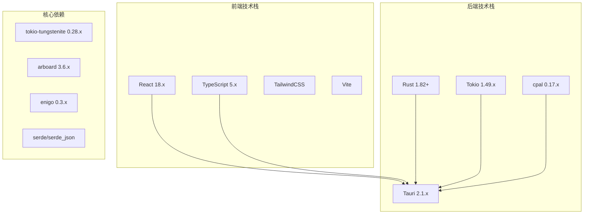
```mermaid
graph TB
    subgraph "前端技术栈"
        FE1[React 18.x]
        FE2[TypeScript 5.x]
        FE3[TailwindCSS]
        FE4[Vite]
    end

    subgraph "后端技术栈"
        BE1[Rust 1.82+]
        BE2[Tauri 2.1.x]
        BE3[Tokio 1.49.x]
        BE4[cpal 0.17.x]
    end

    subgraph "核心依赖"
        D1[tokio-tungstenite 0.28.x]
        D2[arboard 3.6.x]
        D3[enigo 0.3.x]
        D4[serde/serde_json]
    end

    FE1 --> BE2
    FE2 --> BE2
    BE1 --> BE2
    BE3 --> BE2
    BE4 --> BE2
```

---

## 二、系统架构设计

### 2.1 整体架构

系统采用分层架构设计，共分为四层：展示层、应用层、领域层和基础设施层。

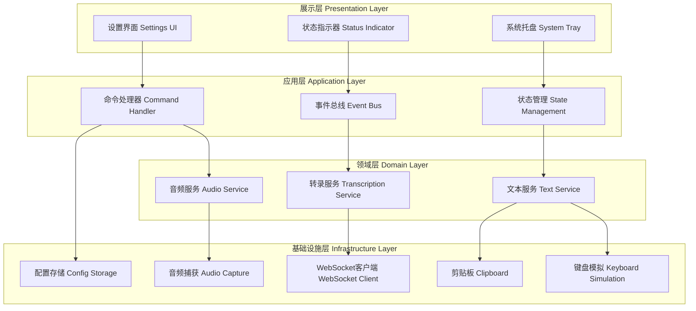
```mermaid
graph TB
    subgraph "展示层 Presentation Layer"
        UI1[设置界面 Settings UI]
        UI2[状态指示器 Status Indicator]
        UI3[系统托盘 System Tray]
    end

    subgraph "应用层 Application Layer"
        APP1[命令处理器 Command Handler]
        APP2[事件总线 Event Bus]
        APP3[状态管理 State Management]
    end

    subgraph "领域层 Domain Layer"
        DOM1[音频服务 Audio Service]
        DOM2[转录服务 Transcription Service]
        DOM3[文本服务 Text Service]
    end

    subgraph "基础设施层 Infrastructure Layer"
        INF1[音频捕获 Audio Capture]
        INF2[WebSocket客户端 WebSocket Client]
        INF3[键盘模拟 Keyboard Simulation]
        INF4[剪贴板 Clipboard]
        INF5[配置存储 Config Storage]
    end

    UI1 --> APP1
    UI2 --> APP2
    UI3 --> APP3
    APP1 --> DOM1
    APP2 --> DOM2
    APP3 --> DOM3
    DOM1 --> INF1
    DOM2 --> INF2
    DOM3 --> INF3
    DOM3 --> INF4
    APP1 --> INF5
```

### 2.2 模块划分

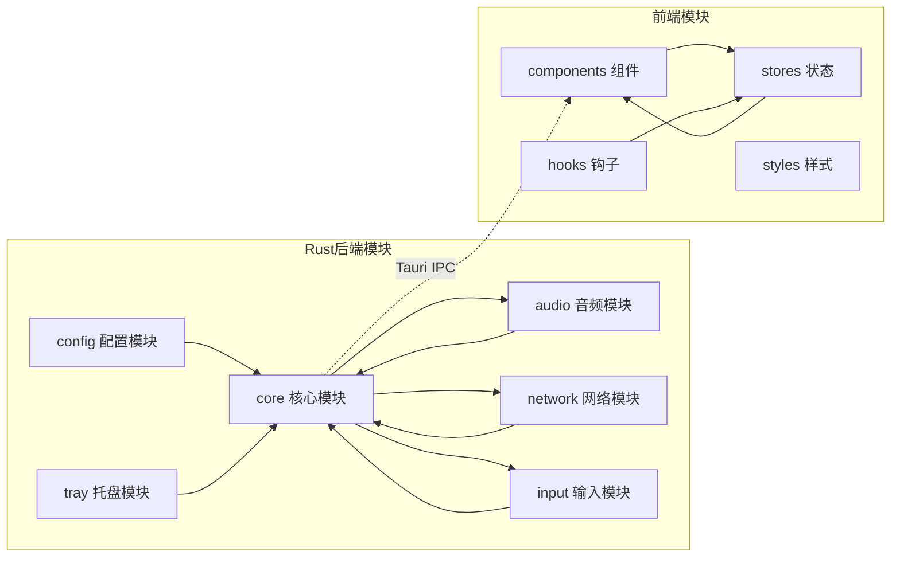
```mermaid
graph LR
    subgraph "Rust后端模块"
        RB1[core 核心模块]
        RB2[audio 音频模块]
        RB3[network 网络模块]
        RB4[input 输入模块]
        RB5[config 配置模块]
        RB6[tray 托盘模块]
    end

    subgraph "前端模块"
        FE1[components 组件]
        FE2[hooks 钩子]
        FE3[stores 状态]
        FE4[styles 样式]
    end

    RB1 --> RB2
    RB1 --> RB3
    RB1 --> RB4
    RB2 --> RB1
    RB3 --> RB1
    RB4 --> RB1
    RB5 --> RB1
    RB6 --> RB1

    RB1 -.Tauri IPC.-> FE1
    FE1 --> FE3
    FE2 --> FE3
    FE3 --> FE1
```

### 2.3 部署架构

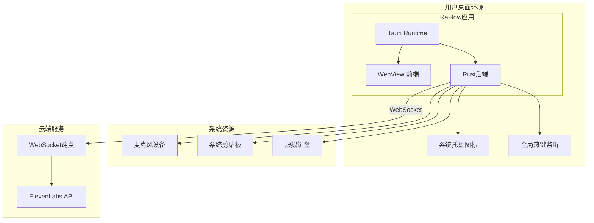
```mermaid
graph TB
    subgraph "用户桌面环境"
        subgraph "RaFlow应用"
            Tauri[Tauri Runtime]
            WebView[WebView 前端]
            RustBackend[Rust后端]
        end

        Tray[系统托盘图标]
        Hotkey[全局热键监听]
    end

    subgraph "系统资源"
        Audio[麦克风设备]
        Clipboard[系统剪贴板]
        Keyboard[虚拟键盘]
    end

    subgraph "云端服务"
        EL[ElevenLabs API]
        WS[WebSocket端点]
    end

    Tauri --> WebView
    Tauri --> RustBackend
    RustBackend --> Tray
    RustBackend --> Hotkey
    RustBackend --> Audio
    RustBackend --> Clipboard
    RustBackend --> Keyboard
    RustBackend -->|WebSocket| WS
    WS --> EL
```

---

## 三、核心组件设计

### 3.1 音频捕获组件

#### 3.1.1 组件职责

音频捕获组件负责从麦克风设备实时采集音频数据，并进行必要的格式转换和预处理。

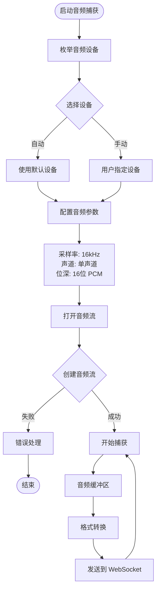
```mermaid
flowchart TB
    Start([启动音频捕获]) --> Enum[枚举音频设备]
    Enum --> Select{选择设备}
    Select -->|自动| Default[使用默认设备]
    Select -->|手动| User[用户指定设备]
    Default --> Config[配置音频参数]
    User --> Config
    Config --> ConfigDetail[采样率: 16kHz<br/>声道: 单声道<br/>位深: 16位 PCM]
    ConfigDetail --> Open[打开音频流]
    Open --> Stream{创建音频流}
    Stream -->|成功| Capture[开始捕获]
    Stream -->|失败| Error[错误处理]
    Error --> End([结束])
    Capture --> Buffer[音频缓冲区]
    Buffer --> Process[格式转换]
    Process --> Send[发送到 WebSocket]
    Send --> Capture
```

#### 3.1.2 核心类型定义

```rust
/// 音频配置
#[derive(Debug, Clone, Serialize, Deserialize)]
pub struct AudioConfig {
    /// 采样率 (固定 16000 Hz)
    pub sample_rate: u32,
    /// 声道数 (固定 1 - 单声道)
    pub channels: u16,
    /// 音频格式
    pub format: AudioFormat,
    /// 缓冲区大小
    pub buffer_size: u32,
}

/// 音频格式
#[derive(Debug, Clone, Copy, Serialize, Deserialize)]
pub enum AudioFormat {
    /// 16位 PCM 小端序
    PcmS16Le,
}

/// 音频设备信息
#[derive(Debug, Clone, Serialize, Deserialize)]
pub struct AudioDeviceInfo {
    /// 设备名称
    pub name: String,
    /// 设备ID
    pub id: String,
    /// 是否为默认设备
    pub is_default: bool,
}

/// 音频帧
#[derive(Debug, Clone)]
pub struct AudioFrame {
    /// 时间戳
    pub timestamp: u64,
    /// PCM数据
    pub data: Vec<i16>,
}
```

#### 3.1.3 依赖版本

| 依赖项 | 版本 | 说明 |
|--------|------|------|
| cpal | 0.17.2 | 跨平台音频 I/O 库 |
| rubato | 0.15.0 | 音频重采样库 (备用) |

---

### 3.2 WebSocket 通信组件

#### 3.2.1 组件职责

WebSocket 通信组件负责与 ElevenLabs Scribe v2 Realtime API 进行实时双向通信。

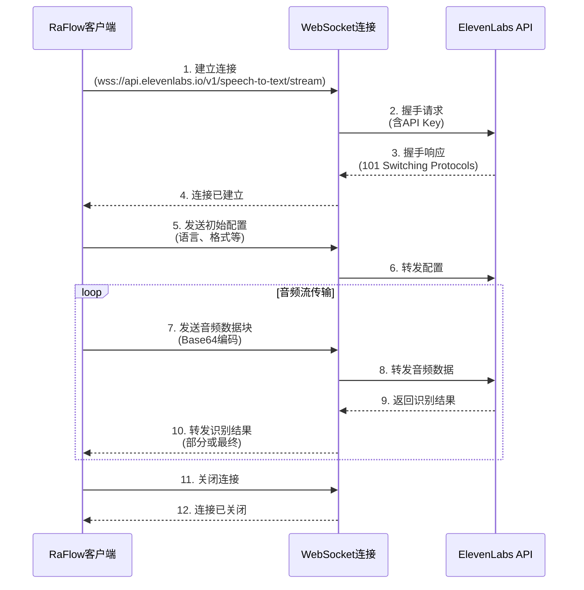
```mermaid
sequenceDiagram
    participant Client as RaFlow客户端
    participant WS as WebSocket连接
    participant API as ElevenLabs API

    Client->>WS: 1. 建立连接<br/>(wss://api.elevenlabs.io/v1/speech-to-text/stream)
    WS->>API: 2. 握手请求<br/>(含API Key)
    API-->>WS: 3. 握手响应<br/>(101 Switching Protocols)
    WS-->>Client: 4. 连接已建立

    Client->>WS: 5. 发送初始配置<br/>(语言、格式等)
    WS->>API: 6. 转发配置

    loop 音频流传输
        Client->>WS: 7. 发送音频数据块<br/>(Base64编码)
        WS->>API: 8. 转发音频数据
        API-->>WS: 9. 返回识别结果
        WS-->>Client: 10. 转发识别结果<br/>(部分或最终)
    end

    Client->>WS: 11. 关闭连接
    WS-->>Client: 12. 连接已关闭
```

#### 3.2.2 状态机设计

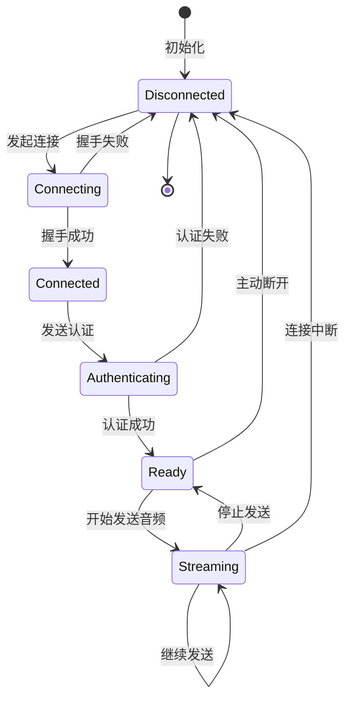
```mermaid
stateDiagram-v2
    [*] --> Disconnected: 初始化
    Disconnected --> Connecting: 发起连接
    Connecting --> Connected: 握手成功
    Connecting --> Disconnected: 握手失败
    Connected --> Authenticating: 发送认证
    Authenticating --> Ready: 认证成功
    Authenticating --> Disconnected: 认证失败
    Ready --> Streaming: 开始发送音频
    Streaming --> Streaming: 继续发送
    Streaming --> Ready: 停止发送
    Ready --> Disconnected: 主动断开
    Streaming --> Disconnected: 连接中断
    Disconnected --> [*]
```

#### 3.2.3 核心类型定义

```rust
/// WebSocket连接状态
#[derive(Debug, Clone, Copy, PartialEq, Eq, Serialize, Deserialize)]
pub enum ConnectionState {
    /// 未连接
    Disconnected,
    /// 连接中
    Connecting,
    /// 已连接
    Connected,
    /// 认证中
    Authenticating,
    /// 就绪
    Ready,
    /// 流式传输中
    Streaming,
    /// 错误
    Error,
}

/// WebSocket消息类型
#[derive(Debug, Clone, Serialize, Deserialize)]
#[serde(tag = "type")]
pub enum WsMessage {
    /// 认证消息
    #[serde(rename = "auth")]
    Auth {
        /// API密钥
        api_key: String,
        /// 语言代码
        language: String,
        /// 音频格式
        format: String,
    },
    /// 音频数据
    #[serde(rename = "audio")]
    Audio {
        /// Base64编码的音频数据
        data: String,
    },
    /// 识别结果
    #[serde(rename = "result")]
    Result {
        /// 识别文本
        text: String,
        /// 是否为最终结果
        is_final: bool,
        /// 置信度
        confidence: f32,
    },
}

/// 转录结果
#[derive(Debug, Clone, Serialize, Deserialize)]
pub struct TranscriptionResult {
    /// 识别的文本
    pub text: String,
    /// 是否为最终结果
    pub is_final: bool,
    /// 置信度 (0.0 - 1.0)
    pub confidence: f32,
    /// 语言检测
    pub language: Option<String>,
    /// 时间戳
    pub timestamp: u64,
}
```

#### 3.2.4 依赖版本

| 依赖项 | 版本 | 说明 |
|--------|------|------|
| tokio-tungstenite | 0.28.0 | 异步 WebSocket 客户端 |
| futures-util | 0.3.31 | 异步工具 |
| serde | 1.0.217 | 序列化/反序列化 |
| serde_json | 1.0.138 | JSON 支持 |

---

### 3.3 文本插入组件

#### 3.3.1 组件职责

文本插入组件负责将识别结果插入到当前活动窗口的光标位置。

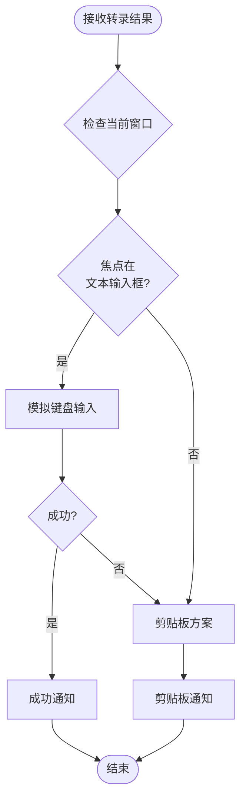
```mermaid
flowchart TB
    Start([接收转录结果]) --> Check{检查当前窗口}
    Check --> Focus{焦点在<br/>文本输入框?}
    Focus -->|是| Simulate[模拟键盘输入]
    Focus -->|否| Clipboard[剪贴板方案]
    Simulate --> Success{成功?}
    Success -->|是| Notify1[成功通知]
    Success -->|否| Clipboard
    Clipboard --> Notify2[剪贴板通知]
    Notify1 --> End([结束])
    Notify2 --> End
```

#### 3.3.2 键盘模拟流程

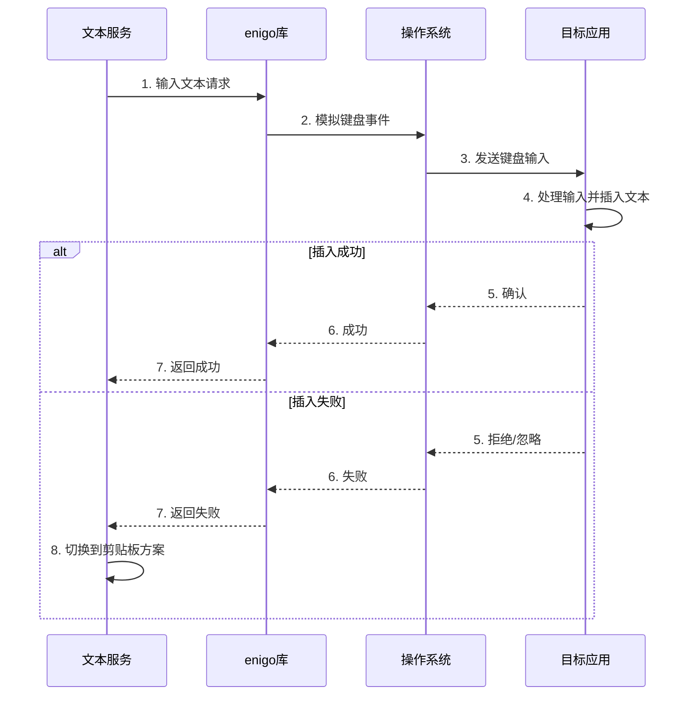
```mermaid
sequenceDiagram
    participant Service as 文本服务
    participant Enigo as enigo库
    participant OS as 操作系统
    participant App as 目标应用

    Service->>Enigo: 1. 输入文本请求
    Enigo->>OS: 2. 模拟键盘事件
    OS->>App: 3. 发送键盘输入
    App->>App: 4. 处理输入并插入文本

    alt 插入成功
        App-->>OS: 5. 确认
        OS-->>Enigo: 6. 成功
        Enigo-->>Service: 7. 返回成功
    else 插入失败
        App-->>OS: 5. 拒绝/忽略
        OS-->>Enigo: 6. 失败
        Enigo-->>Service: 7. 返回失败
        Service->>Service: 8. 切换到剪贴板方案
    end
```

#### 3.3.3 核心类型定义

```rust
/// 文本插入策略
#[derive(Debug, Clone, Copy, Serialize, Deserialize)]
pub enum TextInsertionStrategy {
    /// 自动选择 (优先键盘输入)
    Auto,
    /// 仅使用键盘输入
    KeyboardOnly,
    /// 仅使用剪贴板
    ClipboardOnly,
}

/// 文本插入结果
#[derive(Debug, Clone, Serialize, Deserialize)]
pub enum TextInsertionResult {
    /// 成功插入
    Success {
        /// 使用的策略
        strategy: TextInsertionStrategy,
    },
    /// 失败，已复制到剪贴板
    FallbackToClipboard {
        /// 失败原因
        reason: String,
    },
    /// 完全失败
    Failed {
        /// 错误信息
        error: String,
    },
}
```

#### 3.3.4 依赖版本

| 依赖项 | 版本 | 说明 |
|--------|------|------|
| enigo | 0.3.0 | 跨平台键盘/鼠标模拟 |
| arboard | 3.6.1 | 跨平台剪贴板操作 |

---

### 3.4 全局热键组件

#### 3.4.1 组件职责

全局热键组件负责注册和监听系统级全局快捷键，作为语音输入的触发器。

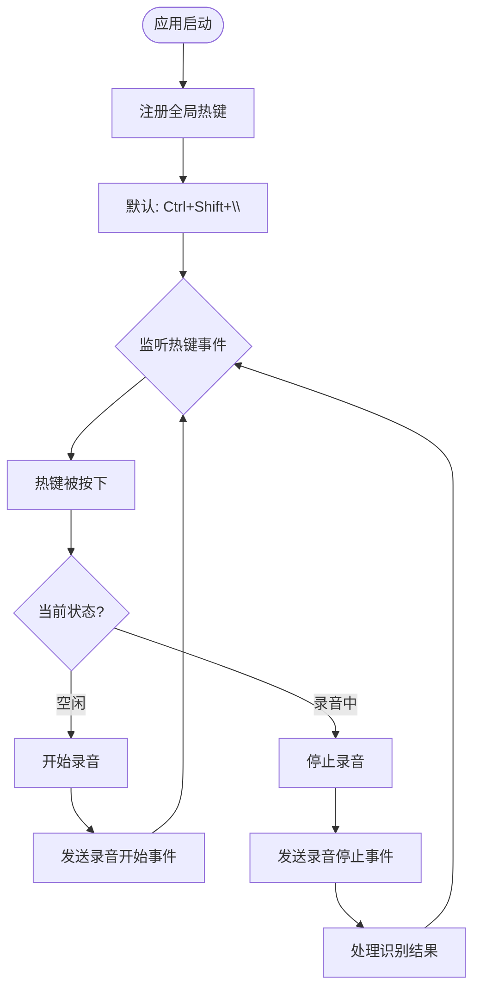
```mermaid
flowchart TB
    Start([应用启动]) --> Register[注册全局热键]
    Register --> Default[默认: Ctrl+Shift+\\]
    Default --> Listen{监听热键事件}
    Listen --> Pressed[热键被按下]
    Pressed --> State{当前状态?}
    State -->|空闲| StartRec[开始录音]
    State -->|录音中| StopRec[停止录音]
    StartRec --> Notify1[发送录音开始事件]
    StopRec --> Notify2[发送录音停止事件]
    Notify1 --> Listen
    Notify2 --> Process[处理识别结果]
    Process --> Listen
```

#### 3.4.2 热键配置

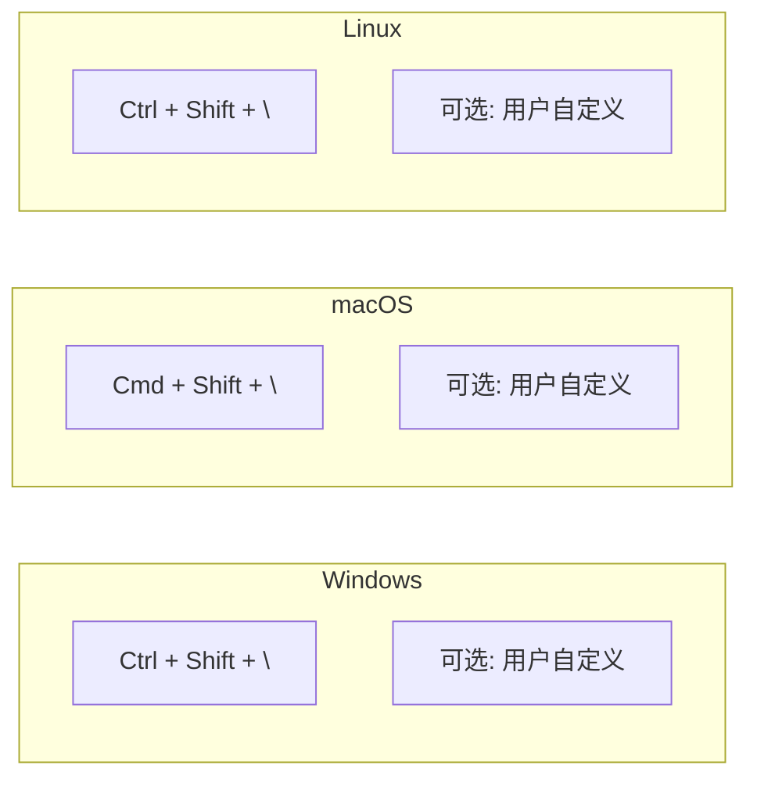
```mermaid
graph LR
    subgraph "Windows"
        WIN1[Ctrl + Shift + \]
        WIN2[可选: 用户自定义]
    end

    subgraph "macOS"
        MAC1[Cmd + Shift + \]
        MAC2[可选: 用户自定义]
    end

    subgraph "Linux"
        LIN1[Ctrl + Shift + \]
        LIN2[可选: 用户自定义]
    end
```

#### 3.4.3 核心类型定义

```rust
/// 热键配置
#[derive(Debug, Clone, Serialize, Deserialize)]
pub struct HotkeyConfig {
    /// 主修饰键
    pub modifiers: Vec<KeyModifier>,
    /// 主键
    pub key: KeyCode,
    /// 是否启用
    pub enabled: bool,
}

/// 修饰键
#[derive(Debug, Clone, Copy, Serialize, Deserialize)]
pub enum KeyModifier {
    Ctrl,
    Alt,
    Shift,
    Super, // Win/Cmd
}

/// 按键码
#[derive(Debug, Clone, Copy, Serialize, Deserialize)]
pub enum KeyCode {
    /// 反斜杠
    Backslash,
    /// 空格
    Space,
    /// 字母 A-Z
    Char(char),
}
```

#### 3.4.4 依赖版本

| 依赖项 | 版本 | 说明 |
|--------|------|------|
| tauri-plugin-global-shortcut | 2.0.x | Tauri 全局热键插件 |

---

### 3.5 系统托盘组件

#### 3.5.1 组件职责

系统托盘组件提供应用的后台常驻和快速访问入口。

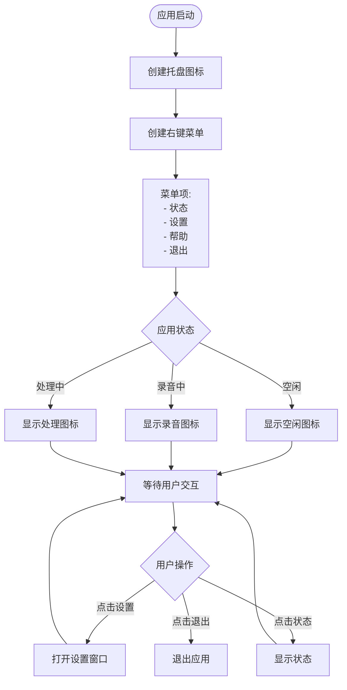
```mermaid
flowchart TB
    Start([应用启动]) --> Create[创建托盘图标]
    Create --> Menu[创建右键菜单]
    Menu --> Items[菜单项:<br/>- 状态<br/>- 设置<br/>- 帮助<br/>- 退出]
    Items --> Idle{应用状态}
    Idle -->|空闲| Icon1[显示空闲图标]
    Idle -->|录音中| Icon2[显示录音图标]
    Idle -->|处理中| Icon3[显示处理图标]
    Icon1 --> Wait[等待用户交互]
    Icon2 --> Wait
    Icon3 --> Wait
    Wait --> Event{用户操作}
    Event -->|点击设置| OpenSettings[打开设置窗口]
    Event -->|点击状态| ShowStatus[显示状态]
    Event -->|点击退出| Exit[退出应用]
    OpenSettings --> Wait
    ShowStatus --> Wait
```

#### 3.5.2 托盘菜单设计

```
┌─────────────────────────┐
│  🎙️  RaFlow             │
│  ─────────────────────  │
│  ● 状态: 就绪           │
│  ● 快捷键: Ctrl+Shift+\ │
│  ─────────────────────  │
│  ⚙️  设置...            │
│  ❓  帮助               │
│  ─────────────────────  │
│  🚪 退出 RaFlow         │
└─────────────────────────┘
```

#### 3.5.3 核心类型定义

```rust
/// 托盘图标状态
#[derive(Debug, Clone, Copy, Serialize, Deserialize)]
pub enum TrayIconState {
    /// 空闲状态
    Idle,
    /// 录音中
    Recording,
    /// 处理中
    Processing,
    /// 错误状态
    Error,
}

/// 托盘菜单动作
#[derive(Debug, Clone, Serialize, Deserialize)]
pub enum TrayMenuAction {
    /// 打开设置
    OpenSettings,
    /// 显示状态
    ShowStatus,
    /// 显示关于
    ShowAbout,
    /// 退出应用
    Quit,
}
```

---

## 四、数据流设计

### 4.1 录音转写流程

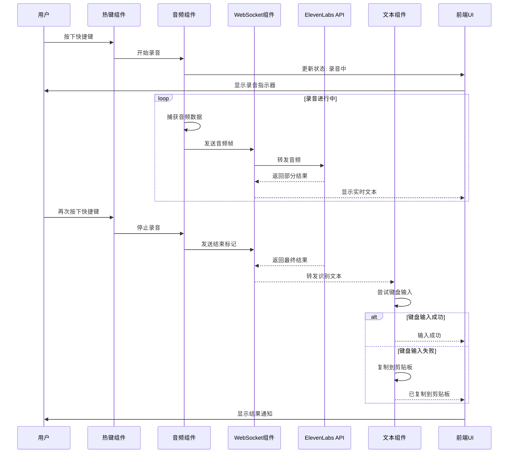
```mermaid
sequenceDiagram
    participant User as 用户
    participant Hotkey as 热键组件
    participant Audio as 音频组件
    participant WS as WebSocket组件
    participant API as ElevenLabs API
    participant Text as 文本组件
    participant UI as 前端UI

    User->>Hotkey: 按下快捷键
    Hotkey->>Audio: 开始录音
    Audio->>UI: 更新状态: 录音中
    UI->>User: 显示录音指示器

    loop 录音进行中
        Audio->>Audio: 捕获音频数据
        Audio->>WS: 发送音频帧
        WS->>API: 转发音频
        API-->>WS: 返回部分结果
        WS-->>UI: 显示实时文本
    end

    User->>Hotkey: 再次按下快捷键
    Hotkey->>Audio: 停止录音
    Audio->>WS: 发送结束标记
    API-->>WS: 返回最终结果
    WS-->>Text: 转发识别文本
    Text->>Text: 尝试键盘输入
    alt 键盘输入成功
        Text-->>UI: 输入成功
    else 键盘输入失败
        Text->>Text: 复制到剪贴板
        Text-->>UI: 已复制到剪贴板
    end
    UI->>User: 显示结果通知
```

### 4.2 错误处理流程

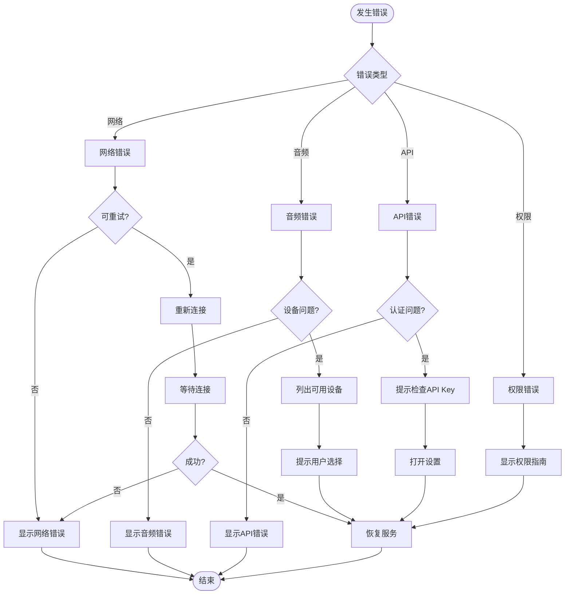
```mermaid
flowchart TB
    Start([发生错误]) --> Classify{错误类型}
    Classify -->|网络| Network[网络错误]
    Classify -->|音频| Audio[音频错误]
    Classify -->|API| APIErr[API错误]
    Classify -->|权限| Permission[权限错误]

    Network --> Retry{可重试?}
    Retry -->|是| Reconnect[重新连接]
    Retry -->|否| NetError[显示网络错误]
    Reconnect --> Wait1[等待连接]
    Wait1 --> Success{成功?}
    Success -->|是| Resume[恢复服务]
    Success -->|否| NetError

    Audio --> CheckDevice{设备问题?}
    CheckDevice -->|是| ListDevices[列出可用设备]
    CheckDevice -->|否| AudioError[显示音频错误]
    ListDevices --> Select[提示用户选择]
    Select --> Resume

    APIErr --> Auth{认证问题?}
    Auth -->|是| APIKey[提示检查API Key]
    Auth -->|否| APIError[显示API错误]
    APIKey --> Settings[打开设置]
    Settings --> Resume

    Permission --> Guide[显示权限指南]
    Guide --> Resume

    NetError --> End([结束])
    AudioError --> End
    APIError --> End
    Resume --> End
```

### 4.3 状态同步流程

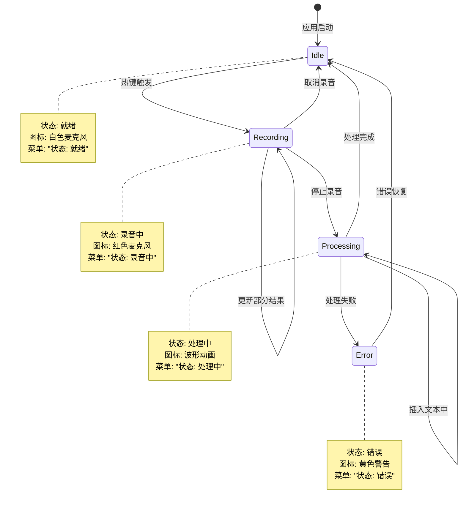
```mermaid
stateDiagram-v2
    [*] --> Idle: 应用启动
    Idle --> Recording: 热键触发
    Recording --> Processing: 停止录音
    Processing --> Idle: 处理完成
    Recording --> Idle: 取消录音
    Processing --> Error: 处理失败
    Error --> Idle: 错误恢复

    Recording --> Recording: 更新部分结果
    Processing --> Processing: 插入文本中

    note right of Idle
        状态: 就绪
        图标: 白色麦克风
        菜单: "状态: 就绪"
    end note

    note right of Recording
        状态: 录音中
        图标: 红色麦克风
        菜单: "状态: 录音中"
    end note

    note right of Processing
        状态: 处理中
        图标: 波形动画
        菜单: "状态: 处理中"
    end note

    note right of Error
        状态: 错误
        图标: 黄色警告
        菜单: "状态: 错误"
    end note
```

---

## 五、前端设计

### 5.1 前端架构

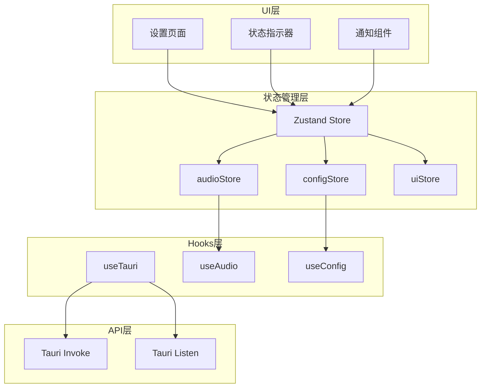
```mermaid
graph TB
    subgraph "UI层"
        Settings[设置页面]
        Status[状态指示器]
        Notifications[通知组件]
    end

    subgraph "状态管理层"
        Store[Zustand Store]
        AudioStore[audioStore]
        ConfigStore[configStore]
        UIStore[uiStore]
    end

    subgraph "Hooks层"
        UseTauri[useTauri]
        UseAudio[useAudio]
        UseConfig[useConfig]
    end

    subgraph "API层"
        TauriAPI[Tauri Invoke]
        TauriListen[Tauri Listen]
    end

    Settings --> Store
    Status --> Store
    Notifications --> Store
    Store --> AudioStore
    Store --> ConfigStore
    Store --> UIStore
    AudioStore --> UseAudio
    ConfigStore --> UseConfig
    UseTauri --> TauriAPI
    UseTauri --> TauriListen
```

### 5.2 设置界面设计

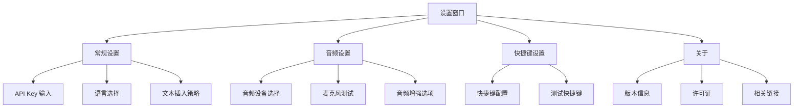
```mermaid
flowchart TB
    Settings[设置窗口] --> Tab1[常规设置]
    Settings --> Tab2[音频设置]
    Settings --> Tab3[快捷键设置]
    Settings --> Tab4[关于]

    Tab1 --> APIKey[API Key 输入]
    Tab1 --> Language[语言选择]
    Tab1 --> Strategy[文本插入策略]

    Tab2 --> Device[音频设备选择]
    Tab2 --> TestMic[麦克风测试]
    Tab2 --> Enhance[音频增强选项]

    Tab3 --> Hotkey[快捷键配置]
    Tab3 --> TestHotkey[测试快捷键]

    Tab4 --> Version[版本信息]
    Tab4 --> License[许可证]
    Tab4 --> Links[相关链接]
```

### 5.3 状态指示器设计

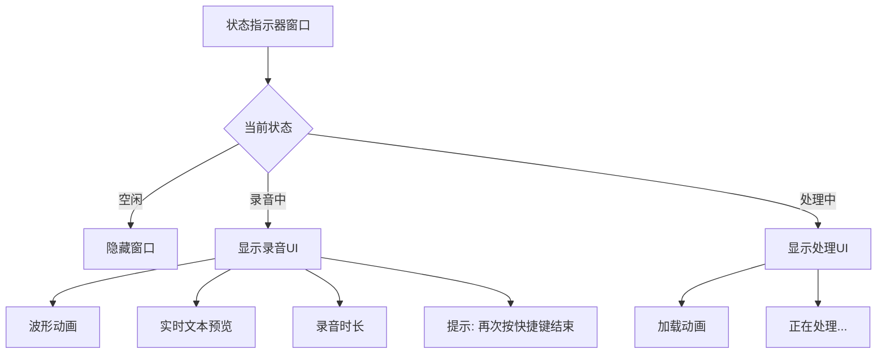
```mermaid
flowchart TB
    Indicator[状态指示器窗口] --> State{当前状态}
    State -->|空闲| Hidden[隐藏窗口]
    State -->|录音中| RecordingUI[显示录音UI]
    State -->|处理中| ProcessingUI[显示处理UI]

    RecordingUI --> Waveform[波形动画]
    RecordingUI --> Text[实时文本预览]
    RecordingUI --> Timer[录音时长]

    ProcessingUI --> Spinner[加载动画]
    ProcessingUI --> StatusText[正在处理...]

    RecordingUI --> Tip[提示: 再次按快捷键结束]
```

### 5.4 前端依赖版本

| 依赖项 | 版本 | 说明 |
|--------|------|------|
| React | 18.3.x | UI 框架 |
| TypeScript | 5.7.x | 类型系统 |
| Vite | 6.0.x | 构建工具 |
| TailwindCSS | 3.4.x | CSS 框架 |
| Zustand | 5.0.x | 状态管理 |
| @tauri-apps/api | 2.1.x | Tauri API |

---

## 六、后端设计

### 6.1 模块组织结构

```
src/
├── main.rs                 # 应用入口
├── lib.rs                  # 库入口
├── core/                   # 核心模块
│   ├── mod.rs
│   ├── app.rs             # 应用结构
│   ├── state.rs           # 应用状态
│   └── error.rs           # 错误类型
├── audio/                  # 音频模块
│   ├── mod.rs
│   ├── capture.rs         # 音频捕获
│   ├── device.rs          # 设备管理
│   └── format.rs          # 格式转换
├── network/                # 网络模块
│   ├── mod.rs
│   ├── websocket.rs       # WebSocket 客户端
│   ├── elevenlabs.rs      # ElevenLabs API
│   └── protocol.rs        # 协议定义
├── input/                  # 输入模块
│   ├── mod.rs
│   ├── keyboard.rs        # 键盘模拟
│   ├── clipboard.rs       # 剪贴板操作
│   └── hotkey.rs          # 全局热键
├── config/                 # 配置模块
│   ├── mod.rs
│   ├── storage.rs         # 配置存储
│   └── models.rs          # 配置模型
├── tray/                   # 托盘模块
│   ├── mod.rs
│   ├── icon.rs            # 图标管理
│   └── menu.rs            # 菜单管理
└── commands/               # Tauri 命令
    ├── mod.rs
    ├── audio.rs
    ├── config.rs
    └── app.rs
```

### 6.2 核心结构体设计

```rust
use std::sync::Arc;
use tokio::sync::Mutex;

/// 应用主结构
pub struct RaFlowApp {
    /// 音频服务
    audio_service: Arc<AudioService>,
    /// 转录服务
    transcription_service: Arc<TranscriptionService>,
    /// 文本服务
    text_service: Arc<TextService>,
    /// 配置管理
    config: Arc<Mutex<AppConfig>>,
    /// 应用状态
    state: Arc<Mutex<AppState>>,
}

/// 应用状态
#[derive(Debug, Clone, Default)]
pub struct AppState {
    /// 当前录音状态
    pub recording_state: RecordingState,
    /// WebSocket 连接状态
    pub connection_state: ConnectionState,
    /// 当前音频设备
    pub current_device: Option<String>,
    /// 最后的识别结果
    pub last_result: Option<String>,
}

/// 录音状态
#[derive(Debug, Clone, Copy, PartialEq, Eq)]
pub enum RecordingState {
    Idle,
    Recording,
    Processing,
}

/// 音频服务
pub struct AudioService {
    /// cpal 主机
    host: cpal::Host,
    /// 当前音频流
    stream: Arc<Mutex<Option<cpal::Stream>>>,
    /// 音频发送器
    sender: mpsc::Sender<AudioFrame>,
}

/// 转录服务
pub struct TranscriptionService {
    /// WebSocket 客户端
    ws_client: Arc<Mutex<Option<WebSocketClient>>>,
    /// API 配置
    api_config: ElevenLabsConfig,
}

/// 文本服务
pub struct TextService {
    /// 插入策略
    strategy: TextInsertionStrategy,
}
```

### 6.3 Tauri 命令定义

```rust
#[tauri::command]
async fn start_recording(app_state: State<'_, Arc<Mutex<AppState>>>) -> Result<(), String> {
    // 开始录音命令实现
}

#[tauri::command]
async fn stop_recording(app_state: State<'_, Arc<Mutex<AppState>>>) -> Result<String, String> {
    // 停止录音命令实现
}

#[tauri::command]
async fn get_audio_devices() -> Result<Vec<AudioDeviceInfo>, String> {
    // 获取音频设备列表
}

#[tauri::command]
async fn save_config(config: AppConfig) -> Result<(), String> {
    // 保存配置
}

#[tauri::command]
async fn get_config() -> Result<AppConfig, String> {
    // 获取配置
}

#[tauri::command]
async fn test_microphone(device_id: String) -> Result<bool, String> {
    // 测试麦克风
}
```

---

## 七、ElevenLabs API 集成

### 7.1 API 连接流程

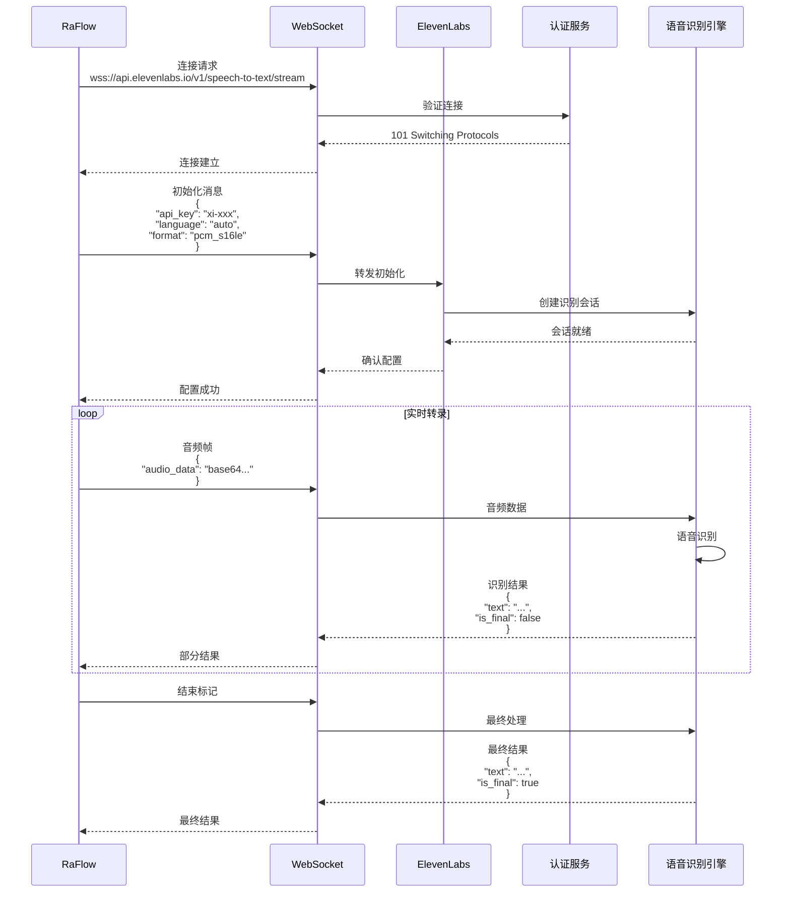
```mermaid
sequenceDiagram
    participant Client as RaFlow
    participant WS as WebSocket
    participant EL as ElevenLabs
    participant Auth as 认证服务
    participant STT as 语音识别引擎

    Client->>WS: 连接请求<br/>wss://api.elevenlabs.io/v1/speech-to-text/stream
    WS->>Auth: 验证连接
    Auth-->>WS: 101 Switching Protocols
    WS-->>Client: 连接建立

    Client->>WS: 初始化消息<br/>{<br/>  "api_key": "xi-xxx",<br/>  "language": "auto",<br/>  "format": "pcm_s16le"<br/>}
    WS->>EL: 转发初始化
    EL->>STT: 创建识别会话
    STT-->>EL: 会话就绪
    EL-->>WS: 确认配置
    WS-->>Client: 配置成功

    loop 实时转录
        Client->>WS: 音频帧<br/>{<br/>  "audio_data": "base64..."<br/>}
        WS->>STT: 音频数据
        STT->>STT: 语音识别
        STT-->>WS: 识别结果<br/>{<br/>  "text": "...",<br/>  "is_final": false<br/>}
        WS-->>Client: 部分结果
    end

    Client->>WS: 结束标记
    WS->>STT: 最终处理
    STT-->>WS: 最终结果<br/>{<br/>  "text": "...",<br/>  "is_final": true<br/>}
    WS-->>Client: 最终结果
```

### 7.2 消息协议

#### 7.2.1 客户端消息类型

```json
// 初始化配置
{
  "type": "init",
  "api_key": "xi-your-api-key",
  "language": "auto",
  "format": "pcm_s16le",
  "sample_rate": 16000
}

// 音频数据
{
  "type": "audio",
  "data": "<base64-encoded-pcm-data>"
}

// 结束标记
{
  "type": "end"
}
```

#### 7.2.2 服务器消息类型

```json
// 识别结果
{
  "type": "result",
  "text": "识别的文本内容",
  "is_final": false,
  "confidence": 0.95,
  "language": "zh-CN"
}

// 错误消息
{
  "type": "error",
  "code": "auth_failed",
  "message": "Invalid API key"
}

// 状态消息
{
  "type": "status",
  "state": "ready"
}
```

### 7.3 错误处理

| 错误代码 | 说明 | 处理方式 |
|----------|------|----------|
| auth_failed | API Key 无效 | 提示用户检查 API Key |
| rate_limited | 超出速率限制 | 等待后重试 |
| connection_lost | 连接丢失 | 自动重连 |
| invalid_format | 音频格式错误 | 检查音频配置 |
| timeout | 请求超时 | 重试或提示用户 |

---

## 八、配置存储设计

### 8.1 配置文件结构

```toml
# ~/.config/raflow/config.toml

[general]
# 应用语言
language = "zh-CN"
# 启动时自动运行
autostart = true
# 最小化到托盘
minimize_to_tray = true

[audio]
# 音频输入设备 ID (空则使用默认)
device_id = ""
# 采样率
sample_rate = 16000
# 启用回声消除
echo_cancellation = true
# 启用噪声抑制
noise_suppression = true
# 启用自动增益
auto_gain = true

[elevenlabs]
# ElevenLabs API Key
api_key = "xi-your-api-key"
# 默认语言 (auto = 自动检测)
language = "auto"
# 连接超时 (秒)
timeout = 30

[hotkey]
# 快捷键配置
modifiers = ["Ctrl", "Shift"]
key = "Backslash"
# 是否启用
enabled = true

[text]
# 文本插入策略
# - auto: 自动选择
# - keyboard: 仅键盘
# - clipboard: 仅剪贴板
strategy = "auto"
# 插入延迟 (毫秒)
insertion_delay = 100

[ui]
# 显示通知
show_notifications = true
# 状态指示器透明度 (0.0 - 1.0)
indicator_opacity = 0.9
# 是否显示实时预览
show_live_preview = true
```

### 8.2 配置类型定义

```rust
use serde::{Deserialize, Serialize};

/// 应用配置
#[derive(Debug, Clone, Serialize, Deserialize)]
pub struct AppConfig {
    /// 通用设置
    pub general: GeneralConfig,
    /// 音频设置
    pub audio: AudioConfig,
    /// ElevenLabs 设置
    pub elevenlabs: ElevenLabsConfig,
    /// 快捷键设置
    pub hotkey: HotkeyConfig,
    /// 文本设置
    pub text: TextConfig,
    /// UI 设置
    pub ui: UIConfig,
}

/// 通用配置
#[derive(Debug, Clone, Serialize, Deserialize)]
pub struct GeneralConfig {
    pub language: String,
    pub autostart: bool,
    pub minimize_to_tray: bool,
}

/// ElevenLabs 配置
#[derive(Debug, Clone, Serialize, Deserialize)]
pub struct ElevenLabsConfig {
    pub api_key: String,
    pub language: String,
    pub timeout: u64,
}

/// 文本配置
#[derive(Debug, Clone, Serialize, Deserialize)]
pub struct TextConfig {
    pub strategy: String,
    pub insertion_delay: u64,
}

/// UI 配置
#[derive(Debug, Clone, Serialize, Deserialize)]
pub struct UIConfig {
    pub show_notifications: bool,
    pub indicator_opacity: f32,
    pub show_live_preview: bool,
}
```

---

## 九、测试策略

### 9.1 测试金字塔

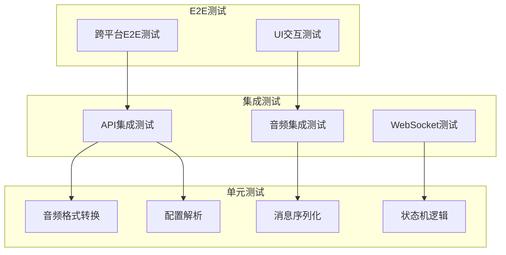
```mermaid
graph TB
    subgraph "E2E测试"
        E2E1[跨平台E2E测试]
        E2E2[UI交互测试]
    end

    subgraph "集成测试"
        INT1[API集成测试]
        INT2[音频集成测试]
        INT3[WebSocket测试]
    end

    subgraph "单元测试"
        UNIT1[音频格式转换]
        UNIT2[消息序列化]
        UNIT3[状态机逻辑]
        UNIT4[配置解析]
    end

    E2E1 --> INT1
    E2E2 --> INT2
    INT1 --> UNIT1
    INT2 --> UNIT2
    INT3 --> UNIT3
    INT1 --> UNIT4
```

### 9.2 测试覆盖率目标

| 模块 | 目标覆盖率 | 说明 |
|------|-----------|------|
| core | 90%+ | 核心逻辑需要高覆盖率 |
| audio | 80%+ | 音频处理需要充分测试 |
| network | 85%+ | 网络通信需要边界测试 |
| input | 75%+ | 输入模拟依赖系统行为 |
| config | 90%+ | 配置需要全面测试 |
| 前端 | 70%+ | UI 测试使用组件测试 |

### 9.3 关键测试场景

```mermaid
flowchart TB
    Start([测试场景]) --> Happy[正常流程测试]
    Start --> Error[异常流程测试]
    Start --> Edge[边界条件测试]

    Happy --> H1[完整录音转写流程]
    Happy --> H2[文本插入成功]
    Happy --> H3[配置保存与加载]
    Happy --> H4[快捷键触发]

    Error --> E1[网络断开恢复]
    Error --> E2[API认证失败]
    Error --> E3[音频设备不可用]
    Error --> E4[剪贴板写入失败]

    Edge --> ED1[空音频输入]
    Edge --> ED2[超长语音输入]
    Edge --> ED3[多语言混合]
    Edge --> ED4[快速连续触发]
```

---

## 十、部署与发布

### 10.1 构建流程

```mermaid
flowchart LR
    Source([源代码]) --> Dep[依赖检查]
    Dep --> Lint[代码检查]
    Lint --> Test[运行测试]
    Test --> Build[编译构建]
    Build --> Package[打包]
    Package --> Sign[签名]
    Sign --> Release[发布]

    subgraph "多平台构建"
        Win[Windows]
        Mac[macOS]
        Lin[Linux]
    end

    Build --> Win
    Build --> Mac
    Build --> Lin
```

### 10.2 发布渠道

```mermaid
graph TB
    subgraph "Windows"
        Win1[MSI 安装包]
        Win2[便携版 ZIP]
    end

    subgraph "macOS"
        Mac1[DMG 镜像]
        Mac2[Homebrew Cask]
    end

    subgraph "Linux"
        Lin1[AppImage]
        Lin2[deb 包]
        Lin3[AUR 包]
    end

    subgraph "在线更新"
        Update[内置更新器]
    end
```

### 10.3 依赖版本清单

#### 10.3.1 Rust 依赖

```toml
[dependencies]
# Tauri 核心
tauri = { version = "2.1", features = ["tray-icon", "image-png"] }
tauri-plugin-global-shortcut = "2.0"

# 异步运行时
tokio = { version = "1.49", features = ["full"] }
tokio-tungstenite = "0.28"

# 音频处理
cpal = "0.17"

# 序列化
serde = { version = "1.0", features = ["derive"] }
serde_json = "1.0"

# 输入模拟
enigo = "0.3"
arboard = "3.6"

# 工具库
thiserror = "2.0"
anyhow = "1.0"
tracing = "0.1"
tracing-subscriber = "0.3"

[build-dependencies]
tauri-build = { version = "2.0", features = [] }
```

#### 10.3.2 前端依赖

```json
{
  "dependencies": {
    "@tauri-apps/api": "^2.1.0",
    "@tauri-apps/plugin-shell": "^2.0.0",
    "react": "^18.3.1",
    "react-dom": "^18.3.1",
    "zustand": "^5.0.0"
  },
  "devDependencies": {
    "@tauri-apps/cli": "^2.1.0",
    "@types/react": "^18.3.0",
    "@types/react-dom": "^18.3.0",
    "@vitejs/plugin-react": "^4.3.0",
    "autoprefixer": "^10.4.0",
    "postcss": "^8.4.0",
    "tailwindcss": "^3.4.0",
    "typescript": "^5.7.0",
    "vite": "^6.0.0"
  }
}
```

---

## 十一、性能优化

### 11.1 延迟优化目标

```mermaid
gantt
    title 端到端延迟分解 (目标: 150ms)
    dateFormat X
    axisFormat %L ms

    section 音频捕获
    音频采集 : 0, 20
    格式转换 : 20, 10

    section 网络传输
    WebSocket 发送 : 30, 10
    API 处理 : 40, 80
    结果返回 : 120, 10

    section 本地处理
    结果解析 : 130, 5
    文本插入 : 135, 10
    总延迟 : 0, 150
```

### 11.2 内存管理

```mermaid
flowchart TB
    Start([应用启动]) --> Alloc1[预分配缓冲区]
    Alloc1 --> Pool{音频数据池}
    Pool --> Reuse[重用内存块]
    Reuse --> Stream{音频流}
    Stream --> Send[发送到网络]
    Send --> Recycle[回收内存]
    Recycle --> Pool

    Alloc1 --> Config[配置缓存]
    Alloc1 --> State[状态缓存]

    note right of Pool
        音频缓冲池大小: 10 * 4096 samples
        预分配可避免运行时分配延迟
    end note
```

### 11.3 CPU 优化

| 组件 | 优化策略 | 预期效果 |
|------|----------|----------|
| 音频采集 | 使用专用线程 | 避免主线程阻塞 |
| WebSocket | 异步 I/O | 高并发处理 |
| 音频转换 | SIMD 优化 | 加速 2-4x |
| 文本插入 | 批量处理 | 减少系统调用 |

---

## 十二、安全设计

### 12.1 数据安全

```mermaid
flowchart TB
    Start([数据流]) --> Classify{数据类型}
    Classify -->|音频| AudioEnc[本地处理<br/>不上传到其他服务]
    Classify -->|文本| TextLocal[本地处理<br/>仅发送到 ElevenLabs]
    Classify -->|API Key| KeyEnc[加密存储<br/>使用系统密钥链]

    AudioEnc --> RAM[仅内存存储]
    RAM --> Clear[使用后立即清除]

    KeyEnc --> KeyStore{选择密钥存储}
    KeyStore -->|Windows| WinDPAPI[Windows DPAPI]
    KeyStore -->|macOS| MacKeychain[macOS Keychain]
    KeyStore -->|Linux| LinSecret[libsecret]
```

### 12.2 权限管理

| 权限 | 用途 | 请求时机 |
|------|------|----------|
| 麦克风访问 | 录音 | 首次使用时 |
| 网络访问 | API 通信 | 应用启动 |
| 辅助功能 | 键盘模拟 | macOS 首次使用 |
| 自动启动 | 后台运行 | 用户手动开启 |

### 12.3 隐私保护

1. **音频数据**：仅发送到 ElevenLabs API，不存储在本地
2. **识别文本**：不记录或上传用户语音内容
3. **API Key**：使用系统安全存储加密保存
4. **网络通信**：强制使用 TLS/WSS 加密
5. **更新检查**：匿名统计，无用户标识

---

## 十三、版本规划

### 13.1 版本里程碑

```mermaid
timeline
    title RaFlow 开发路线图
    section v0.1.0 MVP
        基础框架搭建 : 2026-02
        音频捕获实现 : 2026-02
        WebSocket 集成 : 2026-02
    section v0.2.0 功能完善
        文本插入功能 : 2026-03
        系统托盘 : 2026-03
        设置界面 : 2026-03
    section v0.3.0 优化
        性能优化 : 2026-03
        错误处理 : 2026-04
        用户体验改进 : 2026-04
    section v1.0.0 正式版
        完整测试 : 2026-04
        文档完善 : 2026-05
        正式发布 : 2026-05
```

### 13.2 功能优先级

| 优先级 | 功能 | 版本 |
|--------|------|------|
| P0 | 音频捕获 | v0.1.0 |
| P0 | WebSocket 通信 | v0.1.0 |
| P0 | 文本插入 | v0.2.0 |
| P1 | 全局热键 | v0.1.0 |
| P1 | 系统托盘 | v0.2.0 |
| P1 | 设置界面 | v0.2.0 |
| P2 | 音频增强 | v0.3.0 |
| P2 | 多语言 UI | v0.3.0 |
| P3 | 插件系统 | v2.0.0 |

---

## 十四、风险与缓解

### 14.1 技术风险

| 风险 | 概率 | 影响 | 缓解措施 |
|------|------|------|----------|
| ElevenLabs API 变更 | 中 | 高 | 版本锁定 + 抽象层 |
| 跨平台兼容性 | 高 | 中 | 早期多平台测试 |
| 音频驱动问题 | 中 | 中 | 提供备选方案 |
| 性能不达标 | 低 | 高 | 基准测试 + 优化 |

### 14.2 项目风险

| 风险 | 概率 | 影响 | 缓解措施 |
|------|------|------|----------|
| 开发延期 | 中 | 中 | 迭代开发 + MVP 优先 |
| 资源不足 | 低 | 高 | 分阶段交付 |
| 用户接受度 | 中 | 高 | 早期用户反馈 |

---

## 十五、附录

### 15.1 参考资源

- [ElevenLabs 官方文档](https://elevenlabs.io/docs/overview/intro)
- [ElevenLabs Scribe v2 产品页](https://elevenlabs.io/realtime-speech-to-text)
- [Tauri 2 官方文档](https://v2.tauri.app/)
- [Tokio 官方文档](https://tokio.rs/)
- [cpal 文档](https://docs.rs/cpal)

### 15.2 依赖来源

- [Tokio 1.49.0](https://github.com/tokio-rs/tokio) - 最新稳定版 (2026年1月)
- [cpal 0.17.2](https://github.com/RustAudio/cpal) - 跨平台音频库
- [tokio-tungstenite 0.28.0](https://docs.rs/crate/tokio-tungstenite) - WebSocket 客户端
- [arboard 3.6.1](https://github.com/1Password/arboard) - 剪贴板操作
- [Tauri 2.1](https://v2.tauri.app/) - 应用框架

### 15.3 许可证

本项目采用 MIT 许可证。详见 LICENSE 文件。

---

**文档结束**
