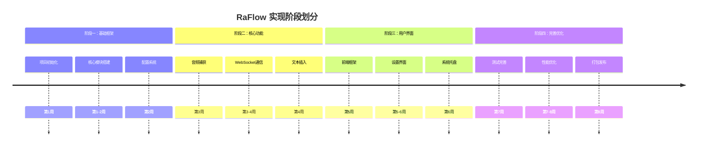
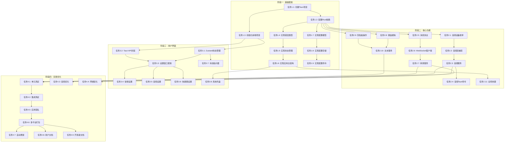

# RaFlow 语音输入工具实现计划

## 文档信息

| 项目 | 值 |
|------|-----|
| 文档名称 | RaFlow 语音输入工具实现计划 |
| 文档版本 | 1.0.0 |
| 创建日期 | 2026-02-24 |
| 作者 | AI Bootcamp Team |
| 基于文档 | specs/w3/002-raflow-design.md |

---

## 一、计划概述

### 1.1 计划说明

本实现计划基于《RaFlow 语音输入工具详细设计文档》，将项目划分为四个主要阶段，每个阶段包含若干具体的开发任务。任务按优先级排序，并标注了任务间的依赖关系。

### 1.2 阶段划分



### 1.3 优先级定义

| 优先级 | 说明 | 标记 |
|--------|------|------|
| P0 | 核心功能，必须完成 | 🔴 |
| P1 | 重要功能，影响体验 | 🟡 |
| P2 | 增强功能，可延后 | 🟢 |
| P3 | 可选功能，未来版本 | ⚪ |

---

## 二、阶段一：基础框架搭建

### 2.1 项目初始化

#### 任务 1.1：创建 Tauri 2 项目脚手架

**优先级：** P0 🔴

**依赖：** 无

**描述：** 使用 Tauri 2 CLI 创建基础项目结构，配置开发环境。

**详细步骤：**
1. 使用 `cargo tauri init` 创建项目
2. 配置 tauri.conf.json 基本设置
3. 设置应用标识符 (com.ai-bootcamp.raflow)
4. 配置窗口基本属性（大小、标题、图标）
5. 验证开发环境可正常运行

**验收标准：**
- [ ] 项目可正常编译运行
- [ ] 显示空白窗口，无错误
- [ ] 前端热重载工作正常
- [ ] Rust 代码可正常调试

**相关文件：**
- `src-tauri/Cargo.toml`
- `src-tauri/tauri.conf.json`
- `src-tauri/src/main.rs`

---

#### 任务 1.2：配置 Rust 依赖和模块结构

**优先级：** P0 🔴

**依赖：** 任务 1.1

**描述：** 配置 Cargo.toml 依赖，创建基础模块目录结构。

**详细步骤：**
1. 添加核心依赖（tokio, serde, thiserror等）
2. 创建模块目录结构（core, audio, network, input, config, tray）
3. 配置 workspace 成员
4. 设置编译优化选项

**依赖版本清单：**
```toml
[dependencies]
tauri = { version = "2.1", features = ["tray-icon", "image-png"] }
tauri-plugin-global-shortcut = "2.0"
tokio = { version = "1.49", features = ["full"] }
tokio-tungstenite = "0.28"
serde = { version = "1.0", features = ["derive"] }
serde_json = "1.0"
thiserror = "2.0"
anyhow = "1.0"
tracing = "0.1"
tracing-subscriber = "0.3"
cpal = "0.17"
enigo = "0.3"
arboard = "3.6"
```

**验收标准：**
- [ ] 所有依赖正确安装
- [ ] 模块目录结构完整
- [ ] `cargo build` 无错误
- [ ] `cargo clippy` 无警告

**相关文件：**
- `src-tauri/Cargo.toml`
- `src-tauri/src/lib.rs`
- `src-tauri/src/core/mod.rs`
- `src-tauri/src/audio/mod.rs`
- `src-tauri/src/network/mod.rs`
- `src-tauri/src/input/mod.rs`
- `src-tauri/src/config/mod.rs`
- `src-tauri/src/tray/mod.rs`

---

#### 任务 1.3：初始化前端项目

**优先级：** P0 🔴

**依赖：** 任务 1.1

**描述：** 使用 Vite + React + TypeScript 初始化前端项目。

**详细步骤：**
1. 安装 Node.js 依赖
2. 配置 Vite 构建
3. 设置 TailwindCSS
4. 配置 TypeScript 路径别名
5. 创建基础目录结构

**前端依赖清单：**
```json
{
  "dependencies": {
    "@tauri-apps/api": "^2.1.0",
    "@tauri-apps/plugin-shell": "^2.0.0",
    "react": "^18.3.1",
    "react-dom": "^18.3.1",
    "zustand": "^5.0.0"
  },
  "devDependencies": {
    "@tauri-apps/cli": "^2.1.0",
    "@types/react": "^18.3.0",
    "@types/react-dom": "^18.3.0",
    "@vitejs/plugin-react": "^4.3.0",
    "autoprefixer": "^10.4.0",
    "postcss": "^8.4.0",
    "tailwindcss": "^3.4.0",
    "typescript": "^5.7.0",
    "vite": "^6.0.0"
  }
}
```

**验收标准：**
- [ ] npm install 无错误
- [ ] 开发服务器可正常启动
- [ ] TailwindCSS 样式生效
- [ ] TypeScript 类型检查通过

**相关文件：**
- `package.json`
- `vite.config.ts`
- `tsconfig.json`
- `tailwind.config.js`
- `src/App.tsx`
- `src/main.tsx`

---

### 2.2 核心模块搭建

#### 任务 1.4：实现错误类型系统

**优先级：** P0 🔴

**依赖：** 任务 1.2

**描述：** 定义统一的错误类型和错误处理机制。

**详细步骤：**
1. 定义 `AppError` 枚举类型
2. 实现各模块的子错误类型
3. 实现 `std::error::Error` trait
4. 实现 `From` 转换
5. 添加错误上下文支持

**代码结构：**
```rust
// core/error.rs
#[derive(Debug, thiserror::Error)]
pub enum AppError {
    #[error("音频错误: {0}")]
    Audio(#[from] AudioError),

    #[error("网络错误: {0}")]
    Network(#[from] NetworkError),

    #[error("配置错误: {0}")]
    Config(#[from] ConfigError),

    #[error("IO错误: {0}")]
    Io(#[from] std::io::Error),
}

pub type Result<T> = std::result::Result<T, AppError>;
```

**验收标准：**
- [ ] 覆盖所有可能的错误场景
- [ ] 错误信息清晰易懂
- [ ] 支持错误链追踪
- [ ] 单元测试覆盖率 90%+

**相关文件：**
- `src-tauri/src/core/error.rs`

---

#### 任务 1.5：实现应用状态管理

**优先级：** P0 🔴

**依赖：** 任务 1.4

**描述：** 实现全局应用状态和状态同步机制。

**详细步骤：**
1. 定义 `AppState` 结构体
2. 定义 `RecordingState` 枚举
3. 定义 `ConnectionState` 枚举
4. 实现 `Clone` 和 `Debug` trait
5. 添加状态变更事件通知

**代码结构：**
```rust
// core/state.rs
#[derive(Debug, Clone, Default)]
pub struct AppState {
    pub recording_state: RecordingState,
    pub connection_state: ConnectionState,
    pub current_device: Option<String>,
    pub last_result: Option<String>,
}

#[derive(Debug, Clone, Copy, PartialEq, Eq)]
pub enum RecordingState {
    Idle,
    Recording,
    Processing,
}

#[derive(Debug, Clone, Copy, PartialEq, Eq)]
pub enum ConnectionState {
    Disconnected,
    Connecting,
    Connected,
    Authenticating,
    Ready,
    Streaming,
    Error,
}
```

**验收标准：**
- [ ] 状态定义完整
- [ ] 线程安全（使用 Arc<Mutex>）
- [ ] 状态变更可被监听
- [ ] 单元测试通过

**相关文件：**
- `src-tauri/src/core/state.rs`

---

#### 任务 1.6：实现应用主结构

**优先级：** P0 🔴

**依赖：** 任务 1.5

**描述：** 实现应用主结构 `RaFlowApp`，整合各服务模块。

**详细步骤：**
1. 定义 `RaFlowApp` 结构体
2. 实现各服务的占位符类型
3. 实现 `new()` 构造函数
4. 实现生命周期管理
5. 添加服务访问方法

**代码结构：**
```rust
// core/app.rs
use std::sync::Arc;
use tokio::sync::Mutex;

pub struct RaFlowApp {
    audio_service: Arc<AudioService>,
    transcription_service: Arc<TranscriptionService>,
    text_service: Arc<TextService>,
    config: Arc<Mutex<AppConfig>>,
    state: Arc<Mutex<AppState>>,
}

impl RaFlowApp {
    pub async fn new() -> Result<Self> {
        // 初始化实现
    }

    pub async fn start(&self) -> Result<()> {
        // 启动服务
    }

    pub async fn shutdown(&self) -> Result<()> {
        // 关闭服务
    }
}
```

**验收标准：**
- [ ] 结构体定义完整
- [ ] 服务可正常初始化
- [ ] 支持异步启动/关闭
- [ ] 无内存泄漏

**相关文件：**
- `src-tauri/src/core/app.rs`

---

### 2.3 配置系统

#### 任务 1.7：实现配置数据模型

**优先级：** P0 🔴

**依赖：** 任务 1.2

**描述：** 定义所有配置的数据结构。

**详细步骤：**
1. 定义 `AppConfig` 根结构
2. 定义各子配置结构
3. 实现 `Serialize/Deserialize` trait
4. 实现默认值
5. 添加配置验证

**配置结构：**
```rust
// config/models.rs
#[derive(Debug, Clone, Serialize, Deserialize)]
pub struct AppConfig {
    pub general: GeneralConfig,
    pub audio: AudioConfig,
    pub elevenlabs: ElevenLabsConfig,
    pub hotkey: HotkeyConfig,
    pub text: TextConfig,
    pub ui: UIConfig,
}

#[derive(Debug, Clone, Serialize, Deserialize)]
pub struct GeneralConfig {
    pub language: String,
    pub autostart: bool,
    pub minimize_to_tray: bool,
}

#[derive(Debug, Clone, Serialize, Deserialize)]
pub struct AudioConfig {
    pub device_id: String,
    pub sample_rate: u32,
    pub echo_cancellation: bool,
    pub noise_suppression: bool,
    pub auto_gain: bool,
}

#[derive(Debug, Clone, Serialize, Deserialize)]
pub struct ElevenLabsConfig {
    pub api_key: String,
    pub language: String,
    pub timeout: u64,
}

#[derive(Debug, Clone, Serialize, Deserialize)]
pub struct HotkeyConfig {
    pub modifiers: Vec<KeyModifier>,
    pub key: KeyCode,
    pub enabled: bool,
}

#[derive(Debug, Clone, Serialize, Deserialize)]
pub struct TextConfig {
    pub strategy: String,
    pub insertion_delay: u64,
}

#[derive(Debug, Clone, Serialize, Deserialize)]
pub struct UIConfig {
    pub show_notifications: bool,
    pub indicator_opacity: f32,
    pub show_live_preview: bool,
}
```

**验收标准：**
- [ ] 所有配置项定义完整
- [ ] 支持 TOML 序列化/反序列化
- [ ] 默认值合理
- [ ] 验证规则有效

**相关文件：**
- `src-tauri/src/config/models.rs`

---

#### 任务 1.8：实现配置存储服务

**优先级：** P0 🔴

**依赖：** 任务 1.7

**描述：** 实现配置文件的读写和管理。

**详细步骤：**
1. 确定配置文件路径（跨平台）
2. 实现 `load()` 方法
3. 实现 `save()` 方法
4. 实现配置更新监听
5. 处理配置文件损坏情况

**代码结构：**
```rust
// config/storage.rs
use dirs::config_dir;
use std::path::PathBuf;

pub struct ConfigStorage {
    config_path: PathBuf,
}

impl ConfigStorage {
    pub fn new() -> Result<Self> {
        let config_dir = config_dir()
            .ok_or_else(|| AppError::Config("无法获取配置目录".into()))?;

        let config_path = config_dir.join("raflow").join("config.toml");

        // 确保配置目录存在
        if let Some(parent) = config_path.parent() {
            std::fs::create_dir_all(parent)?;
        }

        Ok(Self { config_path })
    }

    pub fn load(&self) -> Result<AppConfig> {
        if self.config_path.exists() {
            let content = std::fs::read_to_string(&self.config_path)?;
            let config: AppConfig = toml::from_str(&content)?;
            Ok(config)
        } else {
            Ok(AppConfig::default())
        }
    }

    pub fn save(&self, config: &AppConfig) -> Result<()> {
        let content = toml::to_string_pretty(config)?;
        std::fs::write(&self.config_path, content)?;
        Ok(())
    }
}
```

**验收标准：**
- [ ] 配置文件路径正确
- [ ] 不存在时返回默认配置
- [ ] 保存时自动创建目录
- [ ] 损坏的配置文件有容错

**相关文件：**
- `src-tauri/src/config/storage.rs`

---

#### 任务 1.9：实现 Tauri 配置命令

**优先级：** P0 🔴

**依赖：** 任务 1.8

**描述：** 实现前后端交互的配置管理命令。

**详细步骤：**
1. 实现 `get_config` 命令
2. 实现 `save_config` 命令
3. 实现 `reset_config` 命令
4. 实现 `get_config_schema` 命令
5. 添加命令单元测试

**代码结构：**
```rust
// commands/config.rs
#[tauri::command]
pub async fn get_config(
    storage: State<'_, ConfigStorage>,
) -> Result<AppConfig, String> {
    storage.load().map_err(|e| e.to_string())
}

#[tauri::command]
pub async fn save_config(
    config: AppConfig,
    storage: State<'_, ConfigStorage>,
) -> Result<(), String> {
    storage.save(&config).map_err(|e| e.to_string())
}

#[tauri::command]
pub async fn reset_config(
    storage: State<'_, ConfigStorage>,
) -> Result<AppConfig, String> {
    let default = AppConfig::default();
    storage.save(&default).map_err(|e| e.to_string())?;
    Ok(default)
}
```

**验收标准：**
- [ ] 所有命令正常工作
- [ ] 错误处理完善
- [ ] 前端可正常调用
- [ ] 命令测试通过

**相关文件：**
- `src-tauri/src/commands/config.rs`
- `src-tauri/src/commands/mod.rs`

---

## 三、阶段二：核心功能实现

### 3.1 音频捕获模块

#### 任务 2.1：实现音频设备枚举

**优先级：** P0 🔴

**依赖：** 任务 1.2

**描述：** 使用 cpal 库枚举可用的音频输入设备。

**详细步骤：**
1. 获取默认音频主机
2. 枚举所有输入设备
3. 获取设备信息（名称、ID）
4. 标识默认设备
5. 处理设备不可用情况

**代码结构：**
```rust
// audio/device.rs
use cpal::traits::{DeviceTrait, HostTrait};

pub fn enumerate_audio_devices() -> Result<Vec<AudioDeviceInfo>> {
    let host = cpal::default_host();
    let devices = host.input_devices()?
        .filter_map(|device| {
            let name = device.name().ok()?;
            let default_config = device.default_input_config().ok()?;
            Some(AudioDeviceInfo {
                name,
                id: device.name().ok()?,
                is_default: false, // 需要额外判断
            })
        })
        .collect();

    Ok(devices)
}

pub fn get_default_device() -> Result<AudioDeviceInfo> {
    let host = cpal::default_host();
    let device = host.default_input_device()?;
    // ... 设备信息提取
}
```

**验收标准：**
- [ ] 能正确枚举系统音频设备
- [ ] 设备名称正确显示
- [ ] 能识别默认设备
- [ ] 处理无设备情况

**相关文件：**
- `src-tauri/src/audio/device.rs`

---

#### 任务 2.2：实现音频流捕获

**优先级：** P0 🔴

**依赖：** 任务 2.1

**描述：** 实现实时音频数据捕获流。

**详细步骤：**
1. 配置音频参数（16kHz, 单声道, 16位）
2. 创建音频输入流
3. 设置音频回调
4. 实现数据缓冲
5. 处理流错误

**代码结构：**
```rust
// audio/capture.rs
use cpal::{Stream, StreamConfig, SampleFormat};

pub struct AudioCapture {
    stream: Option<Stream>,
    sender: mpsc::Sender<AudioFrame>,
}

impl AudioCapture {
    pub fn new(device: &Device, sender: mpsc::Sender<AudioFrame>) -> Result<Self> {
        let config = StreamConfig {
            channels: 1,
            sample_rate: cpal::SampleRate(16000),
            buffer_size: cpal::BufferSize::Default,
        };

        let stream = device.build_input_stream(
            &config,
            |data: &[i16], _: &cpal::InputCallbackInfo| {
                let frame = AudioFrame {
                    timestamp: current_timestamp(),
                    data: data.to_vec(),
                };
                let _ = sender.blocking_send(frame);
            },
            |err| {
                eprintln!("音频流错误: {}", err);
            },
            None,
        )?;

        stream.play()?;

        Ok(Self {
            stream: Some(stream),
            sender,
        })
    }

    pub fn start(&mut self) -> Result<()> {
        if let Some(stream) = &self.stream {
            stream.play()?;
        }
        Ok(())
    }

    pub fn stop(&mut self) -> Result<()> {
        if let Some(stream) = &self.stream {
            stream.pause()?;
        }
        Ok(())
    }
}
```

**验收标准：**
- [ ] 能正常启动/停止录音
- [ ] 音频数据持续发送
- [ ] 采样率正确
- [ ] 格式转换无误

**相关文件：**
- `src-tauri/src/audio/capture.rs`

---

#### 任务 2.3：实现音频服务

**优先级：** P0 🔴

**依赖：** 任务 2.2

**描述：** 整合音频捕获功能，提供高级接口。

**详细步骤：**
1. 实现 `AudioService` 结构
2. 实现设备选择逻辑
3. 实现录音状态管理
4. 实现音频帧通道
5. 添加麦克风测试功能

**代码结构：**
```rust
// audio/service.rs
pub struct AudioService {
    capture: Arc<Mutex<Option<AudioCapture>>>,
    sender: mpsc::Sender<AudioFrame>,
    receiver: Arc<Mutex<mpsc::Receiver<AudioFrame>>>,
}

impl AudioService {
    pub fn new() -> Self {
        let (sender, receiver) = mpsc::channel(100);
        Self {
            capture: Arc::new(Mutex::new(None)),
            sender,
            receiver: Arc::new(Mutex::new(receiver)),
        }
    }

    pub async fn start_recording(&self, device_id: Option<String>) -> Result<()> {
        let device = if let Some(id) = device_id {
            find_device_by_id(id)?
        } else {
            get_default_device()?
        };

        let capture = AudioCapture::new(&device, self.sender.clone())?;
        self.capture.lock().await.replace(capture);
        Ok(())
    }

    pub async fn stop_recording(&self) -> Result<()> {
        let mut capture = self.capture.lock().await;
        capture.take(); // Drop 会自动停止
        Ok(())
    }

    pub async fn get_audio_frame(&self) -> Option<AudioFrame> {
        self.receiver.lock().await.recv().await
    }
}
```

**验收标准：**
- [ ] 服务接口清晰
- [ ] 状态管理正确
- [ ] 支持热切换设备
- [ ] 麦克风测试工作

**相关文件：**
- `src-tauri/src/audio/service.rs`
- `src-tauri/src/audio/mod.rs`

---

#### 任务 2.4：实现音频 Tauri 命令

**优先级：** P0 🔴

**依赖：** 任务 2.3

**描述：** 实现音频相关的 Tauri 命令。

**详细步骤：**
1. 实现 `get_audio_devices` 命令
2. 实现 `start_recording` 命令
3. 实现 `stop_recording` 命令
4. 实现 `test_microphone` 命令
5. 添加事件通知

**代码结构：**
```rust
// commands/audio.rs
#[tauri::command]
pub async fn get_audio_devices() -> Result<Vec<AudioDeviceInfo>, String> {
    audio::enumerate_devices().map_err(|e| e.to_string())
}

#[tauri::command]
pub async fn start_recording(
    device_id: Option<String>,
    service: State<'_, AudioService>,
) -> Result<(), String> {
    service.start_recording(device_id).await.map_err(|e| e.to_string())
}

#[tauri::command]
pub async fn stop_recording(
    service: State<'_, AudioService>,
) -> Result<(), String> {
    service.stop_recording().await.map_err(|e| e.to_string())
}

#[tauri::command]
pub async fn test_microphone(device_id: String) -> Result<bool, String> {
    audio::test_device(&device_id).map_err(|e| e.to_string())
}
```

**验收标准：**
- [ ] 所有命令可从前端调用
- [ ] 错误信息友好
- [ ] 事件正确触发
- [ ] 集成测试通过

**相关文件：**
- `src-tauri/src/commands/audio.rs`

---

### 3.2 WebSocket 通信模块

#### 任务 2.5：实现消息协议定义

**优先级：** P0 🔴

**依赖：** 任务 1.2

**描述：** 定义与 ElevenLabs API 通信的消息协议。

**详细步骤：**
1. 定义客户端消息类型
2. 定义服务器消息类型
3. 实现 JSON 序列化
4. 添加消息验证
5. 定义转录结果结构

**代码结构：**
```rust
// network/protocol.rs
#[derive(Debug, Clone, Serialize, Deserialize)]
#[serde(tag = "type")]
pub enum ClientMessage {
    #[serde(rename = "init")]
    Init {
        api_key: String,
        language: String,
        format: String,
        sample_rate: u32,
    },
    #[serde(rename = "audio")]
    Audio { data: String },
    #[serde(rename = "end")]
    End,
}

#[derive(Debug, Clone, Deserialize)]
#[serde(tag = "type")]
pub enum ServerMessage {
    #[serde(rename = "result")]
    Result {
        text: String,
        is_final: bool,
        confidence: f32,
        language: Option<String>,
    },
    #[serde(rename = "error")]
    Error {
        code: String,
        message: String,
    },
    #[serde(rename = "status")]
    Status { state: String },
}

#[derive(Debug, Clone, Serialize, Deserialize)]
pub struct TranscriptionResult {
    pub text: String,
    pub is_final: bool,
    pub confidence: f32,
    pub language: Option<String>,
    pub timestamp: u64,
}
```

**验收标准：**
- [ ] 消息类型完整
- [ ] JSON 序列化正确
- [ ] 兼容 API 规范
- [ ] 单元测试通过

**相关文件：**
- `src-tauri/src/network/protocol.rs`

---

#### 任务 2.6：实现 WebSocket 客户端

**优先级：** P0 🔴

**依赖：** 任务 2.5

**描述：** 实现异步 WebSocket 客户端。

**详细步骤：**
1. 实现 WebSocket 连接
2. 实现消息发送队列
3. 实现消息接收循环
4. 实现自动重连
5. 处理连接关闭

**代码结构：**
```rust
// network/websocket.rs
use tokio_tungstenite::{connect_async, tungstenite::Message};

pub struct WebSocketClient {
    url: String,
    write: Option<SplitSink<WebSocketStream<...>, Message>>,
    result_sender: mpsc::Sender<TranscriptionResult>,
}

impl WebSocketClient {
    pub fn new(url: String, result_sender: mpsc::Sender<TranscriptionResult>) -> Self {
        Self {
            url,
            write: None,
            result_sender,
        }
    }

    pub async fn connect(&mut self, init_msg: ClientMessage) -> Result<()> {
        let (ws_stream, _) = connect_async(&self.url).await?;
        let (mut write, mut read) = ws_stream.split();

        // 发送初始化消息
        let init_json = serde_json::to_string(&init_msg)?;
        write.send(Message::Text(init_json)).await?;

        // 启动接收循环
        let sender = self.result_sender.clone();
        tokio::spawn(async move {
            while let Some(msg) = read.next().await {
                match msg {
                    Ok(Message::Text(text)) => {
                        if let Ok(server_msg) = serde_json::from_str::<ServerMessage>(&text) {
                            handle_server_message(server_msg, &sender).await;
                        }
                    }
                    Ok(Message::Close(_)) => break,
                    Err(e) => eprintln!("WebSocket错误: {}", e),
                    _ => {}
                }
            }
        });

        self.write = Some(write);
        Ok(())
    }

    pub async fn send_audio(&self, data: Vec<u8>) -> Result<()> {
        if let Some(write) = &self.write {
            let base64 = base64::encode(&data);
            let msg = ClientMessage::Audio { data: base64 };
            let json = serde_json::to_string(&msg)?;
            write.send(Message::Text(json)).await?;
        }
        Ok(())
    }

    pub async fn send_end(&self) -> Result<()> {
        if let Some(write) = &self.write {
            let msg = ClientMessage::End;
            let json = serde_json::to_string(&msg)?;
            write.send(Message::Text(json)).await?;
        }
        Ok(())
    }
}
```

**验收标准：**
- [ ] 能成功连接 API
- [ ] 消息发送正常
- [ ] 消息接收正常
- [ ] 重连机制工作

**相关文件：**
- `src-tauri/src/network/websocket.rs`

---

#### 任务 2.7：实现转录服务

**优先级：** P0 🔴

**依赖：** 任务 2.6

**描述：** 整合 WebSocket 客户端，提供转录服务接口。

**详细步骤：**
1. 实现 `TranscriptionService` 结构
2. 实现会话管理
3. 实现音频流转发
4. 实现结果收集
5. 处理认证错误

**代码结构：**
```rust
// network/transcription.rs
pub struct TranscriptionService {
    client: Arc<Mutex<Option<WebSocketClient>>>,
    api_config: ElevenLabsConfig,
    result_sender: mpsc::Sender<TranscriptionResult>,
}

impl TranscriptionService {
    pub fn new(api_config: ElevenLabsConfig) -> (Self, mpsc::Receiver<TranscriptionResult>) {
        let (sender, receiver) = mpsc::channel(10);
        (
            Self {
                client: Arc::new(Mutex::new(None)),
                api_config,
                result_sender: sender,
            },
            receiver,
        )
    }

    pub async fn start_session(&self) -> Result<()> {
        let url = "wss://api.elevenlabs.io/v1/speech-to-text/stream";
        let init_msg = ClientMessage::Init {
            api_key: self.api_config.api_key.clone(),
            language: self.api_config.language.clone(),
            format: "pcm_s16le".to_string(),
            sample_rate: 16000,
        };

        let mut client = WebSocketClient::new(url.to_string(), self.result_sender.clone());
        client.connect(init_msg).await?;

        self.client.lock().await.replace(client);
        Ok(())
    }

    pub async fn send_audio(&self, frame: AudioFrame) -> Result<()> {
        let bytes = audio_frame_to_bytes(frame)?;
        if let Some(client) = self.client.lock().await.as_ref() {
            client.send_audio(bytes).await?;
        }
        Ok(())
    }

    pub async fn end_session(&self) -> Result<()> {
        if let Some(client) = self.client.lock().await.as_ref() {
            client.send_end().await?;
        }
        Ok(())
    }
}
```

**验收标准：**
- [ ] 会话管理正确
- [ ] 音频转发正常
- [ ] 结果回调触发
- [ ] 错误处理完善

**相关文件：**
- `src-tauri/src/network/transcription.rs`
- `src-tauri/src/network/mod.rs`

---

### 3.3 文本插入模块

#### 任务 2.8：实现键盘模拟

**优先级：** P0 🔴

**依赖：** 任务 1.2

**描述：** 使用 enigo 库实现键盘输入模拟。

**详细步骤：**
1. 初始化 enigo
2. 实现文本逐字符输入
3. 实现特殊字符处理
4. 处理输入延迟
5. 实现输入取消

**代码结构：**
```rust
// input/keyboard.rs
use enigo::{Enigo, KeyboardControllable};

pub struct KeyboardSimulator {
    enigo: Enigo,
    delay: Duration,
}

impl KeyboardSimulator {
    pub fn new(delay_ms: u64) -> Result<Self> {
        Ok(Self {
            enigo: Enigo::new(),
            delay: Duration::from_millis(delay_ms),
        })
    }

    pub fn type_text(&mut self, text: &str) -> Result<()> {
        for c in text.chars() {
            if c.is_ascii() {
                self.enigo.key_sequence(&c.to_string());
            } else {
                // 处理 Unicode 字符
                self.type_unicode(c)?;
            }
            tokio::time::sleep(self.delay).await;
        }
        Ok(())
    }

    fn type_unicode(&mut self, c: char) -> Result<()> {
        // Unicode 输入实现
        // 不同平台有不同方法
        Ok(())
    }
}
```

**验收标准：**
- [ ] 英文输入正常
- [ ] 中文输入正常
- [ ] 特殊字符处理正确
- [ ] 跨平台兼容

**相关文件：**
- `src-tauri/src/input/keyboard.rs`

---

#### 任务 2.9：实现剪贴板操作

**优先级：** P0 🔴

**依赖：** 任务 1.2

**描述：** 使用 arboard 库实现剪贴板读写。

**详细步骤：**
1. 实现剪贴板写入
2. 实现剪贴板读取
3. 处理剪贴板错误
4. 保存原剪贴板内容
5. 恢复原剪贴板内容

**代码结构：**
```rust
// input/clipboard.rs
use arboard::Clipboard;

pub struct ClipboardService {
    clipboard: Option<Clipboard>,
    original_content: Option<String>,
}

impl ClipboardService {
    pub fn new() -> Result<Self> {
        let clipboard = Clipboard::new()?;
        Ok(Self {
            clipboard: Some(clipboard),
            original_content: None,
        })
    }

    pub fn save_original(&mut self) -> Result<()> {
        if let Some(clipboard) = &self.clipboard {
            self.original_content = clipboard.get_text().ok();
        }
        Ok(())
    }

    pub fn set_text(&self, text: &str) -> Result<()> {
        if let Some(clipboard) = &self.clipboard {
            clipboard.set_text(text)?;
        }
        Ok(())
    }

    pub fn get_text(&self) -> Result<String> {
        if let Some(clipboard) = &self.clipboard {
            Ok(clipboard.get_text()?)
        } else {
            Ok(String::new())
        }
    }

    pub fn restore_original(&mut self) -> Result<()> {
        if let Some(original) = &self.original_content {
            self.set_text(original)?;
        }
        Ok(())
    }
}
```

**验收标准：**
- [ ] 写入剪贴板正常
- [ ] 读取剪贴板正常
- [ ] 保存/恢复功能正常
- [ ] 错误处理完善

**相关文件：**
- `src-tauri/src/input/clipboard.rs`

---

#### 任务 2.10：实现文本服务

**优先级：** P0 🔴

**依赖：** 任务 2.8, 2.9

**描述：** 整合键盘和剪贴板功能，实现智能文本插入。

**详细步骤：**
1. 定义 `TextInsertionStrategy` 枚举
2. 实现策略选择逻辑
3. 实现自动降级机制
4. 实现结果通知
5. 添加插入重试

**代码结构：**
```rust
// input/service.rs
pub enum TextInsertionResult {
    Success { strategy: TextInsertionStrategy },
    FallbackToClipboard { reason: String },
    Failed { error: String },
}

pub struct TextService {
    keyboard: KeyboardSimulator,
    clipboard: ClipboardService,
    strategy: TextInsertionStrategy,
}

impl TextService {
    pub fn new(strategy: TextInsertionStrategy) -> Result<Self> {
        Ok(Self {
            keyboard: KeyboardSimulator::new(100)?,
            clipboard: ClipboardService::new()?,
            strategy,
        })
    }

    pub async fn insert_text(&mut self, text: &str) -> Result<TextInsertionResult> {
        match self.strategy {
            TextInsertionStrategy::Auto => {
                // 先尝试键盘
                match self.keyboard.type_text(text).await {
                    Ok(_) => Ok(TextInsertionResult::Success {
                        strategy: TextInsertionStrategy::KeyboardOnly,
                    }),
                    Err(_) => {
                        // 降级到剪贴板
                        self.clipboard.set_text(text)?;
                        Ok(TextInsertionResult::FallbackToClipboard {
                            reason: "键盘输入失败".to_string(),
                        })
                    }
                }
            }
            TextInsertionStrategy::KeyboardOnly => {
                self.keyboard.type_text(text).await?;
                Ok(TextInsertionResult::Success {
                    strategy: TextInsertionStrategy::KeyboardOnly,
                })
            }
            TextInsertionStrategy::ClipboardOnly => {
                self.clipboard.set_text(text)?;
                Ok(TextInsertionResult::Success {
                    strategy: TextInsertionStrategy::ClipboardOnly,
                })
            }
        }
    }
}
```

**验收标准：**
- [ ] 自动策略正常工作
- [ ] 降级机制触发正确
- [ ] 结果返回准确
- [ ] 跨平台兼容

**相关文件：**
- `src-tauri/src/input/service.rs`
- `src-tauri/src/input/mod.rs`

---

### 3.4 全局热键模块

#### 任务 2.11：实现全局热键

**优先级：** P1 🟡

**依赖：** 任务 1.6

**描述：** 使用 Tauri 全局快捷键插件实现热键监听。

**详细步骤：**
1. 注册默认快捷键（Ctrl+Shift+\）
2. 实现快捷键回调
3. 实现热键状态切换
4. 支持自定义快捷键
5. 处理快捷键冲突

**代码结构：**
```rust
// input/hotkey.rs
use tauri_plugin_global_shortcut::{GlobalShortcutExt, Shortcut, ShortcutState};

pub struct HotkeyService {
    shortcut: Option<Shortcut>,
    is_recording: Arc<Mutex<bool>>,
}

impl HotkeyService {
    pub fn new(app: &AppHandle) -> Result<Self> {
        Ok(Self {
            shortcut: None,
            is_recording: Arc::new(Mutex::new(false)),
        })
    }

    pub fn register(&mut self, app: &AppHandle, hotkey: &HotkeyConfig) -> Result<()> {
        let shortcut_str = format!("{:?}+{:?}", hotkey.modifiers, hotkey.key);
        let shortcut = Shortcut::new(Some(hotkey.modifiers.clone()), hotkey.key);

        let is_recording = self.is_recording.clone();
        app.global_shortcut().on_shortcut(shortcut, move |_app, _shortcut, _event| {
            let mut state = is_recording.blocking_lock();
            *state = !(*state);
            // 触发录音状态切换事件
        })?;

        self.shortcut = Some(shortcut);
        Ok(())
    }

    pub fn unregister(&mut self, app: &AppHandle) -> Result<()> {
        if let Some(shortcut) = &self.shortcut {
            app.global_shortcut().unregister(shortcut)?;
        }
        Ok(())
    }
}
```

**验收标准：**
- [ ] 默认快捷键正常工作
- [ ] 状态切换正确
- [ ] 自定义快捷键生效
- [ ] 跨平台兼容

**相关文件：**
- `src-tauri/src/input/hotkey.rs`

---

## 四、阶段三：用户界面实现

### 4.1 前端基础

#### 任务 3.1：实现 Zustand 状态管理

**优先级：** P0 🔴

**依赖：** 任务 1.3

**描述：** 创建 Zustand store 管理前端状态。

**详细步骤：**
1. 创建 audioStore
2. 创建 configStore
3. 创建 uiStore
4. 实现状态持久化
5. 实现状态订阅

**代码结构：**
```typescript
// src/stores/audioStore.ts
import { create } from 'zustand';
import { persist } from 'zustand/middleware';

interface AudioState {
  isRecording: boolean;
  devices: AudioDevice[];
  currentDevice: string | null;
  setRecording: (recording: boolean) => void;
  setDevices: (devices: AudioDevice[]) => void;
  setCurrentDevice: (device: string) => void;
}

export const useAudioStore = create<AudioState>()(
  persist(
    (set) => ({
      isRecording: false,
      devices: [],
      currentDevice: null,
      setRecording: (recording) => set({ isRecording: recording }),
      setDevices: (devices) => set({ devices }),
      setCurrentDevice: (device) => set({ currentDevice: device }),
    }),
    { name: 'audio-storage' }
  )
);

// src/stores/configStore.ts
interface ConfigState {
  config: AppConfig | null;
  isLoading: boolean;
  loadConfig: () => Promise<void>;
  saveConfig: (config: AppConfig) => Promise<void>;
}

export const useConfigStore = create<ConfigState>()((set, get) => ({
  config: null,
  isLoading: false,
  loadConfig: async () => {
    set({ isLoading: true });
    const config = await invoke<AppConfig>('get_config');
    set({ config, isLoading: false });
  },
  saveConfig: async (config) => {
    await invoke('save_config', { config });
    set({ config });
  },
}));

// src/stores/uiStore.ts
interface UIState {
  showSettings: boolean;
  showIndicator: boolean;
  notifications: Notification[];
  openSettings: () => void;
  closeSettings: () => void;
  showNotification: (notification: Notification) => void;
}

export const useUIStore = create<UIState>()((set) => ({
  showSettings: false,
  showIndicator: false,
  notifications: [],
  openSettings: () => set({ showSettings: true }),
  closeSettings: () => set({ showSettings: false }),
  showNotification: (notification) => set((state) => ({
    notifications: [...state.notifications, notification]
  })),
}));
```

**验收标准：**
- [ ] 状态管理正常工作
- [ ] 持久化功能正常
- [ ] 组件订阅正确
- [ ] TypeScript 类型正确

**相关文件：**
- `src/stores/audioStore.ts`
- `src/stores/configStore.ts`
- `src/stores/uiStore.ts`

---

#### 任务 3.2：实现 Tauri API 封装

**优先级：** P0 🔴

**依赖：** 任务 1.3

**描述：** 封装 Tauri invoke 和 listen 调用。

**详细步骤：**
1. 创建音频 API 模块
2. 创建配置 API 模块
3. 创建事件监听模块
4. 添加错误处理
5. 添加类型定义

**代码结构：**
```typescript
// src/api/tauri.ts
import { invoke, type Listener } from '@tauri-apps/api/core';

// 音频相关 API
export const audioApi = {
  getDevices: () => invoke<AudioDevice[]>('get_audio_devices'),
  startRecording: (deviceId?: string) =>
    invoke('start_recording', { deviceId }),
  stopRecording: () =>
    invoke('stop_recording'),
  testMicrophone: (deviceId: string) =>
    invoke<boolean>('test_microphone', { deviceId }),
};

// 配置相关 API
export const configApi = {
  getConfig: () => invoke<AppConfig>('get_config'),
  saveConfig: (config: AppConfig) =>
    invoke('save_config', { config }),
  resetConfig: () => invoke<AppConfig>('reset_config'),
};

// 事件监听
export const events = {
  onRecordingStarted: (callback: () => void) =>
    listen('recording-started', callback),
  onRecordingStopped: (callback: (text: string) => void) =>
    listen('recording-stopped', callback),
  onTranscriptionResult: (callback: (result: TranscriptionResult) => void) =>
    listen('transcription-result', callback),
  onError: (callback: (error: string) => void) =>
    listen('error', callback),
};
```

**验收标准：**
- [ ] API 调用正常工作
- [ ] 类型定义准确
- [ ] 错误处理完善
- [ ] 事件监听正常

**相关文件：**
- `src/api/tauri.ts`
- `src/api/types.ts`

---

### 4.2 设置界面

#### 任务 3.3：实现设置窗口框架

**优先级：** P1 🟡

**依赖：** 任务 3.1, 3.2

**描述：** 创建设置窗口的基础框架和标签页。

**详细步骤：**
1. 创建设置窗口组件
2. 实现标签页导航
3. 实现窗口管理
4. 添加基础样式
5. 实现响应式布局

**代码结构：**
```typescript
// src/components/Settings.tsx
export function Settings() {
  const { showSettings, closeSettings } = useUIStore();
  const [activeTab, setActiveTab] = useState('general');

  if (!showSettings) return null;

  return (
    <div className="fixed inset-0 flex items-center justify-center bg-black/50">
      <div className="w-[600px] h-[500px] bg-white rounded-lg shadow-xl">
        {/* 头部 */}
        <div className="flex items-center justify-between p-4 border-b">
          <h2 className="text-xl font-semibold">设置</h2>
          <button onClick={closeSettings}>
            <X className="w-5 h-5" />
          </button>
        </div>

        {/* 标签页导航 */}
        <div className="flex border-b">
          <TabButton active={activeTab === 'general'} onClick={() => setActiveTab('general')}>
            常规
          </TabButton>
          <TabButton active={activeTab === 'audio'} onClick={() => setActiveTab('audio')}>
            音频
          </TabButton>
          <TabButton active={activeTab === 'hotkey'} onClick={() => setActiveTab('hotkey')}>
            快捷键
          </TabButton>
          <TabButton active={activeTab === 'about'} onClick={() => setActiveTab('about')}>
            关于
          </TabButton>
        </div>

        {/* 内容区域 */}
        <div className="p-4">
          {activeTab === 'general' && <GeneralSettings />}
          {activeTab === 'audio' && <AudioSettings />}
          {activeTab === 'hotkey' && <HotkeySettings />}
          {activeTab === 'about' && <About />}
        </div>
      </div>
    </div>
  );
}
```

**验收标准：**
- [ ] 窗口正常显示
- [ ] 标签切换流畅
- [ ] 样式美观
- [ ] 响应式布局正常

**相关文件：**
- `src/components/Settings.tsx`
- `src/components/TabButton.tsx`

---

#### 任务 3.4：实现常规设置页面

**优先级：** P1 🟡

**依赖：** 任务 3.3

**描述：** 实现 API Key 和基本设置输入。

**详细步骤：**
1. API Key 输入框
2. 语言选择下拉框
3. 文本插入策略选择
4. 通知开关
5. 保存按钮

**代码结构：**
```typescript
// src/components/settings/GeneralSettings.tsx
export function GeneralSettings() {
  const { config, saveConfig } = useConfigStore();

  const handleSave = async () => {
    await saveConfig(config);
    // 显示成功通知
  };

  return (
    <div className="space-y-4">
      {/* API Key */}
      <div>
        <label className="block text-sm font-medium mb-1">ElevenLabs API Key</label>
        <input
          type="password"
          value={config?.elevenlabs.api_key || ''}
          onChange={(e) => updateConfig('elevenlabs.api_key', e.target.value)}
          className="w-full px-3 py-2 border rounded"
          placeholder="xi-your-api-key"
        />
      </div>

      {/* 语言选择 */}
      <div>
        <label className="block text-sm font-medium mb-1">识别语言</label>
        <select
          value={config?.elevenlabs.language || 'auto'}
          onChange={(e) => updateConfig('elevenlabs.language', e.target.value)}
          className="w-full px-3 py-2 border rounded"
        >
          <option value="auto">自动检测</option>
          <option value="zh-CN">中文</option>
          <option value="en-US">英语</option>
          <option value="ja-JP">日语</option>
        </select>
      </div>

      {/* 文本插入策略 */}
      <div>
        <label className="block text-sm font-medium mb-1">文本插入方式</label>
        <select
          value={config?.text.strategy || 'auto'}
          onChange={(e) => updateConfig('text.strategy', e.target.value)}
          className="w-full px-3 py-2 border rounded"
        >
          <option value="auto">自动</option>
          <option value="keyboard">仅键盘输入</option>
          <option value="clipboard">仅剪贴板</option>
        </select>
      </div>

      {/* 保存按钮 */}
      <button
        onClick={handleSave}
        className="w-full py-2 bg-blue-500 text-white rounded hover:bg-blue-600"
      >
        保存设置
      </button>
    </div>
  );
}
```

**验收标准：**
- [ ] 所有输入框正常工作
- [ ] 配置保存成功
- [ ] 表单验证正确
- [ ] 样式美观

**相关文件：**
- `src/components/settings/GeneralSettings.tsx`

---

#### 任务 3.5：实现音频设置页面

**优先级：** P1 🟡

**依赖：** 任务 3.3, 3.2

**描述：** 实现音频设备选择和测试功能。

**详细步骤：**
1. 设备下拉列表
2. 设备刷新按钮
3. 麦克风测试按钮
4. 音频增强开关
5. 音量指示器

**代码结构：**
```typescript
// src/components/settings/AudioSettings.tsx
export function AudioSettings() {
  const { config, updateConfig } = useConfigStore();
  const [devices, setDevices] = useState<AudioDevice[]>([]);
  const [testing, setTesting] = useState(false);

  useEffect(() => {
    loadDevices();
  }, []);

  const loadDevices = async () => {
    const devs = await audioApi.getDevices();
    setDevices(devs);
  };

  const testMicrophone = async (deviceId: string) => {
    setTesting(true);
    const success = await audioApi.testMicrophone(deviceId);
    // 显示测试结果
    setTesting(false);
  };

  return (
    <div className="space-y-4">
      {/* 设备选择 */}
      <div>
        <div className="flex items-center justify-between mb-1">
          <label className="text-sm font-medium">音频输入设备</label>
          <button onClick={loadDevices} className="text-blue-500 text-sm">
            刷新
          </button>
        </div>
        <select
          value={config?.audio.device_id || ''}
          onChange={(e) => updateConfig('audio.device_id', e.target.value)}
          className="w-full px-3 py-2 border rounded"
        >
          <option value="">默认设备</option>
          {devices.map((dev) => (
            <option key={dev.id} value={dev.id}>
              {dev.name}
            </option>
          ))}
        </select>
      </div>

      {/* 麦克风测试 */}
      <button
        onClick={() => testMicrophone(config?.audio.device_id || '')}
        disabled={testing}
        className="px-4 py-2 bg-green-500 text-white rounded disabled:opacity-50"
      >
        {testing ? '测试中...' : '测试麦克风'}
      </button>

      {/* 音频增强 */}
      <div className="space-y-2">
        <label className="flex items-center">
          <input
            type="checkbox"
            checked={config?.audio.echo_cancellation || false}
            onChange={(e) => updateConfig('audio.echo_cancellation', e.target.checked)}
            className="mr-2"
          />
          <span className="text-sm">回声消除</span>
        </label>
        <label className="flex items-center">
          <input
            type="checkbox"
            checked={config?.audio.noise_suppression || false}
            onChange={(e) => updateConfig('audio.noise_suppression', e.target.checked)}
            className="mr-2"
          />
          <span className="text-sm">噪声抑制</span>
        </label>
      </div>
    </div>
  );
}
```

**验收标准：**
- [ ] 设备列表正确显示
- [ ] 设备选择生效
- [ ] 麦克风测试工作
- [ ] 配置保存成功

**相关文件：**
- `src/components/settings/AudioSettings.tsx`

---

#### 任务 3.6：实现快捷键设置页面

**优先级：** P1 🟡

**依赖：** 任务 3.3

**描述：** 实现全局快捷键配置界面。

**详细步骤：**
1. 快捷键输入组件
2. 修饰键选择
3. 快捷键捕获
4. 测试按钮
5. 重置按钮

**代码结构：**
```typescript
// src/components/settings/HotkeySettings.tsx
export function HotkeySettings() {
  const { config, updateConfig } = useConfigStore();
  const [capturing, setCapturing] = useState(false);
  const [currentHotkey, setCurrentHotkey] = useState<string>('');

  const startCapture = () => {
    setCapturing(true);
    setCurrentHotkey?('按下快捷键...');
  };

  const handleKeyDown = (e: KeyboardEvent) => {
    if (!capturing) return;
    e.preventDefault();

    const modifiers: string[] = [];
    if (e.ctrlKey) modifiers.push('Ctrl');
    if (e.altKey) modifiers.push('Alt');
    if (e.shiftKey) modifiers.push('Shift');
    if (e.metaKey) modifiers.push('Super');

    const key = e.key;
    const hotkeyStr = [...modifiers, key].join('+');

    setCurrentHotkey(hotkeyStr);
    setCapturing(false);

    // 保存到配置
    updateConfig('hotkey.modifiers', modifiers);
    updateConfig('hotkey.key', key);
  };

  useEffect(() => {
    if (capturing) {
      window.addEventListener('keydown', handleKeyDown);
      return () => window.removeEventListener('keydown', handleKeyDown);
    }
  }, [capturing]);

  const resetHotkey = () => {
    updateConfig('hotkey.modifiers', ['Ctrl', 'Shift']);
    updateConfig('hotkey.key', 'Backslash');
  };

  return (
    <div className="space-y-4">
      {/* 快捷键显示 */}
      <div>
        <label className="block text-sm font-medium mb-1">全局快捷键</label>
        <button
          onClick={startCapture}
          className={`w-full px-4 py-3 border-2 rounded text-center font-mono ${
            capturing ? 'border-blue-500 bg-blue-50' : 'border-gray-300'
          }`}
        >
          {capturing ? currentHotkey : displayHotkey(config?.hotkey)}
        </button>
        <p className="text-xs text-gray-500 mt-1">
          点击上方按钮，然后按下您想设置的快捷键
        </p>
      </div>

      {/* 重置按钮 */}
      <button
        onClick={resetHotkey}
        className="px-4 py-2 text-gray-600 border rounded hover:bg-gray-50"
      >
        重置为默认快捷键
      </button>

      {/* 启用开关 */}
      <label className="flex items-center">
        <input
          type="checkbox"
          checked={config?.hotkey.enabled || false}
          onChange={(e) => updateConfig('hotkey.enabled', e.target.checked)}
          className="mr-2"
        />
        <span className="text-sm">启用全局快捷键</span>
      </label>
    </div>
  );
}
```

**验收标准：**
- [ ] 快捷键捕获正常
- [ ] 显示格式正确
- [ ] 测试功能工作
- [ ] 重置功能正常

**相关文件：**
- `src/components/settings/HotkeySettings.tsx`

---

### 4.3 状态指示器

#### 任务 3.7：实现状态指示器窗口

**优先级：** P1 🟡

**依赖：** 任务 3.1

**描述：** 创建浮动的录音状态指示器。

**详细步骤：**
1. 创建独立窗口组件
2. 实现录音动画
3. 实现实时文本预览
4. 实现计时器
5. 添加关闭按钮

**代码结构：**
```typescript
// src/components/StatusIndicator.tsx
export function StatusIndicator() {
  const { isRecording, partialText, recordingDuration } = useAudioStore();

  if (!isRecording) return null;

  return (
    <div className="fixed top-20 left-1/2 -translate-x-1/2 bg-black/80 text-white px-6 py-4 rounded-full shadow-2xl flex items-center space-x-4">
      {/* 录音图标动画 */}
      <div className="relative">
        <Mic className="w-6 h-6 text-red-500" />
        <div className="absolute inset-0 bg-red-500/30 rounded-full animate-ping" />
      </div>

      {/* 分隔线 */}
      <div className="w-px h-8 bg-gray-600" />

      {/* 实时文本 */}
      <div className="max-w-md">
        <p className="text-sm">{partialText || '正在聆听...'}</p>
      </div>

      {/* 分隔线 */}
      <div className="w-px h-8 bg-gray-600" />

      {/* 时长 */}
      <div className="font-mono text-sm">
        {formatDuration(recordingDuration)}
      </div>
    </div>
  );
}
```

**验收标准：**
- [ ] 录音时正常显示
- [ ] 动画流畅
- [ ] 文本实时更新
- [ ] 样式美观

**相关文件：**
- `src/components/StatusIndicator.tsx`

---

### 4.4 系统托盘

#### 任务 3.8：实现系统托盘

**优先级：** P1 🟡

**依赖：** 任务 1.6

**描述：** 实现系统托盘图标和菜单。

**详细步骤：**
1. 创建托盘图标
2. 定义托盘菜单项
3. 实现菜单动作
4. 实现状态更新
5. 实现托盘点击行为

**代码结构：**
```rust
// tray/mod.rs
use tauri::{AppHandle, Manager, tray::{MouseButton, MouseButtonState, TrayIconBuilder}};

pub fn setup_tray(app: &AppHandle) -> Result<()> {
    let _tray = TrayIconBuilder::with_id("main")
        .icon(app.default_window_icon().unwrap().clone())
        .tooltip("RaFlow 语音输入")
        .menu(|menu| {
            menu.add_item(MenuItem::with_id(
                "status",
                "状态: 就绪",
                true,
                None::<&str>
            ))
            .add_native_item(tauri::menu::PredefinedMenuItem::separator())
            .add_item(MenuItem::with_id("settings", "设置", true, None::<&str>))
            .add_item(MenuItem::with_id("about", "关于", true, None::<&str>))
            .add_native_item(tauri::menu::PredefinedMenuItem::separator())
            .add_item(MenuItem::with_id("quit", "退出", true, None::<&str>))
        })
        .on_menu_event(move |app, event| {
            match event.id.as_ref() {
                "settings" => {
                    // 打开设置窗口
                }
                "about" => {
                    // 显示关于对话框
                }
                "quit" => {
                    app.exit(0);
                }
                _ => {}
            }
        })
        .on_tray_icon_event(|_tray, event| {
            if let TrayIconEvent::Click {
                button: MouseButton::Left,
                button_state: MouseButtonState::Up,
                ..
            } = event {
                // 左键点击托盘图标
            }
        })
        .build(app)?;

    Ok(())
}

pub fn update_tray_status(app: &AppHandle, state: TrayIconState) {
    if let Some(tray) = app.tray_by_id("main") {
        let menu = tray.menu()?;
        let status_item = menu.get("status").unwrap();
        let text = match state {
            TrayIconState::Idle => "状态: 就绪",
            TrayIconState::Recording => "状态: 录音中",
            TrayIconState::Processing => "状态: 处理中",
            TrayIconState::Error => "状态: 错误",
        };
        status_item.set_title(text);
    }
}
```

**验收标准：**
- [ ] 托盘图标正常显示
- [ ] 菜单项可点击
- [ ] 状态更新正确
- [ ] 跨平台兼容

**相关文件：**
- `src-tauri/src/tray/mod.rs`

---

## 五、阶段四：完善与优化

### 5.1 测试

#### 任务 4.1：编写单元测试

**优先级：** P0 🔴

**依赖：** 所有功能模块

**描述：** 为核心模块编写单元测试。

**详细步骤：**
1. core 模块测试
2. config 模块测试
3. audio 模块测试
4. network 模块测试
5. input 模块测试

**测试目标：**
| 模块 | 目标覆盖率 |
|------|-----------|
| core | 90%+ |
| audio | 80%+ |
| network | 85%+ |
| input | 75%+ |
| config | 90%+ |

**验收标准：**
- [ ] 所有测试通过
- [ ] 覆盖率达到目标
- [ ] 无 clippy 警告
- [ ] CI 集成完成

**相关文件：**
- `src-tauri/tests/`
- 各模块的 `tests.rs` 或 `mod_test.rs`

---

#### 任务 4.2：编写集成测试

**优先级：** P1 🟡

**依赖：** 任务 4.1

**描述：** 编写端到端集成测试。

**详细步骤：**
1. 完整录音转写流程测试
2. 配置持久化测试
3. 错误恢复测试
4. 多平台兼容性测试
5. 性能基准测试

**关键测试场景：**
- 正常录音转写流程
- 网络断开恢复
- API 认证失败
- 音频设备切换
- 快捷键触发

**验收标准：**
- [ ] 核心流程测试通过
- [ ] 错误场景覆盖
- [ ] 多平台测试通过
- [ ] 性能达标

**相关文件：**
- `src-tauri/tests/integration_test.rs`

---

### 5.2 性能优化

#### 任务 4.3：音频处理优化

**优先级：** P2 🟢

**依赖：** 任务 2.3

**描述：** 优化音频捕获和处理的性能。

**优化项：**
1. 使用专用音频线程
2. 实现音频缓冲池
3. 优化内存拷贝
4. SIMD 音频转换
5. 减少锁竞争

**目标：**
- 音频延迟 < 30ms
- CPU 占用 < 5%
- 内存占用稳定

**验收标准：**
- [ ] 延迟达标
- [ ] CPU 占用降低
- [ ] 无内存泄漏
- [ ] 基准测试通过

**相关文件：**
- `src-tauri/src/audio/capture.rs`
- `src-tauri/benches/audio_bench.rs`

---

#### 任务 4.4：网络通信优化

**优先级：** P2 🟢

**依赖：** 任务 2.7

**描述：** 优化 WebSocket 通信性能。

**优化项：**
1. 实现消息批量发送
2. 优化 Base64 编码
3. 减少内存分配
4. 实现连接复用
5. 添加请求压缩

**目标：**
- 端到端延迟 < 150ms
- 网络吞吐稳定
- 重连时间 < 3s

**验收标准：**
- [ ] 延迟达标
- [ ] 网络稳定
- [ ] 快速重连
- [ ] 基准测试通过

**相关文件：**
- `src-tauri/src/network/websocket.rs`
- `src-tauri/benches/network_bench.rs`

---

### 5.3 打包与发布

#### 任务 4.5：配置应用签名

**优先级：** P0 🔴

**依赖：** 所有功能完成

**描述：** 配置各平台的应用签名。

**详细步骤：**
1. Windows 代码签名证书配置
2. macOS 证书和签名配置
3. Linux GPG 签名配置
4. 自动化签名流程

**验收标准：**
- [ ] Windows 安装包可正常安装
- [ ] macOS 应用可正常打开
- [ ] Linux 包签名验证通过
- [ ] CI 自动签名工作

**相关文件：**
- `src-tauri/gen/`
- `.github/workflows/release.yml`

---

#### 任务 4.6：配置多平台打包

**优先级：** P0 🔴

**依赖：** 任务 4.5

**描述：** 配置各平台的打包选项。

**打包格式：**
| 平台 | 格式 |
|------|------|
| Windows | MSI, ZIP |
| macOS | DMG, APP |
| Linux | AppImage, deb |

**详细步骤：**
1. 配置 tauri.conf.json 打包选项
2. 配置安装程序 UI
3. 配置应用图标
4. 配置元数据

**验收标准：**
- [ ] 各平台打包成功
- [ ] 安装程序正常工作
- [ ] 图标和元数据正确
- [ ] 文件大小合理

**相关文件：**
- `src-tauri/tauri.conf.json`
- `src-tauri/icons/`

---

#### 任务 4.7：实现自动更新

**优先级：** P2 🟢

**依赖：** 任务 4.6

**描述：** 实现应用自动更新功能。

**详细步骤：**
1. 配置更新服务器
2. 实现更新检查
3. 实现更新下载
4. 实现更新安装
5. 添加更新设置

**验收标准：**
- [ ] 更新检查正常
- [ ] 更新下载成功
- [ ] 更新安装无误
- [ ] 用户可控

**相关文件：**
- `src-tauri/src/updater.rs`
- `src/components/UpdateDialog.tsx`

---

### 5.4 文档

#### 任务 4.8：编写用户文档

**优先级：** P1 🟡

**依赖：** 所有功能完成

**描述：** 编写面向最终用户的文档。

**文档结构：**
1. 快速开始指南
2. 功能说明
3. 常见问题
4. 故障排除
5. 键盘快捷键

**验收标准：**
- [ ] 文档完整清晰
- [ ] 截图配图齐全
- [ ] 多语言支持
- [ ] 可访问性良好

**相关文件：**
- `docs/user-guide/`
- `README.md`

---

#### 任务 4.9：编写开发者文档

**优先级：** P2 🟢

**依赖：** 所有功能完成

**描述：** 编写面向开发者的文档。

**文档结构：**
1. 架构设计说明
2. 开发环境搭建
3. 代码规范
4. 贡献指南
5. API 文档

**验收标准：**
- [ ] 架构说明清晰
- [ ] 环境搭建步骤完整
- [ ] 代码示例正确
- [ ] rustdoc 生成

**相关文件：**
- `docs/developer-guide/`
- `CONTRIBUTING.md`
- 各模块 rustdoc 注释

---

## 六、任务依赖关系图



---

## 七、里程碑定义

### 7.1 里程碑一：基础框架完成 (M1)

**目标：** 项目基础架构搭建完成，配置系统可用

**包含任务：**
- 任务 1.1 - 1.9

**验收标准：**
- [ ] 项目可正常编译运行
- [ ] 配置存取功能正常
- [ ] 错误处理完善
- [ ] 单元测试覆盖率 70%+

**交付物：**
- 可运行的项目骨架
- 配置管理模块
- 核心类型定义

---

### 7.2 里程碑二：核心功能完成 (M2)

**目标：** 语音转写核心功能可用

**包含任务：**
- 任务 2.1 - 2.11

**验收标准：**
- [ ] 音频捕获功能正常
- [ ] WebSocket 通信正常
- [ ] 文本插入功能正常
- [ ] 全局热键工作
- [ ] 端到端流程测试通过

**交付物：**
- 完整的音频处理模块
- WebSocket 通信模块
- 文本插入模块
- 热键监听模块

---

### 7.3 里程碑三：用户界面完成 (M3)

**目标：** 完整的用户界面可用

**包含任务：**
- 任务 3.1 - 3.8

**验收标准：**
- [ ] 设置界面功能完整
- [ ] 状态指示器正常显示
- [ ] 系统托盘工作正常
- [ ] UI 交互流畅
- [ ] 前端测试通过

**交付物：**
- 设置窗口
- 状态指示器
- 系统托盘
- 前端状态管理

---

### 7.4 里程碑四：产品发布 (M4)

**目标：** 产品可正式发布

**包含任务：**
- 任务 4.1 - 4.9

**验收标准：**
- [ ] 所有测试通过
- [ ] 性能指标达标
- [ ] 多平台打包成功
- [ ] 文档完整
- [ ] 无已知严重 Bug

**交付物：**
- Windows 安装包
- macOS DMG
- Linux AppImage/deb
- 用户文档
- 开发者文档

---

## 八、风险与应对

### 8.1 技术风险

| 风险 | 概率 | 影响 | 应对措施 |
|------|------|------|----------|
| ElevenLabs API 变更 | 中 | 高 | 版本锁定 + 抽象层设计 |
| 跨平台兼容性问题 | 高 | 中 | 早期多平台测试 |
| 音频驱动兼容性 | 中 | 中 | 提供备选方案 |
| 性能不达标 | 低 | 高 | 持续性能监控 |

### 8.2 项目风险

| 风险 | 概率 | 影响 | 应对措施 |
|------|------|------|----------|
| 开发进度延期 | 中 | 中 | 迭代开发，MVP 优先 |
| 依赖库 Bug | 低 | 中 | 及时更新和补丁 |
| 测试覆盖不足 | 中 | 低 | 强制测试覆盖率 |

---

## 九、附录

### 9.1 开发环境要求

```toml
# Rust 环境
rustc = "1.82.0"
cargo = "latest"

# Node.js 环境
nodejs = "18.x or 20.x"
npm = "10.x"

# 系统依赖
# Windows: Visual Studio Build Tools
# macOS: Xcode Command Line Tools
# Linux: build-essential, libwebkit2gtk-4.0-dev
```

### 9.2 代码规范

- Rust 代码遵循 `rustfmt` 和 `clippy` 规范
- TypeScript 代码使用 ESLint 和 Prettier
- 提交信息遵循 Conventional Commits 规范

### 9.3 测试规范

- 单元测试与源码同目录
- 集成测试放在 `tests/` 目录
- 性能测试放在 `benches/` 目录

---

**文档结束**
