# RaFlow 设计文档 V2

> 基于 ElevenLabs Scribe v2 的跨平台实时语音输入工具

---

## 目录

1. [项目概述](#1-项目概述)
2. [系统架构](#2-系统架构)
3. [核心模块设计](#3-核心模块设计)
4. [数据流与状态机](#4-数据流与状态机)
5. [网络协议](#5-网络协议)
6. [前端设计](#6-前端设计)
7. [配置系统](#7-配置系统)
8. [错误处理](#8-错误处理)
9. [技术栈](#9-技术栈)
10. [未来规划](#10-未来规划)

---

## 1. 项目概述

### 1.1 产品定位

RaFlow 是一款桌面端实时语音转文字输入工具，通过全局快捷键触发，实现低延迟（<150ms）的语音识别和文本插入。

### 1.2 核心功能

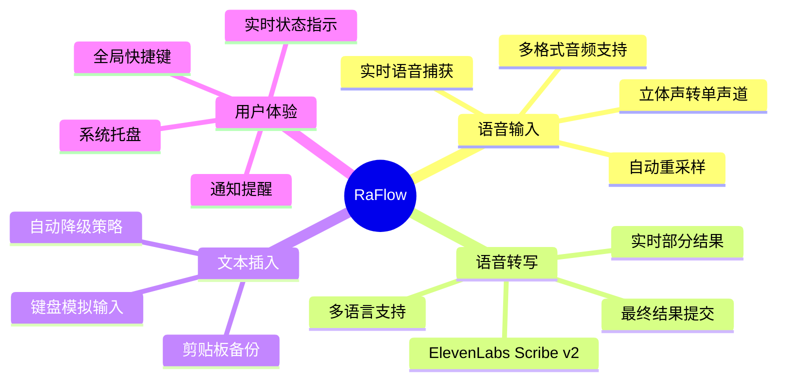
```mermaid
mindmap
  root((RaFlow))
    语音输入
      实时语音捕获
      多格式音频支持
      立体声转单声道
      自动重采样
    语音转写
      ElevenLabs Scribe v2
      多语言支持
      实时部分结果
      最终结果提交
    文本插入
      键盘模拟输入
      剪贴板备份
      自动降级策略
    用户体验
      全局快捷键
      系统托盘
      实时状态指示
      通知提醒
```

### 1.3 技术特点

| 特性 | 描述 |
|------|------|
| 跨平台 | 支持 Windows、macOS、Linux |
| 低延迟 | WebSocket 实时通信，延迟 <150ms |
| 多格式音频 | 支持 I16、F32、I32、U16 格式 |
| 智能降级 | 键盘输入失败自动切换剪贴板 |
| 配置持久化 | TOML 格式配置文件 |

---

## 2. 系统架构

### 2.1 整体架构图

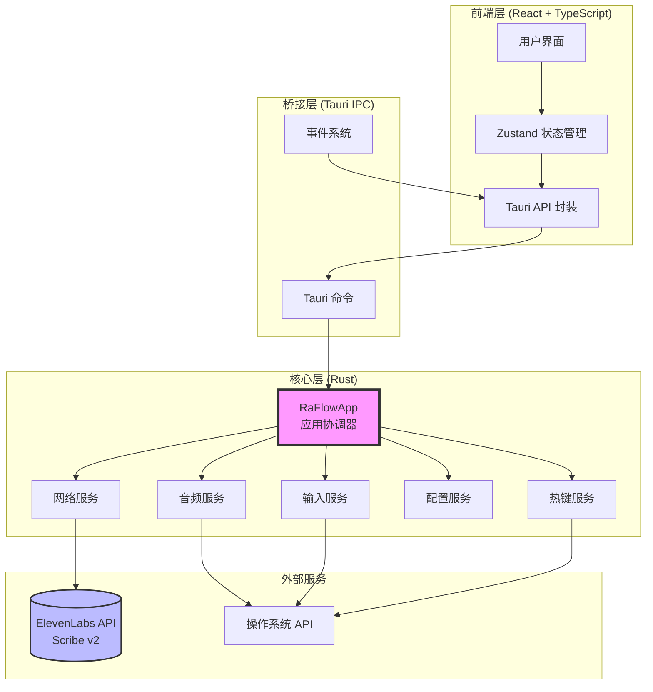
```mermaid
graph TB
    subgraph Frontend["前端层 (React + TypeScript)"]
        UI[用户界面]
        Stores[Zustand 状态管理]
        API[Tauri API 封装]
    end

    subgraph Bridge["桥接层 (Tauri IPC)"]
        Commands[Tauri 命令]
        Events[事件系统]
    end

    subgraph Core["核心层 (Rust)"]
        App[RaFlowApp<br/>应用协调器]
        Audio[音频服务]
        Network[网络服务]
        Input[输入服务]
        Config[配置服务]
        Hotkey[热键服务]
    end

    subgraph External["外部服务"]
        ElevenLabs[(ElevenLabs API<br/>Scribe v2)]
        OS[操作系统 API]
    end

    UI --> Stores
    Stores --> API
    API --> Commands
    Commands --> App
    Events --> API

    App --> Audio
    App --> Network
    App --> Input
    App --> Config
    App --> Hotkey

    Audio --> OS
    Input --> OS
    Hotkey --> OS
    Network --> ElevenLabs

    style App fill:#f9f,stroke:#333,stroke-width:4px
    style ElevenLabs fill:#bbf,stroke:#333,stroke-width:2px
```

### 2.2 模块依赖关系

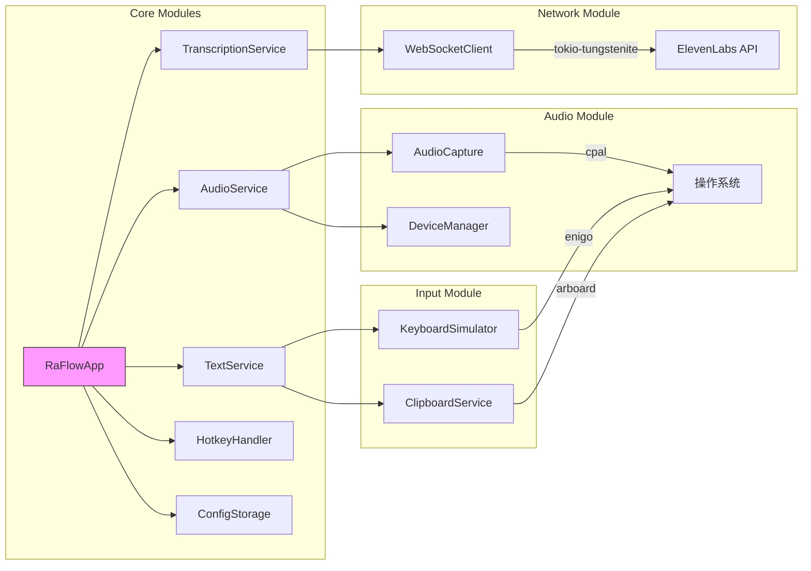
```mermaid
graph LR
    subgraph Core Modules
        RaFlowApp --> AudioService
        RaFlowApp --> TranscriptionService
        RaFlowApp --> TextService
        RaFlowApp --> HotkeyHandler
        RaFlowApp --> ConfigStorage
    end

    subgraph Audio Module
        AudioService --> AudioCapture
        AudioService --> DeviceManager
        AudioCapture --> |cpal| OS[操作系统]
    end

    subgraph Network Module
        TranscriptionService --> WebSocketClient
        WebSocketClient --> |tokio-tungstenite| API[ElevenLabs API]
    end

    subgraph Input Module
        TextService --> KeyboardSimulator
        TextService --> ClipboardService
        KeyboardSimulator --> |enigo| OS
        ClipboardService --> |arboard| OS
    end

    style RaFlowApp fill:#f9f,stroke:#333
```

### 2.3 目录结构

```
w3-raflow/
├── src/                          # 前端代码
│   ├── api/                      # Tauri API 封装
│   │   ├── index.ts
│   │   ├── tauri.ts             # 命令和事件
│   │   └── types.ts             # 类型定义
│   ├── components/               # React 组件
│   │   ├── Notification.tsx
│   │   ├── Settings.tsx
│   │   ├── StatusIndicator.tsx
│   │   └── settings/            # 设置子组件
│   ├── stores/                   # Zustand 状态
│   │   ├── audioStore.ts
│   │   ├── configStore.ts
│   │   └── uiStore.ts
│   ├── App.tsx
│   └── main.tsx
│
├── src-tauri/                    # Rust 后端
│   ├── src/
│   │   ├── core/                 # 核心模块
│   │   │   ├── app.rs           # RaFlowApp
│   │   │   ├── state.rs         # 应用状态
│   │   │   └── error.rs         # 错误类型
│   │   ├── audio/                # 音频模块
│   │   │   ├── capture.rs       # 音频捕获
│   │   │   ├── device.rs        # 设备枚举
│   │   │   └── service.rs       # 音频服务
│   │   ├── network/              # 网络模块
│   │   │   ├── protocol.rs      # 消息协议
│   │   │   ├── websocket.rs     # WS 客户端
│   │   │   └── transcription.rs # 转录服务
│   │   ├── input/                # 输入模块
│   │   │   ├── keyboard.rs      # 键盘模拟
│   │   │   ├── clipboard.rs     # 剪贴板
│   │   │   └── service.rs       # 文本服务
│   │   ├── config/               # 配置模块
│   │   │   ├── models.rs        # 配置模型
│   │   │   └── storage.rs       # 配置存储
│   │   ├── hotkey/               # 热键模块
│   │   │   ├── handler.rs       # 热键处理
│   │   │   └── manager.rs       # 热键管理
│   │   ├── commands/             # Tauri 命令
│   │   │   ├── audio.rs
│   │   │   ├── config.rs
│   │   │   ├── hotkey.rs
│   │   │   └── recording.rs
│   │   ├── tray/                 # 系统托盘
│   │   ├── main.rs
│   │   └── lib.rs
│   ├── Cargo.toml
│   └── tauri.conf.json
│
├── docs/
├── .github/workflows/
└── package.json
```

---

## 3. 核心模块设计

### 3.1 RaFlowApp - 应用协调器

`RaFlowApp` 是整个应用的核心，负责协调各服务之间的交互。

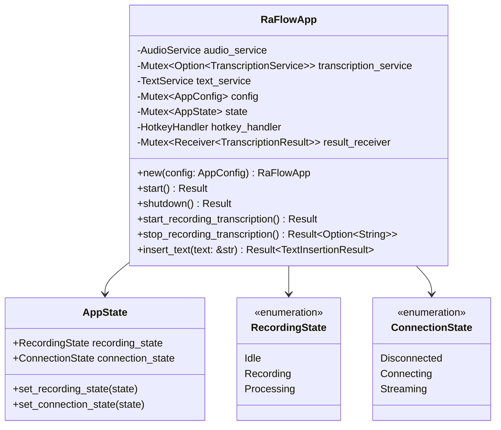
```mermaid
classDiagram
    class RaFlowApp {
        -AudioService audio_service
        -Mutex~Option~TranscriptionService~~ transcription_service
        -TextService text_service
        -Mutex~AppConfig~ config
        -Mutex~AppState~ state
        -HotkeyHandler hotkey_handler
        -Mutex~Receiver~TranscriptionResult~~ result_receiver
        +new(config: AppConfig) RaFlowApp
        +start() Result
        +shutdown() Result
        +start_recording_transcription() Result
        +stop_recording_transcription() Result~Option~String~~
        +insert_text(text: &str) Result~TextInsertionResult~
    }

    class AppState {
        +RecordingState recording_state
        +ConnectionState connection_state
        +set_recording_state(state)
        +set_connection_state(state)
    }

    class RecordingState {
        <<enumeration>>
        Idle
        Recording
        Processing
    }

    class ConnectionState {
        <<enumeration>>
        Disconnected
        Connecting
        Streaming
    }

    RaFlowApp --> AppState
    RaFlowApp --> RecordingState
    RaFlowApp --> ConnectionState
```

**核心方法流程：**

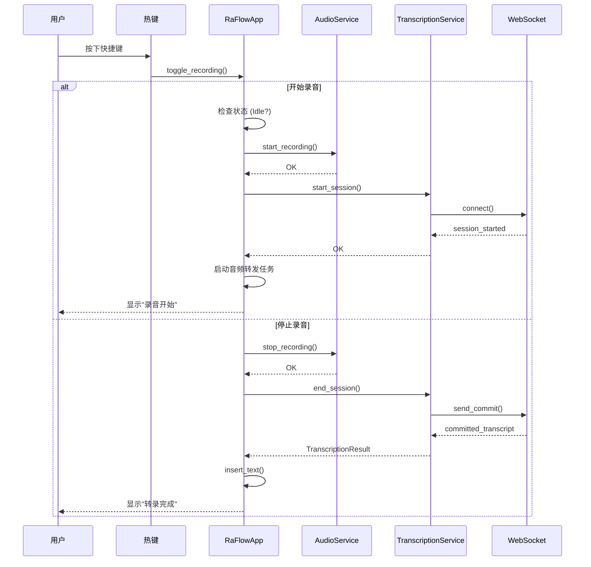
```mermaid
sequenceDiagram
    participant User as 用户
    participant Hotkey as 热键
    participant App as RaFlowApp
    participant Audio as AudioService
    participant Trans as TranscriptionService
    participant WS as WebSocket

    User->>Hotkey: 按下快捷键
    Hotkey->>App: toggle_recording()

    alt 开始录音
        App->>App: 检查状态 (Idle?)
        App->>Audio: start_recording()
        Audio-->>App: OK
        App->>Trans: start_session()
        Trans->>WS: connect()
        WS-->>Trans: session_started
        Trans-->>App: OK
        App->>App: 启动音频转发任务
        App-->>User: 显示"录音开始"
    else 停止录音
        App->>Audio: stop_recording()
        Audio-->>App: OK
        App->>Trans: end_session()
        Trans->>WS: send_commit()
        WS-->>Trans: committed_transcript
        Trans-->>App: TranscriptionResult
        App->>App: insert_text()
        App-->>User: 显示"转录完成"
    end
```

### 3.2 音频模块

#### 3.2.1 架构设计

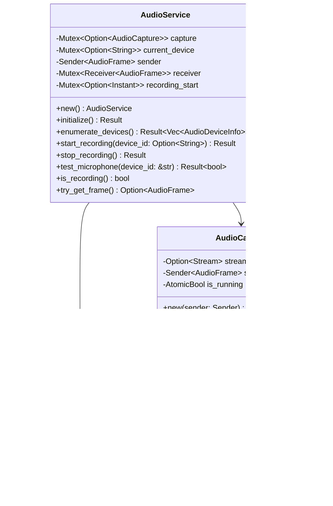
```mermaid
classDiagram
    class AudioService {
        -Mutex~Option~AudioCapture~~ capture
        -Mutex~Option~String~~ current_device
        -Sender~AudioFrame~ sender
        -Mutex~Receiver~AudioFrame~~ receiver
        -Mutex~Option~Instant~~ recording_start
        +new() AudioService
        +initialize() Result
        +enumerate_devices() Result~Vec~AudioDeviceInfo~~
        +start_recording(device_id: Option~String~) Result
        +stop_recording() Result
        +test_microphone(device_id: &str) Result~bool~
        +is_recording() bool
        +try_get_frame() Option~AudioFrame~
    }

    class AudioCapture {
        -Option~Stream~ stream
        -Sender~AudioFrame~ sender
        -AtomicBool is_running
        +new(sender: Sender) AudioCapture
        +start(device: &Device) Result
        +stop() Result
        +is_running() bool
    }

    class AudioFrame {
        +u64 timestamp
        +Vec~i16~ data
        +new(timestamp, data) AudioFrame
        +to_bytes() Vec~u8~
        +from_bytes(bytes) AudioFrame
        +duration_ms() u64
    }

    class AudioCaptureConfig {
        +u32 sample_rate
        +u16 channels
        +u32 buffer_size
    }

    AudioService --> AudioCapture
    AudioService --> AudioFrame
    AudioCapture --> AudioFrame
    AudioCapture --> AudioCaptureConfig
```

#### 3.2.2 音频处理流程

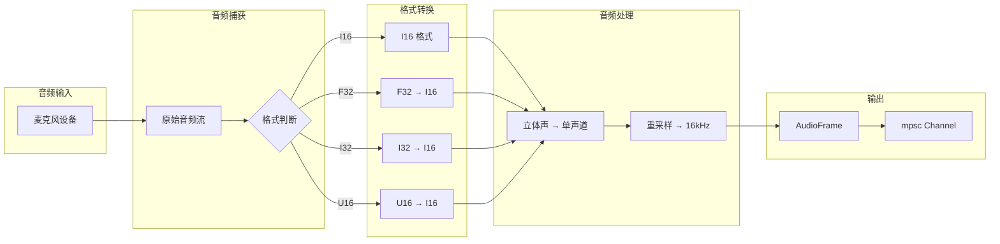
```mermaid
flowchart LR
    subgraph Input["音频输入"]
        Device[麦克风设备]
    end

    subgraph Capture["音频捕获"]
        Raw[原始音频流]
        Format{格式判断}
    end

    subgraph Convert["格式转换"]
        I16[I16 格式]
        F32[F32 → I16]
        I32[I32 → I16]
        U16[U16 → I16]
    end

    subgraph Process["音频处理"]
        Mono[立体声 → 单声道]
        Resample[重采样 → 16kHz]
    end

    subgraph Output["输出"]
        Frame[AudioFrame]
        Channel[mpsc Channel]
    end

    Device --> Raw
    Raw --> Format
    Format -->|I16| I16
    Format -->|F32| F32
    Format -->|I32| I32
    Format -->|U16| U16

    I16 --> Mono
    F32 --> Mono
    I32 --> Mono
    U16 --> Mono

    Mono --> Resample
    Resample --> Frame
    Frame --> Channel
```

#### 3.2.3 音频格式转换

```rust
/// 支持的音频格式转换
pub mod convert {
    /// f32 → i16
    pub fn f32_to_i16(samples: &[f32]) -> Vec<i16>;

    /// i32 → i16
    pub fn i32_to_i16(samples: &[i32]) -> Vec<i16>;

    /// u16 → i16
    pub fn u16_to_i16(samples: &[u16]) -> Vec<i16>;

    /// 立体声 → 单声道（通用）
    pub fn stereo_to_mono_n<T>(samples: &[T], channels: usize) -> Vec<T>;

    /// 立体声 → 单声道（f32）
    pub fn stereo_to_mono_f32(samples: &[f32], channels: usize) -> Vec<f32>;

    /// 重采样（线性插值）
    pub fn resample(data: &[i16], from_rate: u32, to_rate: u32) -> Vec<i16>;
}
```

### 3.3 网络模块

#### 3.3.1 架构设计

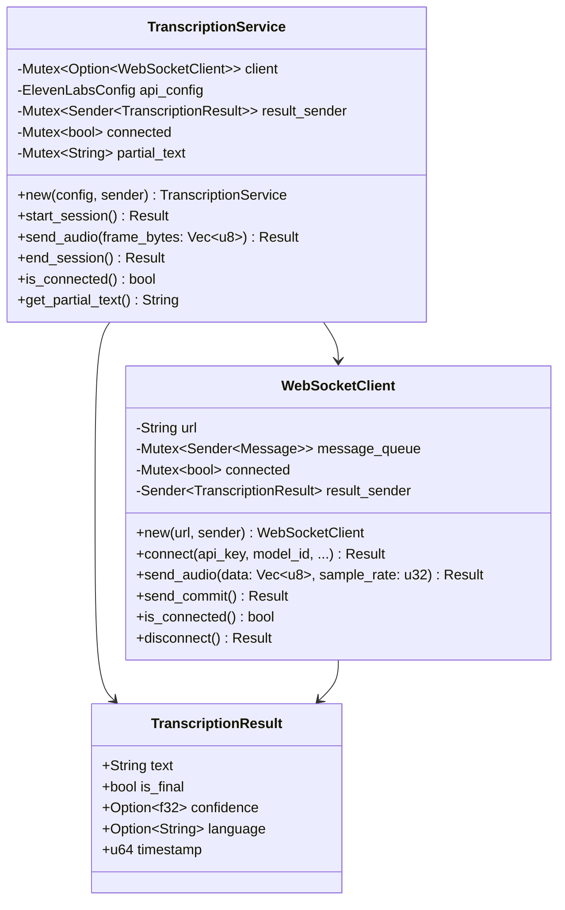
```mermaid
classDiagram
    class TranscriptionService {
        -Mutex~Option~WebSocketClient~~ client
        -ElevenLabsConfig api_config
        -Mutex~Sender~TranscriptionResult~~ result_sender
        -Mutex~bool~ connected
        -Mutex~String~ partial_text
        +new(config, sender) TranscriptionService
        +start_session() Result
        +send_audio(frame_bytes: Vec~u8~) Result
        +end_session() Result
        +is_connected() bool
        +get_partial_text() String
    }

    class WebSocketClient {
        -String url
        -Mutex~Sender~Message~~ message_queue
        -Mutex~bool~ connected
        -Sender~TranscriptionResult~ result_sender
        +new(url, sender) WebSocketClient
        +connect(api_key, model_id, ...) Result
        +send_audio(data: Vec~u8~, sample_rate: u32) Result
        +send_commit() Result
        +is_connected() bool
        +disconnect() Result
    }

    class TranscriptionResult {
        +String text
        +bool is_final
        +Option~f32~ confidence
        +Option~String~ language
        +u64 timestamp
    }

    TranscriptionService --> WebSocketClient
    TranscriptionService --> TranscriptionResult
    WebSocketClient --> TranscriptionResult
```

#### 3.3.2 WebSocket 通信流程

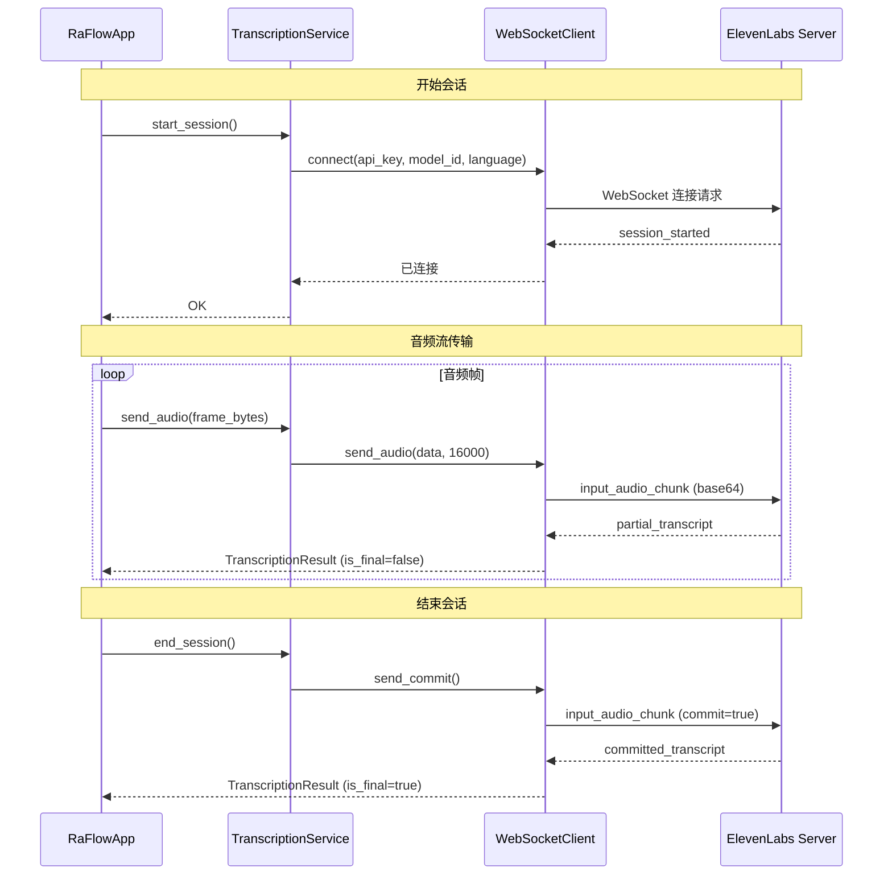
```mermaid
sequenceDiagram
    participant App as RaFlowApp
    participant TS as TranscriptionService
    participant WS as WebSocketClient
    participant Server as ElevenLabs Server

    Note over App,Server: 开始会话
    App->>TS: start_session()
    TS->>WS: connect(api_key, model_id, language)
    WS->>Server: WebSocket 连接请求
    Server-->>WS: session_started
    WS-->>TS: 已连接
    TS-->>App: OK

    Note over App,Server: 音频流传输
    loop 音频帧
        App->>TS: send_audio(frame_bytes)
        TS->>WS: send_audio(data, 16000)
        WS->>Server: input_audio_chunk (base64)
        Server-->>WS: partial_transcript
        WS-->>App: TranscriptionResult (is_final=false)
    end

    Note over App,Server: 结束会话
    App->>TS: end_session()
    TS->>WS: send_commit()
    WS->>Server: input_audio_chunk (commit=true)
    Server-->>WS: committed_transcript
    WS-->>App: TranscriptionResult (is_final=true)
```

### 3.4 输入模块

#### 3.4.1 文本插入策略

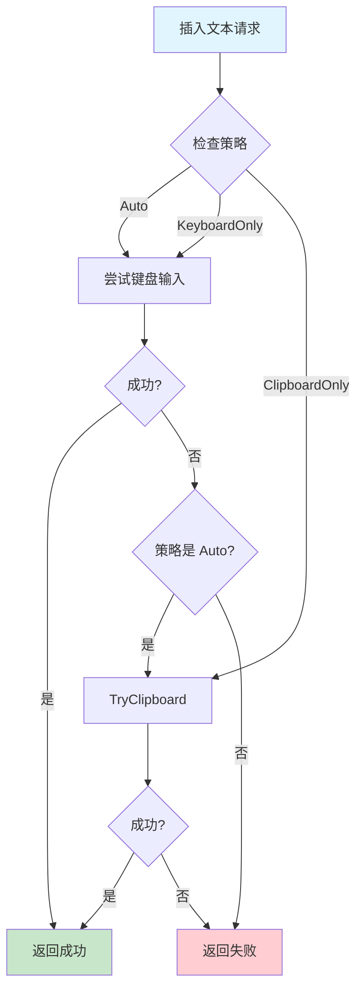
```mermaid
flowchart TD
    Start[插入文本请求] --> Check{检查策略}

    Check -->|Auto| TryKeyboard[尝试键盘输入]
    Check -->|KeyboardOnly| TryKeyboard
    Check -->|ClipboardOnly| TryClipboard

    TryKeyboard --> KeyboardResult{成功?}
    KeyboardResult -->|是| Success[返回成功]
    KeyboardResult -->|否| Fallback{策略是 Auto?}

    Fallback -->|是| TryClipboard
    Fallback -->|否| Failed[返回失败]

    TryClipboard --> ClipboardResult{成功?}
    ClipboardResult -->|是| Success
    ClipboardResult -->|否| Failed

    style Start fill:#e1f5fe
    style Success fill:#c8e6c9
    style Failed fill:#ffcdd2
```

#### 3.4.2 类设计

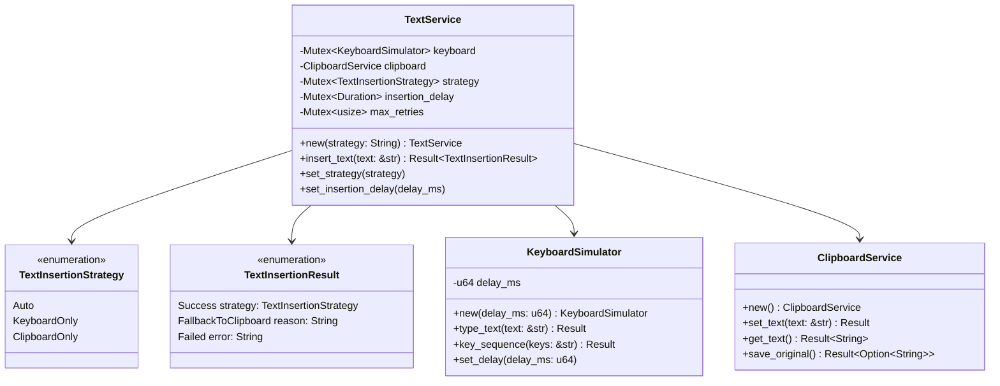
```mermaid
classDiagram
    class TextService {
        -Mutex~KeyboardSimulator~ keyboard
        -ClipboardService clipboard
        -Mutex~TextInsertionStrategy~ strategy
        -Mutex~Duration~ insertion_delay
        -Mutex~usize~ max_retries
        +new(strategy: String) TextService
        +insert_text(text: &str) Result~TextInsertionResult~
        +set_strategy(strategy)
        +set_insertion_delay(delay_ms)
    }

    class TextInsertionStrategy {
        <<enumeration>>
        Auto
        KeyboardOnly
        ClipboardOnly
    }

    class TextInsertionResult {
        <<enumeration>>
        Success strategy: TextInsertionStrategy
        FallbackToClipboard reason: String
        Failed error: String
    }

    class KeyboardSimulator {
        -u64 delay_ms
        +new(delay_ms: u64) KeyboardSimulator
        +type_text(text: &str) Result
        +key_sequence(keys: &str) Result
        +set_delay(delay_ms: u64)
    }

    class ClipboardService {
        +new() ClipboardService
        +set_text(text: &str) Result
        +get_text() Result~String~
        +save_original() Result~Option~String~~
    }

    TextService --> TextInsertionStrategy
    TextService --> TextInsertionResult
    TextService --> KeyboardSimulator
    TextService --> ClipboardService
```

### 3.5 热键模块

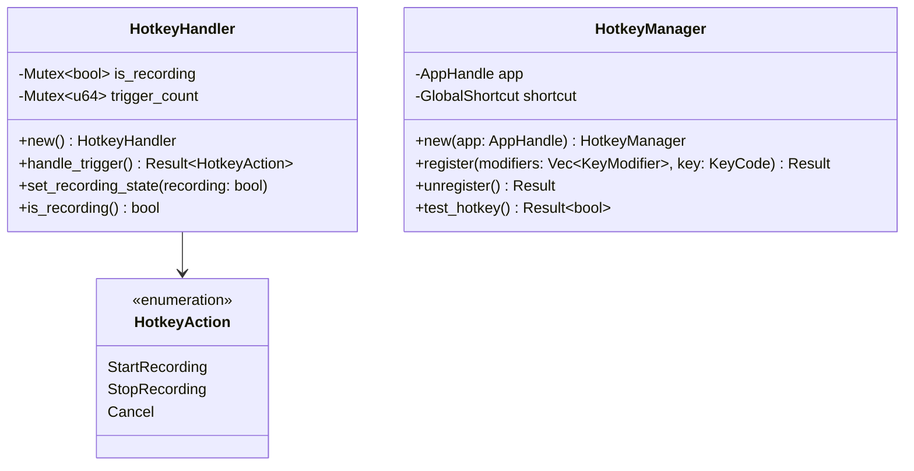
```mermaid
classDiagram
    class HotkeyHandler {
        -Mutex~bool~ is_recording
        -Mutex~u64~ trigger_count
        +new() HotkeyHandler
        +handle_trigger() Result~HotkeyAction~
        +set_recording_state(recording: bool)
        +is_recording() bool
    }

    class HotkeyAction {
        <<enumeration>>
        StartRecording
        StopRecording
        Cancel
    }

    class HotkeyManager {
        -AppHandle app
        -GlobalShortcut shortcut
        +new(app: AppHandle) HotkeyManager
        +register(modifiers: Vec~KeyModifier~, key: KeyCode) Result
        +unregister() Result
        +test_hotkey() Result~bool~
    }

    HotkeyHandler --> HotkeyAction
```

---

## 4. 数据流与状态机

### 4.1 录音状态机

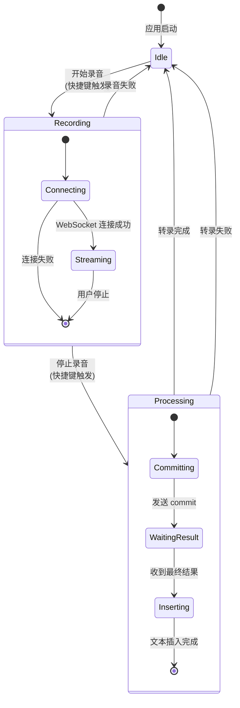
```mermaid
stateDiagram-v2
    [*] --> Idle: 应用启动

    Idle --> Recording: 开始录音<br/>(快捷键触发)
    Recording --> Idle: 录音失败
    Recording --> Processing: 停止录音<br/>(快捷键触发)

    Processing --> Idle: 转录完成
    Processing --> Idle: 转录失败

    state Recording {
        [*] --> Connecting
        Connecting --> Streaming: WebSocket 连接成功
        Connecting --> [*]: 连接失败
        Streaming --> [*]: 用户停止
    }

    state Processing {
        [*] --> Committing
        Committing --> WaitingResult: 发送 commit
        WaitingResult --> Inserting: 收到最终结果
        Inserting --> [*]: 文本插入完成
    }
```

### 4.2 完整数据流

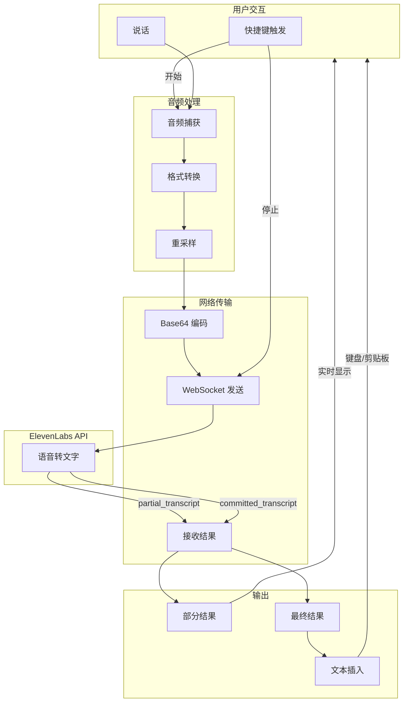
```mermaid
flowchart TB
    subgraph User["用户交互"]
        Hotkey[快捷键触发]
        Speak[说话]
    end

    subgraph Audio["音频处理"]
        Capture[音频捕获]
        Convert[格式转换]
        Resample[重采样]
    end

    subgraph Network["网络传输"]
        Encode[Base64 编码]
        WebSocket[WebSocket 发送]
        Receive[接收结果]
    end

    subgraph API["ElevenLabs API"]
        Transcribe[语音转文字]
    end

    subgraph Output["输出"]
        Partial[部分结果]
        Final[最终结果]
        Insert[文本插入]
    end

    Hotkey --> |开始| Capture
    Speak --> Capture
    Capture --> Convert
    Convert --> Resample
    Resample --> Encode
    Encode --> WebSocket
    WebSocket --> Transcribe

    Transcribe --> |partial_transcript| Receive
    Transcribe --> |committed_transcript| Receive

    Receive --> Partial
    Receive --> Final

    Partial --> |实时显示| User
    Final --> Insert
    Insert --> |键盘/剪贴板| User

    Hotkey --> |停止| WebSocket
```

### 4.3 事件流

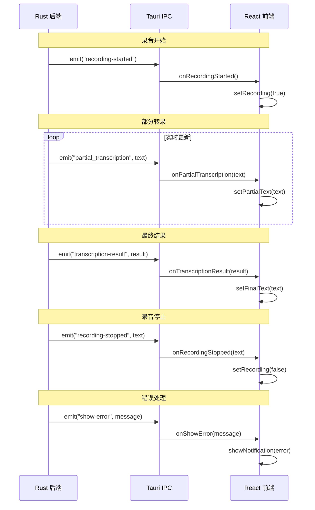
```mermaid
sequenceDiagram
    participant Backend as Rust 后端
    participant IPC as Tauri IPC
    participant Frontend as React 前端

    Note over Backend,Frontend: 录音开始
    Backend->>IPC: emit("recording-started")
    IPC->>Frontend: onRecordingStarted()
    Frontend->>Frontend: setRecording(true)

    Note over Backend,Frontend: 部分转录
    loop 实时更新
        Backend->>IPC: emit("partial_transcription", text)
        IPC->>Frontend: onPartialTranscription(text)
        Frontend->>Frontend: setPartialText(text)
    end

    Note over Backend,Frontend: 最终结果
    Backend->>IPC: emit("transcription-result", result)
    IPC->>Frontend: onTranscriptionResult(result)
    Frontend->>Frontend: setFinalText(text)

    Note over Backend,Frontend: 录音停止
    Backend->>IPC: emit("recording-stopped", text)
    IPC->>Frontend: onRecordingStopped(text)
    Frontend->>Frontend: setRecording(false)

    Note over Backend,Frontend: 错误处理
    Backend->>IPC: emit("show-error", message)
    IPC->>Frontend: onShowError(message)
    Frontend->>Frontend: showNotification(error)
```

---

## 5. 网络协议

### 5.1 ElevenLabs WebSocket API

**连接 URL:**
```
wss://api.elevenlabs.io/v1/speech-to-text/realtime
```

**查询参数:**
| 参数 | 说明 | 示例 |
|------|------|------|
| `model_id` | 模型标识 | `scribe_v2_realtime` |
| `audio_format` | 音频格式 | `pcm_16000` |
| `language_code` | 语言代码 (ISO 639-3) | `zho`, `eng` |
| `commit_strategy` | 提交策略 | `manual` |

### 5.2 消息协议

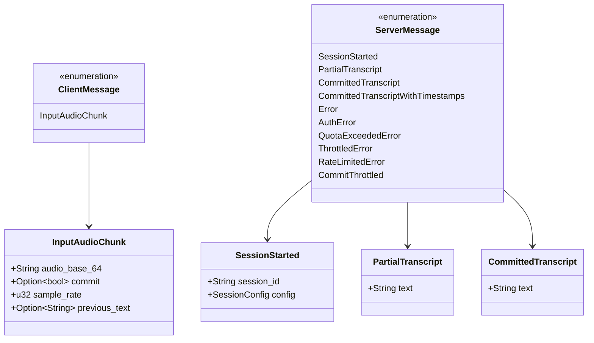
```mermaid
classDiagram
    class ClientMessage {
        <<enumeration>>
        InputAudioChunk
    }

    class InputAudioChunk {
        +String audio_base_64
        +Option~bool~ commit
        +u32 sample_rate
        +Option~String~ previous_text
    }

    class ServerMessage {
        <<enumeration>>
        SessionStarted
        PartialTranscript
        CommittedTranscript
        CommittedTranscriptWithTimestamps
        Error
        AuthError
        QuotaExceededError
        ThrottledError
        RateLimitedError
        CommitThrottled
    }

    class SessionStarted {
        +String session_id
        +SessionConfig config
    }

    class PartialTranscript {
        +String text
    }

    class CommittedTranscript {
        +String text
    }

    ClientMessage --> InputAudioChunk
    ServerMessage --> SessionStarted
    ServerMessage --> PartialTranscript
    ServerMessage --> CommittedTranscript
```

### 5.3 消息示例

**发送音频块:**
```json
{
  "message_type": "input_audio_chunk",
  "audio_base_64": "//uQxAAAAANIAAAA...",
  "sample_rate": 16000
}
```

**提交转录:**
```json
{
  "message_type": "input_audio_chunk",
  "audio_base_64": "",
  "commit": true,
  "sample_rate": 16000
}
```

**接收部分结果:**
```json
{
  "message_type": "partial_transcript",
  "text": "你好世界"
}
```

**接收最终结果:**
```json
{
  "message_type": "committed_transcript",
  "text": "你好世界，这是一个测试"
}
```

---

## 6. 前端设计

### 6.1 组件结构

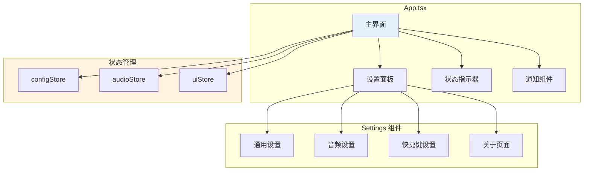
```mermaid
graph TB
    subgraph App["App.tsx"]
        Main[主界面]
        Settings[设置面板]
        Status[状态指示器]
        Notification[通知组件]
    end

    subgraph SettingsPanel["Settings 组件"]
        General[通用设置]
        Audio[音频设置]
        Hotkey[快捷键设置]
        About[关于页面]
    end

    subgraph Stores["状态管理"]
        ConfigStore[configStore]
        AudioStore[audioStore]
        UIStore[uiStore]
    end

    Main --> Settings
    Main --> Status
    Main --> Notification

    Settings --> General
    Settings --> Audio
    Settings --> Hotkey
    Settings --> About

    Main --> ConfigStore
    Main --> AudioStore
    Main --> UIStore

    style Main fill:#e3f2fd
    style Stores fill:#fff3e0
```

### 6.2 状态管理

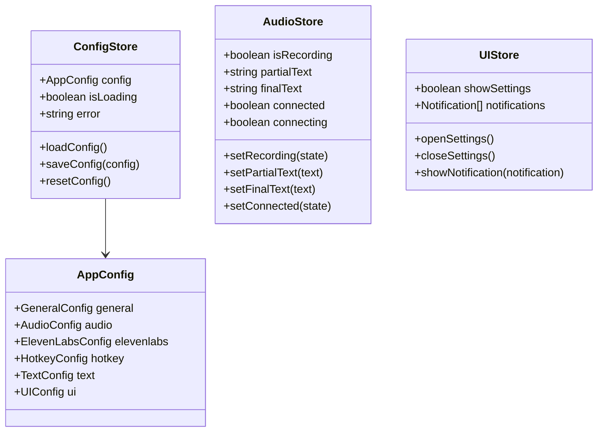
```mermaid
classDiagram
    class ConfigStore {
        +AppConfig config
        +boolean isLoading
        +string error
        +loadConfig()
        +saveConfig(config)
        +resetConfig()
    }

    class AudioStore {
        +boolean isRecording
        +string partialText
        +string finalText
        +boolean connected
        +boolean connecting
        +setRecording(state)
        +setPartialText(text)
        +setFinalText(text)
        +setConnected(state)
    }

    class UIStore {
        +boolean showSettings
        +Notification[] notifications
        +openSettings()
        +closeSettings()
        +showNotification(notification)
    }

    class AppConfig {
        +GeneralConfig general
        +AudioConfig audio
        +ElevenLabsConfig elevenlabs
        +HotkeyConfig hotkey
        +TextConfig text
        +UIConfig ui
    }

    ConfigStore --> AppConfig
```

### 6.3 事件监听

```typescript
// 前端事件监听器
const eventListeners = {
  // 录音事件
  "recording-started": () => setRecording(true),
  "recording-stopped": (text) => setRecording(false),

  // 转录事件
  "transcription-result": (result) => {
    if (result.is_final) setFinalText(result.text);
  },
  "partial_transcription": (text) => setPartialText(text),

  // 连接事件
  "connection-state-changed": (connected) => setConnected(connected),

  // 错误事件
  "show-error": (error) => showNotification({ type: "error", message: error }),
  "error": (error) => showNotification({ type: "error", message: error }),
};
```

---

## 7. 配置系统

### 7.1 配置模型

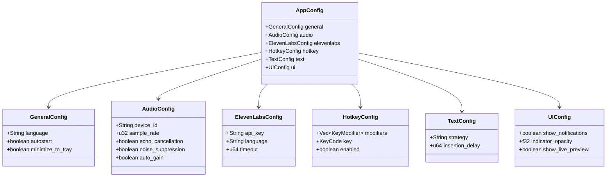
```mermaid
classDiagram
    class AppConfig {
        +GeneralConfig general
        +AudioConfig audio
        +ElevenLabsConfig elevenlabs
        +HotkeyConfig hotkey
        +TextConfig text
        +UIConfig ui
    }

    class GeneralConfig {
        +String language
        +boolean autostart
        +boolean minimize_to_tray
    }

    class AudioConfig {
        +String device_id
        +u32 sample_rate
        +boolean echo_cancellation
        +boolean noise_suppression
        +boolean auto_gain
    }

    class ElevenLabsConfig {
        +String api_key
        +String language
        +u64 timeout
    }

    class HotkeyConfig {
        +Vec~KeyModifier~ modifiers
        +KeyCode key
        +boolean enabled
    }

    class TextConfig {
        +String strategy
        +u64 insertion_delay
    }

    class UIConfig {
        +boolean show_notifications
        +f32 indicator_opacity
        +boolean show_live_preview
    }

    AppConfig --> GeneralConfig
    AppConfig --> AudioConfig
    AppConfig --> ElevenLabsConfig
    AppConfig --> HotkeyConfig
    AppConfig --> TextConfig
    AppConfig --> UIConfig
```

### 7.2 默认配置

```toml
# ~/.config/raflow/config.toml

[general]
language = "zh-CN"
autostart = false
minimize_to_tray = true

[audio]
device_id = ""
sample_rate = 16000
echo_cancellation = true
noise_suppression = true
auto_gain = true

[elevenlabs]
api_key = ""
language = "zho"  # ISO 639-3
timeout = 30

[hotkey]
modifiers = ["Ctrl", "Shift"]
key = "o"
enabled = true

[text]
strategy = "auto"  # auto | keyboard | clipboard
insertion_delay = 100

[ui]
show_notifications = true
indicator_opacity = 0.9
show_live_preview = true
```

### 7.3 语言代码映射

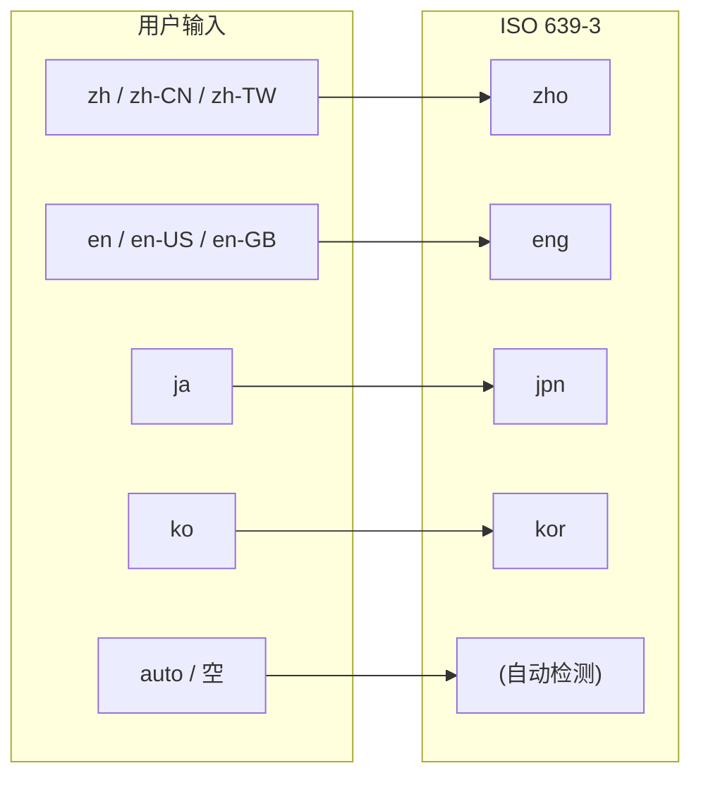
```mermaid
flowchart LR
    subgraph Input["用户输入"]
        ZH["zh / zh-CN / zh-TW"]
        EN["en / en-US / en-GB"]
        JA["ja"]
        KO["ko"]
        AUTO["auto / 空"]
    end

    subgraph Output["ISO 639-3"]
        ZHO["zho"]
        ENG["eng"]
        JPN["jpn"]
        KOR["kor"]
        EMPTY["(自动检测)"]
    end

    ZH --> ZHO
    EN --> ENG
    JA --> JPN
    KO --> KOR
    AUTO --> EMPTY
```

---

## 8. 错误处理

### 8.1 错误类型层次

```mermaid
classDiagram
    class AppError {
        <<enumeration>>
        Audio(AudioError)
        Network(NetworkError)
        Input(InputError)
        Config(ConfigError)
        Other(String)
    }

    class AudioError {
        <<enumeration>>
        DeviceUnavailable(String)
        RecordingFailed(String)
        StreamError(String)
        UnsupportedFormat(String)
    }

    class NetworkError {
        <<enumeration>>
        ConnectionFailed(String)
        SendFailed(String)
        ReceiveFailed(String)
        AuthFailed(String)
    }

    class InputError {
        <<enumeration>>
        KeyboardError(String)
        ClipboardError(String)
        Other(String)
    }

    class ConfigError {
        <<enumeration>>
        LoadFailed(String)
        SaveFailed(String)
        InvalidConfig(String)
    }

    AppError --> AudioError
    AppError --> NetworkError
    AppError --> InputError
    AppError --> ConfigError
```

### 8.2 错误处理流程

```mermaid
flowchart TD
    Error[发生错误] --> Type{错误类型}

    Type -->|音频错误| Audio[AudioError]
    Type -->|网络错误| Network[NetworkError]
    Type -->|输入错误| Input[InputError]
    Type -->|配置错误| Config[ConfigError]

    Audio --> AudioHandler{可恢复?}
    Network --> NetworkHandler{可恢复?}
    Input --> InputHandler{可恢复?}
    Config --> ConfigHandler{可恢复?}

    AudioHandler -->|是| Retry[重试操作]
    AudioHandler -->|否| Notify[通知用户]

    NetworkHandler -->|是| Reconnect[重新连接]
    NetworkHandler -->|否| Notify

    InputHandler -->|是| Fallback[降级策略]
    InputHandler -->|否| Notify

    ConfigHandler -->|是| Reset[重置配置]
    ConfigHandler -->|否| Notify

    Retry --> Resume[继续执行]
    Reconnect --> Resume
    Fallback --> Resume
    Reset --> Resume

    Notify --> Log[记录日志]
    Log --> Show[显示错误消息]

    style Error fill:#ffcdd2
    style Resume fill:#c8e6c9
    style Notify fill:#fff9c4
```

### 8.3 用户友好的错误消息

| 错误场景 | 技术错误 | 用户消息 |
|----------|----------|----------|
| API Key 未配置 | `api_key.is_empty()` | "请先在设置中配置 ElevenLabs API Key" |
| 无音频设备 | `devices.is_empty()` | "未检测到可用的音频输入设备" |
| WebSocket 连接失败 | `ConnectionFailed` | "无法连接到转录服务，请检查网络" |
| 认证失败 | `AuthError` | "API Key 无效，请检查配置" |
| 配额超限 | `QuotaExceededError` | "API 调用配额已用尽" |
| 键盘输入失败 | `KeyboardError` | "键盘输入失败，已复制到剪贴板" |

---

## 9. 技术栈

### 9.1 后端技术栈 (Rust)

```mermaid
mindmap
  root((Rust 后端))
    框架
      Tauri 2.1
      tokio 1.49+
    音频
      cpal 0.17
      跨平台音频 I/O
    网络
      tokio-tungstenite 0.28
      WebSocket 客户端
      TLS 支持
    输入
      enigo 0.3
      键盘模拟
      arboard 3.6
      剪贴板操作
    序列化
      serde 1.0
      serde_json
      toml
    其他
      thiserror 2.0
      tracing 0.1
      base64
```

### 9.2 前端技术栈 (TypeScript/React)

```mermaid
mindmap
  root((前端))
    框架
      React 18.3
      TypeScript 5.7
    状态管理
      Zustand 5.0
    UI
      TailwindCSS 3.4
      Lucide React 图标
    构建
      Vite 6.0
    Tauri
      @tauri-apps/api 2.1
```

### 9.3 依赖版本表

#### Rust 依赖

| 依赖 | 版本 | 用途 |
|------|------|------|
| `tauri` | 2.1 | 应用框架 |
| `tauri-plugin-global-shortcut` | 2.0 | 全局快捷键 |
| `tokio` | 1.49+ | 异步运行时 |
| `tokio-tungstenite` | 0.28 | WebSocket |
| `cpal` | 0.17 | 音频 I/O |
| `enigo` | 0.3 | 键盘模拟 |
| `arboard` | 3.6 | 剪贴板 |
| `serde` | 1.0 | 序列化 |
| `thiserror` | 2.0 | 错误处理 |
| `tracing` | 0.1 | 日志 |
| `base64` | 0.22 | Base64 编码 |

#### 前端依赖

| 依赖 | 版本 | 用途 |
|------|------|------|
| `@tauri-apps/api` | 2.1.0 | Tauri API |
| `react` | 18.3.1 | UI 框架 |
| `zustand` | 5.0.0 | 状态管理 |
| `lucide-react` | 0.468.0 | 图标 |
| `tailwindcss` | 3.4.0 | CSS |
| `vite` | 6.0.0 | 构建工具 |
| `typescript` | 5.7.0 | 类型系统 |

---

## 10. 未来规划

### 10.1 短期优化

```mermaid
timeline
    title RaFlow 发展路线图
    section Q1 2026
        性能优化 : 减少音频延迟
        : 优化内存使用
        用户体验 : 添加音量指示器
        : 改进错误提示
    section Q2 2026
        功能增强 : 支持 VAD 自动提交
        : 添加历史记录
        平台支持 : Wayland 支持
        : ARM64 支持
    section Q3 2026
        高级功能 : 多语言切换
        : 自定义词汇表
        集成 : VS Code 插件
        : 输入法集成
```

### 10.2 架构演进

```mermaid
graph LR
    subgraph Current["当前架构"]
        A1[单进程]
        A2[直接 API 调用]
        A3[本地配置]
    end

    subgraph Future["未来架构"]
        B1[多进程支持]
        B2[插件系统]
        B3[云同步配置]
        B4[离线模型支持]
    end

    Current --> |演进| Future
```

### 10.3 技术债务

| 优先级 | 项目 | 描述 |
|--------|------|------|
| 高 | 测试覆盖 | 增加单元测试和集成测试 |
| 高 | 错误处理 | 统一错误处理策略 |
| 中 | 日志系统 | 结构化日志，支持日志级别配置 |
| 中 | 配置验证 | 添加配置 JSON Schema 验证 |
| 低 | 性能监控 | 添加性能指标收集 |

---

## 附录

### A. Tauri 命令列表

| 命令 | 说明 | 参数 |
|------|------|------|
| `get_config` | 获取配置 | - |
| `save_config` | 保存配置 | `config: AppConfig` |
| `reset_config` | 重置配置 | - |
| `get_audio_devices` | 获取音频设备 | - |
| `start_recording` | 开始录音 | `device_id: Option<String>` |
| `stop_recording` | 停止录音 | - |
| `toggle_recording` | 切换录音 | - |
| `test_microphone` | 测试麦克风 | `device_id: String` |
| `register_hotkey` | 注册热键 | `modifiers: Vec<String>, key: String` |
| `unregister_hotkey` | 注销热键 | - |
| `check_for_updates` | 检查更新 | - |

### B. 事件列表

| 事件 | 负载 | 触发时机 |
|------|------|----------|
| `recording-started` | - | 录音开始 |
| `recording-stopped` | `text?: string` | 录音停止 |
| `transcription-result` | `TranscriptionResult` | 收到最终转录 |
| `partial_transcription` | `string` | 收到部分转录 |
| `connection-state-changed` | `boolean` | 连接状态变化 |
| `show-error` | `string` | 需要显示错误 |
| `error` | `string` | 发生错误 |
| `hotkey-triggered` | - | 热键触发 |

### C. 配置文件路径

| 平台 | 路径 |
|------|------|
| Linux | `~/.config/raflow/config.toml` |
| macOS | `~/Library/Application Support/raflow/config.toml` |
| Windows | `%APPDATA%\raflow\config.toml` |

---

*文档版本: 2.0*
*最后更新: 2026-02-27*
*基于 w3-raflow 代码库分析*
