# Codex 架构分析文档

> 本文档基于 OpenAI Codex CLI 源码进行深度分析，详细介绍其架构设计、核心模块、数据流和技术栈。

## 1. 项目概述

Codex 是 OpenAI 开发的本地 AI 编码助手，采用 Rust 语言编写核心逻辑，提供终端用户界面（TUI）和命令行界面（CLI）两种交互方式。该项目支持与多种 AI 模型（OpenAI、Ollama、LM Studio 等）集成，并通过 MCP（Model Context Protocol）协议实现工具扩展。

### 1.1 项目规模

| 指标 | 数值 |
|------|------|
| 核心 Rust 代码行数 | ~107,266 行 |
| Rust Crates 数量 | 50+ 个 |
| 主要编程语言 | Rust (Edition 2024), TypeScript |
| 构建系统 | Bazel, Cargo |

---

## 2. 整体架构

### 2.1 系统架构图

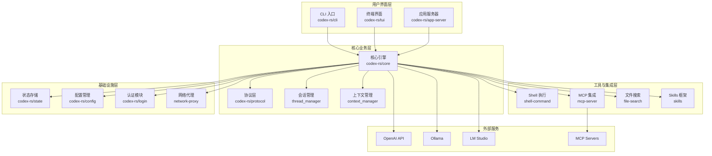

### 2.2 分层架构说明

| 层级 | 职责 | 主要模块 |
|------|------|----------|
| **用户界面层** | 处理用户交互，渲染界面 | cli, tui, app-server |
| **核心业务层** | 实现核心 AI 对话逻辑 | core, protocol, thread_manager |
| **工具与集成层** | 提供工具调用和外部集成 | shell-command, mcp-server, file-search |
| **基础设施层** | 提供持久化、配置、认证等基础能力 | state, config, login |

---

## 3. 目录结构

### 3.1 顶层目录

```
venders/codex/
├── codex-cli/          # Node.js CLI 包装器
├── codex-rs/           # Rust 核心代码 (主要业务逻辑)
├── sdk/                # SDK 组件
├── shell-tool-mcp/     # MCP Shell 工具
└── docs/               # 文档
```

### 3.2 核心模块结构 (codex-rs)

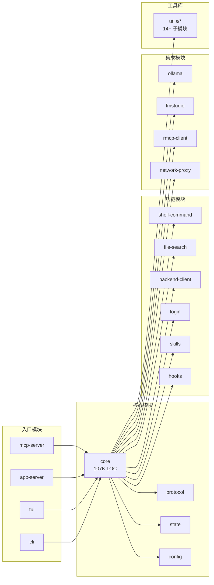

---

## 4. 核心模块详解

### 4.1 CLI 模块 (codex-rs/cli)

CLI 是系统的入口点，提供多种子命令：

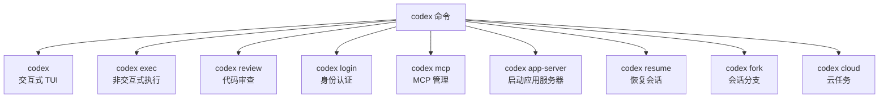

**主要子命令说明：**

| 命令 | 功能 | 使用场景 |
|------|------|----------|
| `codex` | 启动交互式 TUI | 日常编码辅助 |
| `codex exec` | 非交互式执行 | 脚本集成、CI/CD |
| `codex review` | 代码审查 | PR 审查、代码质量检查 |
| `codex login` | 身份认证 | 首次使用、更换账户 |
| `codex mcp-server` | 作为 MCP 服务器运行 | 与其他 AI 工具集成 |
| `codex app-server` | 启动应用服务器 | IDE 扩展集成 |
| `codex resume` | 恢复会话 | 继续之前的工作 |
| `codex fork` | 创建会话分支 | 探索不同方案 |

### 4.2 核心引擎 (codex-rs/core)

核心引擎是整个系统的核心，包含约 107,266 行代码，负责：

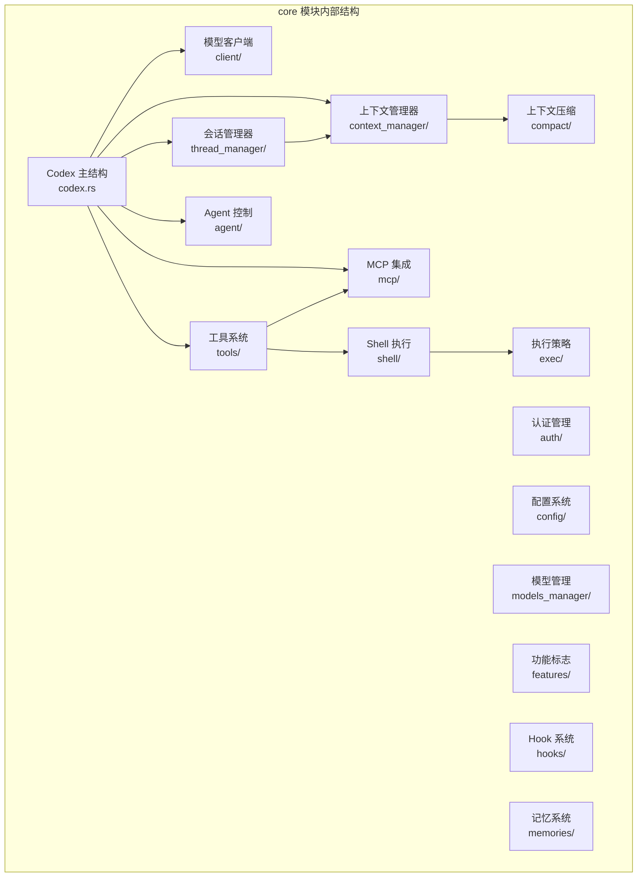

#### 4.2.1 Codex 主结构

`Codex` 是核心结构体，负责：
- 管理与 AI 模型的实时对话
- 协调各个子系统（工具、MCP、Shell 等）
- 处理事件流和消息分发

#### 4.2.2 会话管理器 (ThreadManager)

负责：
- 创建和管理会话（CodexThread）
- 会话持久化和恢复
- 会话分支（fork）功能

#### 4.2.3 上下文管理器 (ContextManager)

负责：
- 管理发送给模型的上下文窗口大小
- 触发上下文压缩
- 保持对话连贯性

### 4.3 协议层 (codex-rs/protocol)

协议层定义了系统中的核心数据类型：

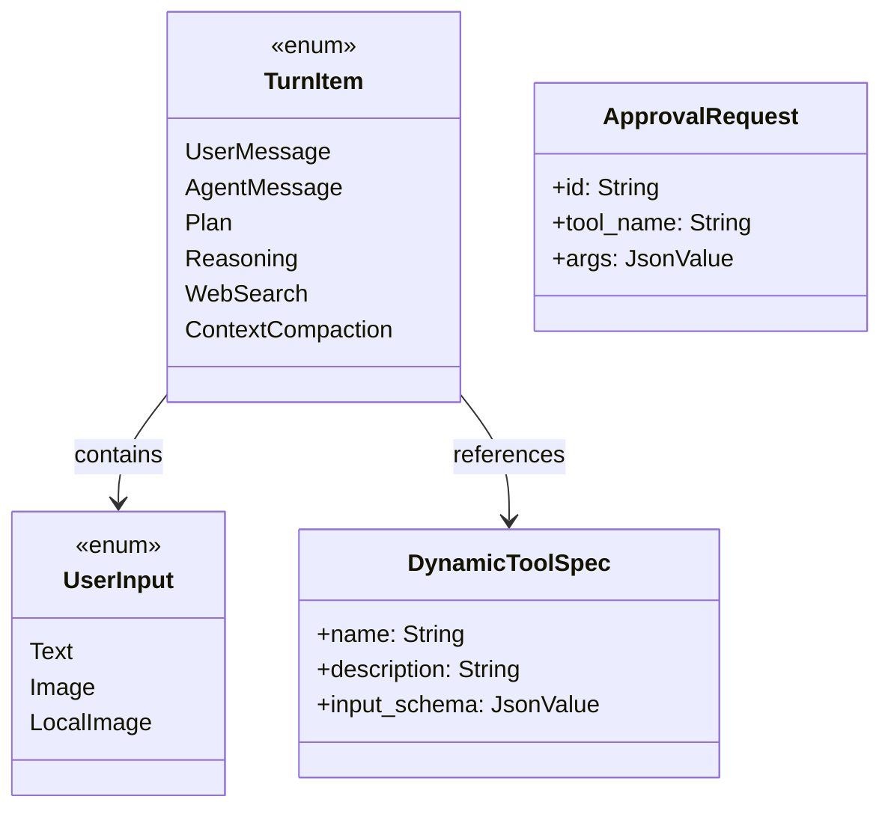

**核心类型说明：**

| 类型 | 用途 |
|------|------|
| `TurnItem` | 对话中的每一项（用户消息、AI 响应、计划等） |
| `UserInput` | 用户输入类型（文本、远程图片、本地图片） |
| `DynamicToolSpec` | 动态工具规范定义 |
| `ApprovalRequest` | 工具执行审批请求 |

### 4.4 TUI 模块 (codex-rs/tui)

终端用户界面模块，基于 Ratatui 框架构建：

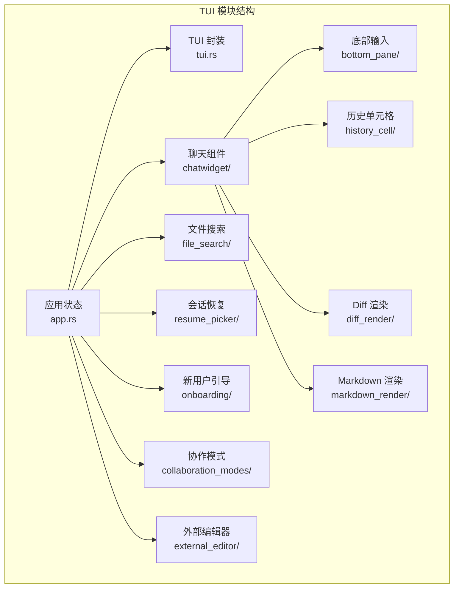

**主要组件说明：**

| 组件 | 功能 |
|------|------|
| `app.rs` | 主应用状态机和事件循环 |
| `chatwidget/` | 聊天消息显示和交互 |
| `bottom_pane/` | 用户输入区域 |
| `history_cell/` | 历史消息渲染 |
| `diff_render/` | 代码差异可视化 |
| `markdown_render/` | Markdown 内容渲染 |

---

## 5. 核心业务流程

### 5.1 会话生命周期

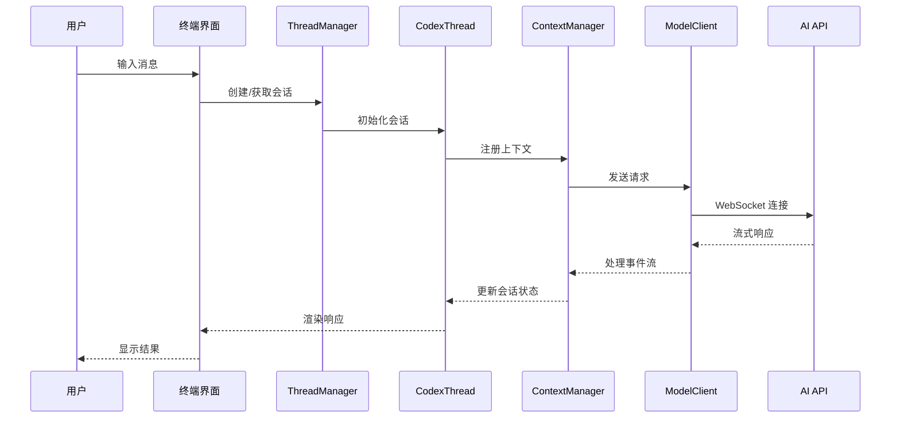

### 5.2 工具调用流程

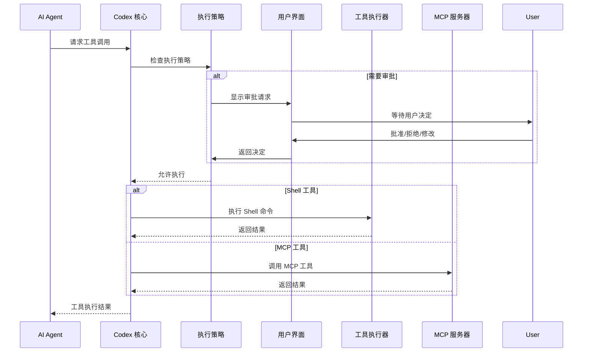

### 5.3 上下文管理流程

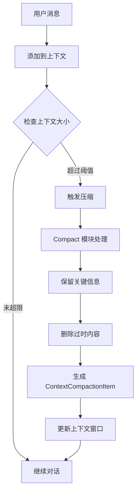

### 5.4 MCP 集成流程

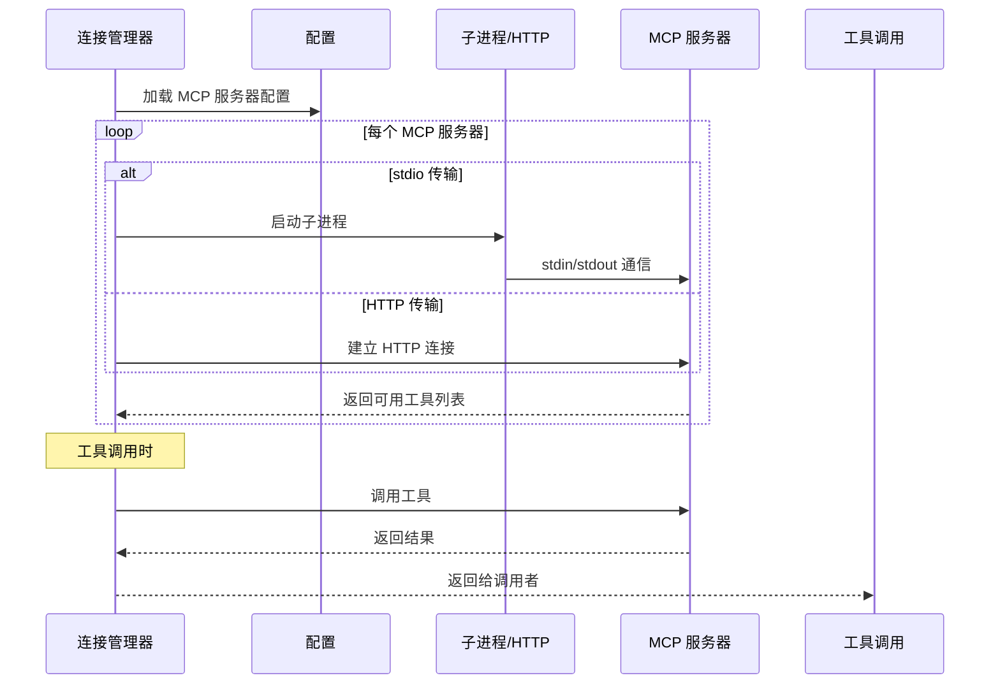

---

## 6. 配置系统

### 6.1 配置类型

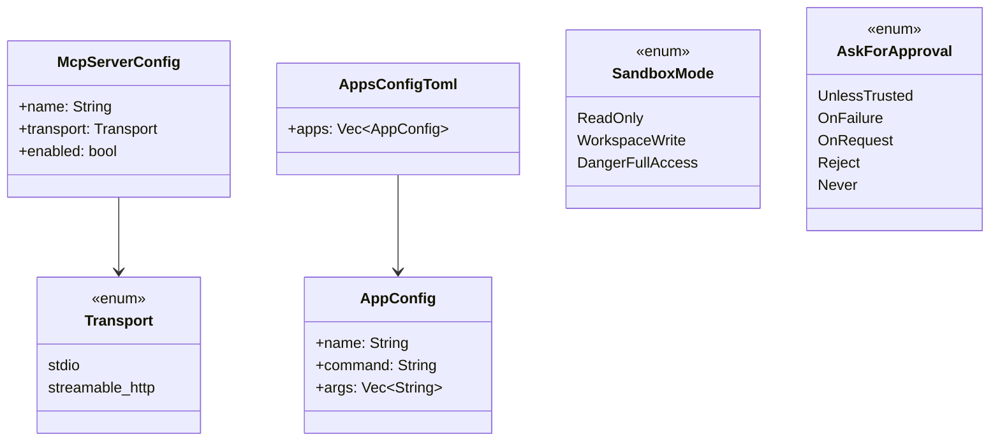

### 6.2 沙盒模式

| 模式 | 权限 | 使用场景 |
|------|------|----------|
| `ReadOnly` | 只读文件系统 | 安全审查模式 |
| `WorkspaceWrite` | 工作区可写 | 日常开发（默认） |
| `DangerFullAccess` | 完全访问 | 信任的环境 |

### 6.3 审批策略

| 策略 | 行为 |
|------|------|
| `UnlessTrusted` | 除非是信任的项目，否则请求审批 |
| `OnFailure` | 执行失败时请求审批 |
| `OnRequest` | 按需请求审批 |
| `Reject` | 自动拒绝（可配置具体行为） |
| `Never` | 从不请求审批 |

---

## 7. 工具系统

### 7.1 工具类型

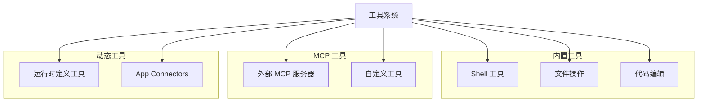

### 7.2 Shell 命令执行

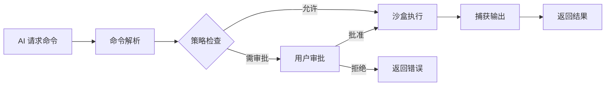

---

## 8. MCP 协议集成

### 8.1 MCP 架构

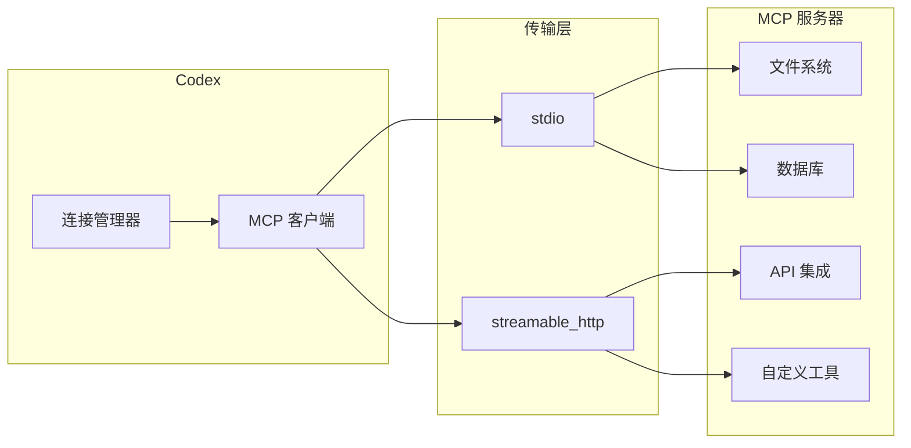

### 8.2 MCP 功能

- **工具 (Tools)**: 可调用的函数
- **资源 (Resources)**: 可读取的数据
- **提示词 (Prompts)**: 预定义的提示模板

---

## 9. 技术栈

### 9.1 核心依赖

| 类别 | 依赖 | 用途 |
|------|------|------|
| **异步运行时** | tokio | 异步任务调度 |
| **UI 框架** | ratatui | 终端界面渲染 |
| **序列化** | serde, serde_json | JSON/TOML 序列化 |
| **网络** | reqwest, tokio-tungstenite | HTTP/WebSocket 通信 |
| **数据库** | sqlx | SQLite 持久化 |
| **CLI** | clap | 命令行解析 |
| **沙盒** | landlock, seccompiler | Linux 安全沙盒 |
| **认证** | keyring | 密钥存储 |
| **搜索** | nucleo, ignore | 文件搜索和忽略 |
| **解析** | tree-sitter, tree-sitter-bash | 语法解析 |
| **渲染** | pulldown-cmark, syntect | Markdown/语法高亮 |
| **遥测** | opentelemetry | 可观测性 |

### 9.2 构建系统

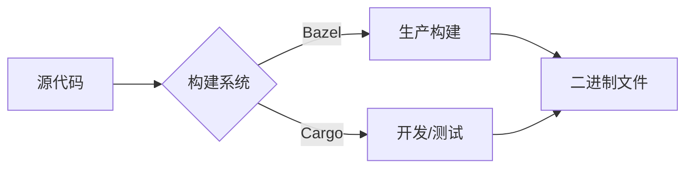

---

## 10. 安全架构

### 10.1 多层安全模型

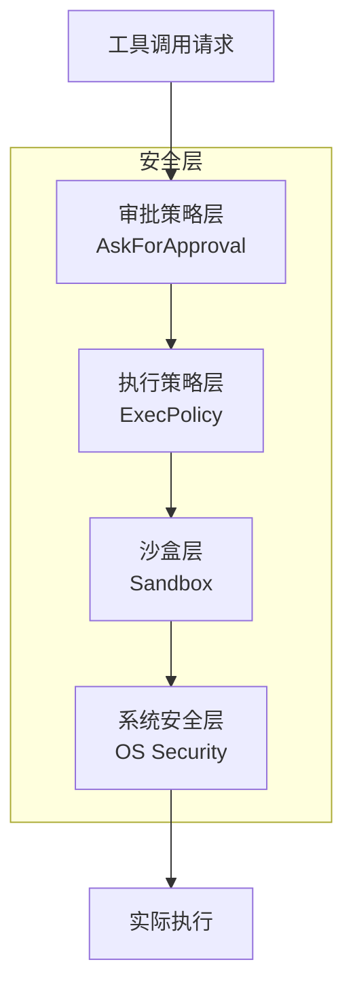

### 10.2 平台特定沙盒

| 平台 | 沙盒技术 |
|------|----------|
| Linux | Landlock + Seccomp |
| macOS | Seatbelt (sandbox-exec) |
| Windows | Restricted Token |

---

## 11. 状态持久化

### 11.1 状态存储架构

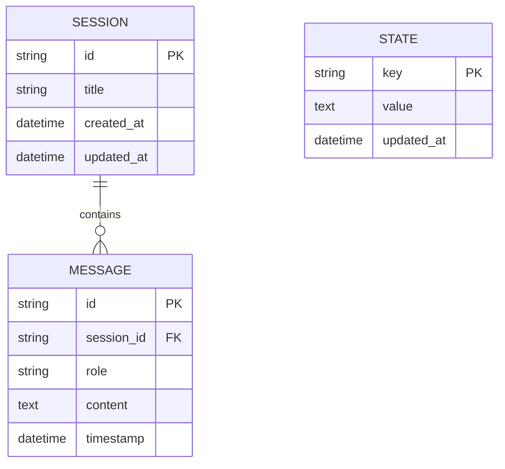

### 11.2 会话记录 (Rollout)

- 完整的会话历史记录
- 支持会话恢复和分支
- 存储在本地文件系统

---

## 12. 扩展机制

### 12.1 Skills 框架

基于 `SKILL.md` 文件的自定义行为定义：

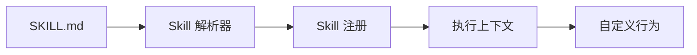

### 12.2 Hooks 系统

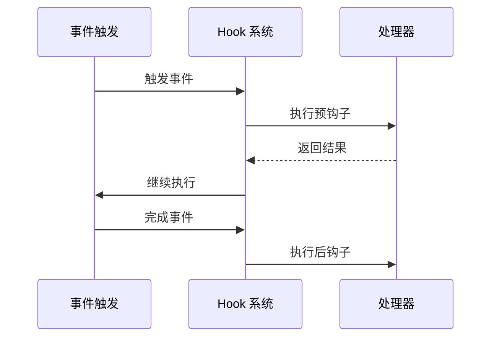

---

## 13. App Server 协议

### 13.1 协议版本

| 版本 | 状态 | 特点 |
|------|------|------|
| V1 | 已弃用 | 旧版协议 |
| V2 | 当前 | camelCase, JSON-RPC, TypeScript 绑定自动生成 |

### 13.2 V2 协议特性

- 实验性 API 支持 (ExperimentalApi 宏)
- 游标分页支持
- 自动生成 TypeScript 类型定义

---

## 14. 总结

### 14.1 架构优势

1. **模块化设计**: 50+ 个独立 crates，职责清晰
2. **分层架构**: UI、业务、协议、基础设施分离
3. **事件驱动**: 异步处理，高响应性
4. **可扩展性**: Skills、MCP、Hooks 多种扩展机制
5. **安全性**: 多层安全模型，平台特定沙盒

### 14.2 核心设计模式

| 模式 | 应用场景 |
|------|----------|
| 分层架构 | 整体系统设计 |
| 事件驱动 | UI 更新、消息处理 |
| 策略模式 | 审批、沙盒、执行策略 |
| 插件系统 | Skills、MCP、Hooks |
| 仓库模式 | 状态持久化 |

### 14.3 关键文件路径

| 功能 | 路径 |
|------|------|
| CLI 入口 | `codex-rs/cli/src/main.rs` |
| 核心引擎 | `codex-rs/core/src/codex.rs` |
| 协议定义 | `codex-rs/protocol/src/items.rs` |
| 配置类型 | `codex-rs/core/src/config/types.rs` |
| 状态管理 | `codex-rs/state/src/lib.rs` |
| TUI 应用 | `codex-rs/tui/src/app.rs` |

---

## 附录：Mermaid 图表源码

本文档中所有 Mermaid 图表均可直接在支持 Mermaid 的 Markdown 渲染器中显示，包括：
- GitHub
- GitLab
- VS Code (with Mermaid extension)
- Typora
- Obsidian

---

*文档生成时间: 2026-02-27*
*分析版本: Codex CLI (latest)*
