# Codex 架构分析文档

## 1. 项目概述

Codex 是 OpenAI 开发的本地运行的编码代理 CLI 工具，旨在为开发者提供强大的 AI 辅助编程能力。该项目采用双实现策略：

- **TypeScript 实现** (`codex-cli`): 传统的 Node.js 实现，已被标记为 legacy
- **Rust 实现** (`codex-rs`): 现代化的高性能实现，是当前的主要开发方向

### 1.1 核心特性

- **本地执行**: 在用户本地环境运行，保护代码隐私
- **沙箱安全**: 多平台沙箱机制（macOS Seatbelt、Linux Landlock/Docker、Windows Sandbox）
- **多模型支持**: 支持 OpenAI、Azure、Ollama、LMStudio 等多种 AI 提供商
- **交互式 TUI**: 基于 ratatui 的终端用户界面
- **MCP 协议**: 支持 Model Context Protocol，可扩展外部工具
- **权限管理**: 细粒度的执行权限控制（Suggest、Auto Edit、Full Auto）

## 2. 整体架构

### 2.1 系统架构图

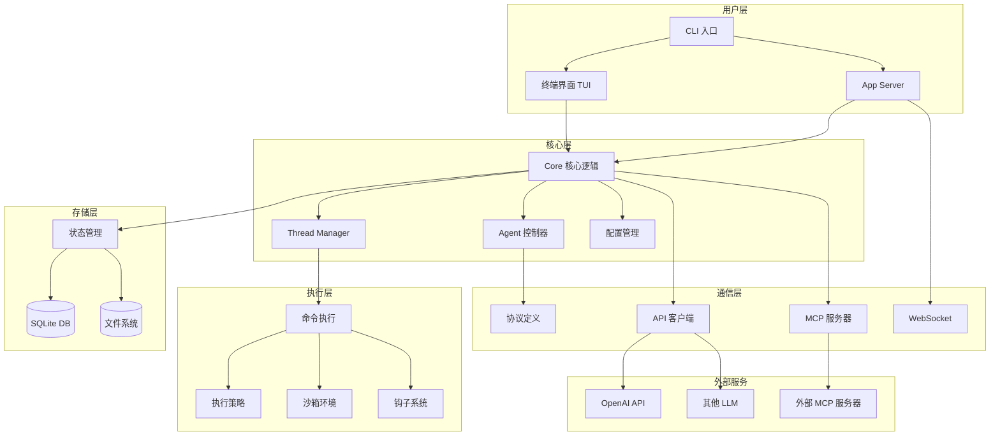

### 2.2 模块依赖关系

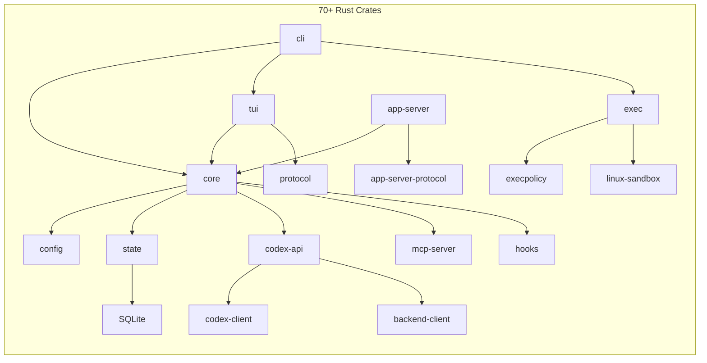

## 3. 核心模块详解

### 3.1 CLI 模块 (`codex-rs/cli`)

**职责**: 命令行入口，参数解析，子命令分发

**关键组件**:
- `main.rs`: 主入口，使用 clap 进行参数解析
- 支持多种子命令：
  - `exec`: 非交互式执行
  - `review`: 代码审查
  - `login/logout`: 认证管理
  - `mcp`: MCP 服务器管理
  - `app`: 桌面应用启动（macOS）

**架构特点**:
```rust
// 多工具 CLI 设计
struct MultitoolCli {
    config_overrides: CliConfigOverrides,
    feature_toggles: FeatureToggles,
    interactive: TuiCli,
    subcommand: Option<Subcommand>,
}
```

### 3.2 Core 模块 (`codex-rs/core`)

**职责**: 核心业务逻辑，会话管理，AI 交互

**关键子模块**:

#### 3.2.1 Codex 主控制器
```rust
// codex.rs - 核心会话控制器
pub struct Codex {
    thread_manager: ThreadManager,
    agent_control: AgentControl,
    exec_policy: ExecPolicyManager,
    mcp_connections: McpConnectionManager,
    analytics: AnalyticsEventsClient,
    // ...
}
```

**核心流程**:
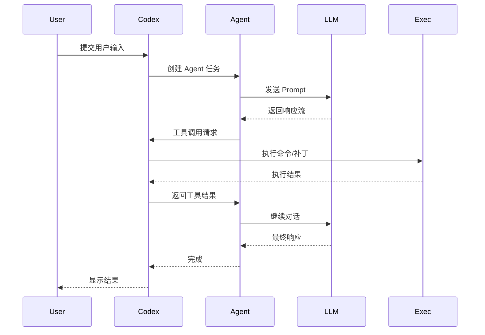

#### 3.2.2 Thread Manager（会话管理器）
- 管理多个对话线程
- 持久化会话历史
- 支持会话恢复和切换

#### 3.2.3 Agent 控制器
- 管理 Agent 生命周期
- 处理 Agent 状态转换
- 支持子 Agent（subagent）机制

### 3.3 TUI 模块 (`codex-rs/tui`)

**职责**: 终端用户界面，基于 ratatui 实现

**架构设计**:
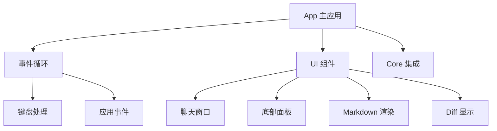

**关键特性**:
- 实时流式输出渲染
- Markdown 语法高亮
- Diff 可视化
- 多窗格布局
- 快捷键支持

### 3.4 App Server 模块 (`codex-rs/app-server`)

**职责**: 提供 JSON-RPC 协议的应用服务器，支持 IDE 集成

**协议版本**:
- **v1**: 传统协议（不再添加新功能）
- **v2**: 现代协议，所有新功能在此实现

**通信方式**:
- stdio（标准输入输出）
- WebSocket

**核心 API**:
```rust
// v2 协议示例
pub enum V2Method {
    // Thread 管理
    ThreadCreate,
    ThreadRead,
    ThreadList,
    ThreadDelete,

    // 消息操作
    MessageSend,
    MessageStream,

    // 配置管理
    ConfigRead,
    ConfigWrite,

    // MCP 集成
    McpServerList,
    McpServerAdd,
    // ...
}
```

**架构模式**:
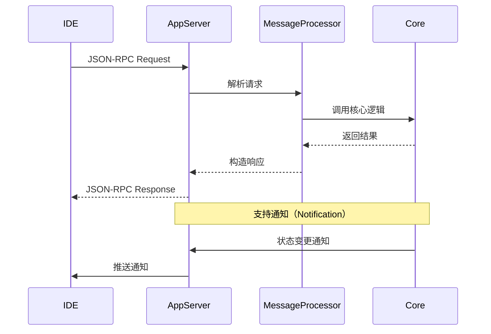

### 3.5 Protocol 模块 (`codex-rs/protocol`)

**职责**: 定义核心数据结构和协议

**关键类型**:
- `ThreadId`: 会话标识符
- `TurnItem`: 对话轮次项
- `ApprovalRequest`: 权限请求
- `DynamicToolSpec`: 动态工具规范
- `ModelInfo`: 模型信息

### 3.6 State 模块 (`codex-rs/state`)

**职责**: 状态持久化，基于 SQLite

**数据模型**:
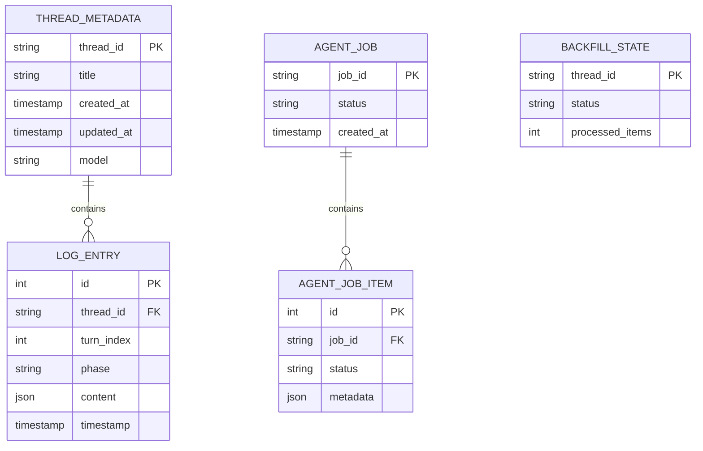

**功能**:
- 会话元数据存储
- 日志条目（rollout）持久化
- Agent 任务跟踪
- 回填（backfill）状态管理

### 3.7 Exec 模块 (`codex-rs/exec`)

**职责**: 命令执行和文件操作

**执行策略**:
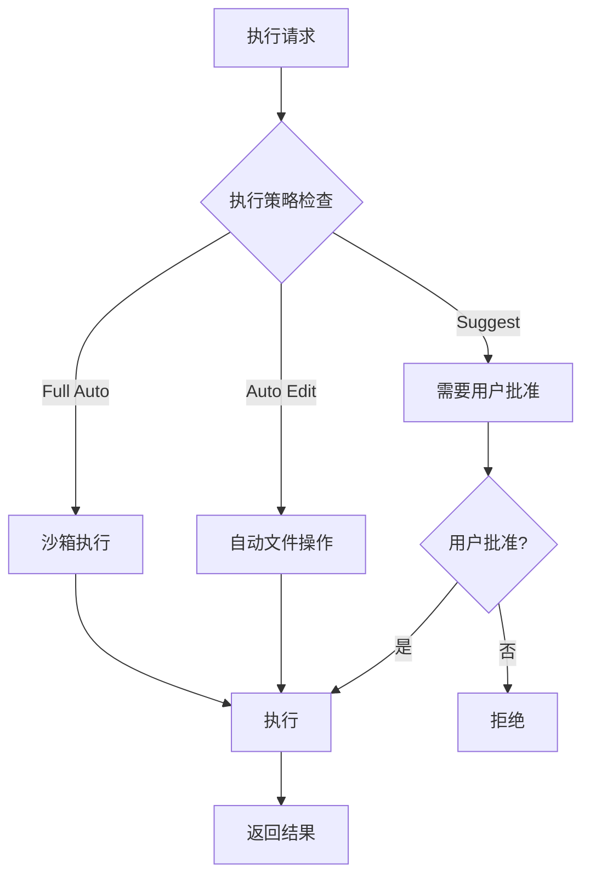

**沙箱实现**:

#### macOS - Seatbelt
```rust
// 使用 Apple Seatbelt (sandbox-exec)
// 限制文件系统访问和网络连接
```

#### Linux - Landlock
```rust
// 使用 Landlock LSM
// 细粒度文件系统访问控制
```

#### Windows - Windows Sandbox
```rust
// 使用 Windows Sandbox API
// 进程隔离和资源限制
```

### 3.8 MCP 模块 (`codex-rs/mcp-server`)

**职责**: Model Context Protocol 服务器实现

**MCP 架构**:
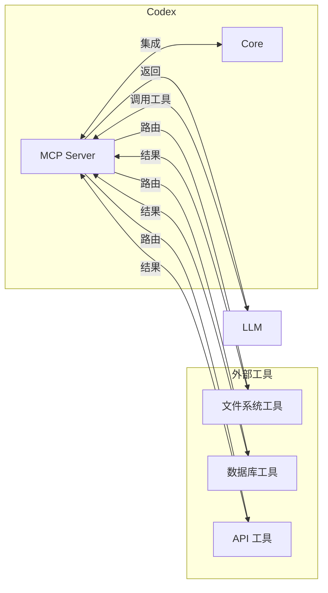

**工具类型**:
- **内置工具**: Bash、文件操作、Git 等
- **外部 MCP 服务器**: 通过配置连接的第三方工具

### 3.9 API 客户端 (`codex-rs/codex-api`)

**职责**: 与 AI 服务提供商通信

**支持的 API**:
- OpenAI Responses API
- WebSocket 实时 API
- SSE (Server-Sent Events) 流式响应

**架构**:
```rust
pub trait ModelClient {
    async fn create_session(&self) -> Result<ModelClientSession>;
}

pub struct ModelClientSession {
    // 流式响应处理
    async fn send_prompt(&mut self, prompt: Prompt)
        -> Result<ResponseStream>;
}
```

## 4. 数据流分析

### 4.1 用户输入处理流程

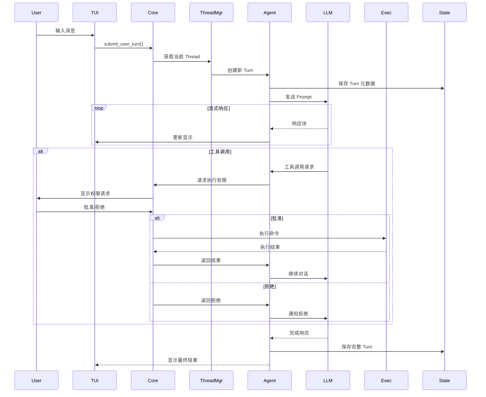

### 4.2 配置加载流程

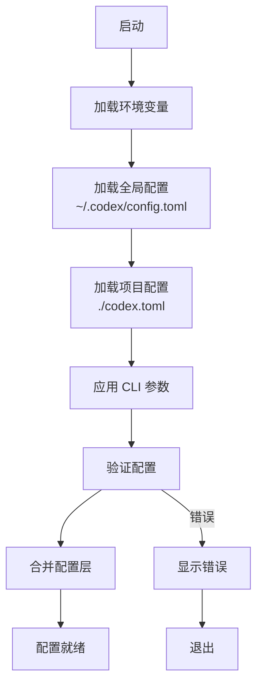

### 4.3 沙箱执行流程

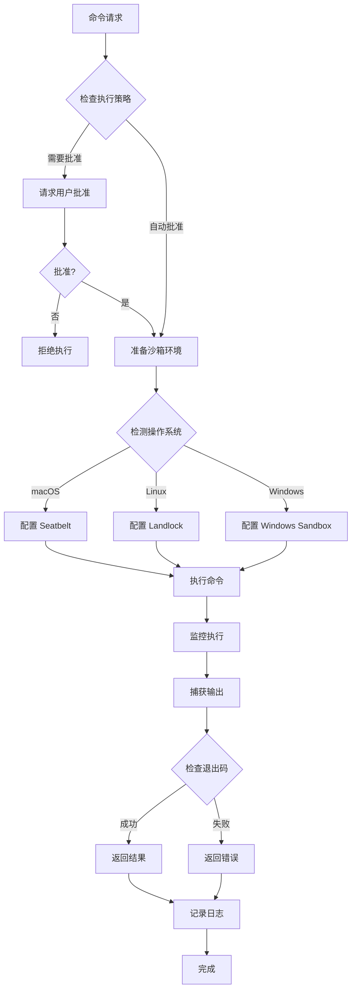

## 5. 关键技术特性

### 5.1 权限管理系统

Codex 实现了三级权限模型：

| 模式 | 自动批准范围 | 需要批准 |
|------|------------|---------|
| **Suggest** | 读取文件 | 所有写操作、所有命令 |
| **Auto Edit** | 读取文件、应用补丁 | 所有命令执行 |
| **Full Auto** | 读取文件、写入文件、执行命令（沙箱） | 无 |

### 5.2 网络策略

在 Full Auto 模式下：
- 默认禁用网络访问
- 可配置白名单允许特定域名
- 使用网络代理审计所有网络请求

### 5.3 实时协作

支持实时语音输入和流式响应：


### 5.4 内存管理

支持自动和手动内存管理：
- **自动压缩**: 当上下文接近限制时自动压缩历史
- **远程压缩**: 使用 LLM 进行智能摘要
- **项目文档**: 支持 AGENTS.md 文件提供持久化指令

### 5.5 钩子系统

支持在关键事件触发自定义脚本：
```toml
[hooks]
before_agent = "scripts/pre_agent.sh"
after_agent = "scripts/post_agent.sh"
user_prompt_submit = "scripts/on_submit.sh"
```

## 6. 扩展性设计

### 6.1 插件架构

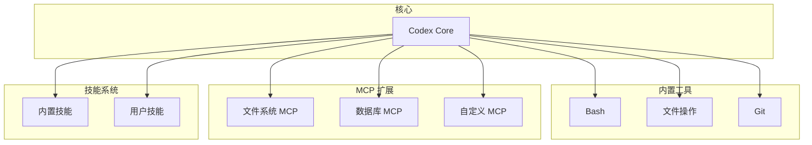

### 6.2 模型提供商扩展

支持任何兼容 OpenAI API 的提供商：
```toml
[providers.custom]
name = "Custom Provider"
base_url = "https://api.custom.com/v1"
api_key_env = "CUSTOM_API_KEY"
```

### 6.3 技能系统

支持自定义技能（Skills）：
- 位于 `.codex/skills/` 目录
- 使用 SKILL.md 定义技能行为
- 可包含参考文档和示例

## 7. 性能优化

### 7.1 异步架构

全面采用 Tokio 异步运行时：
- 非阻塞 I/O
- 并发任务处理
- 流式数据处理

### 7.2 增量渲染

TUI 采用增量渲染策略：
- 仅更新变化的区域
- 使用双缓冲技术
- 优化大文本渲染

### 7.3 数据库优化

SQLite 优化：
- 使用 WAL 模式
- 批量写入
- 索引优化
- 连接池管理

## 8. 安全性设计

### 8.1 多层防护

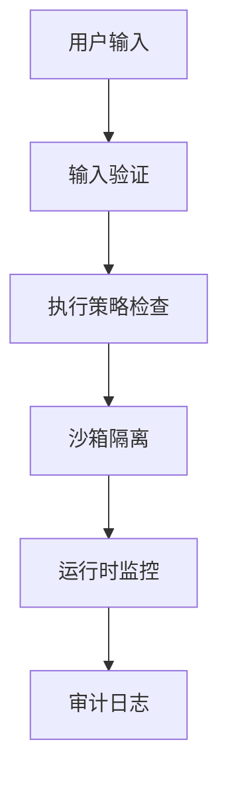

### 8.2 凭证管理

- 使用系统 Keyring 存储敏感信息
- 支持多平台（macOS Keychain、Linux Secret Service、Windows Credential Manager）
- 不在配置文件中存储明文密钥

### 8.3 代码签名

- macOS 应用签名
- 二进制完整性验证

## 9. 测试策略

### 9.1 测试类型

- **单元测试**: 使用 Rust 内置测试框架
- **集成测试**: 测试模块间交互
- **快照测试**: 使用 insta 进行 UI 快照测试
- **端到端测试**: 模拟完整用户流程

### 9.2 测试工具

```rust
// 使用 wiremock 模拟 API
let mock_server = MockServer::start().await;

// 使用 insta 进行快照测试
assert_snapshot!(rendered_output);

// 使用 pretty_assertions 进行断言
assert_eq!(expected, actual);
```

## 10. 部署和分发

### 10.1 分发方式

- **npm**: `npm install -g @openai/codex`
- **Homebrew**: `brew install --cask codex`
- **直接下载**: GitHub Releases 提供预编译二进制

### 10.2 平台支持

- macOS (Apple Silicon + Intel)
- Linux (x86_64 + ARM64)
- Windows (通过 WSL2)

### 10.3 构建系统

- **Cargo**: Rust 包管理和构建
- **Bazel**: 大规模构建支持
- **pnpm**: TypeScript 部分的包管理

## 11. 未来展望

### 11.1 计划中的功能

- 更强大的协作模式
- 增强的代码审查能力
- 更多 IDE 集成
- 云端同步支持

### 11.2 架构演进

- 进一步模块化
- 更好的插件生态
- 性能持续优化
- 更丰富的 MCP 工具

## 12. 总结

Codex 是一个设计精良、架构清晰的现代化 AI 编程助手。其核心优势包括：

1. **模块化设计**: 70+ 独立 crates，职责清晰
2. **安全第一**: 多层沙箱和权限控制
3. **高性能**: Rust 实现，异步架构
4. **可扩展**: MCP 协议和技能系统
5. **跨平台**: 支持主流操作系统
6. **开发者友好**: 丰富的配置选项和钩子系统

通过深入理解其架构，开发者可以更好地使用、扩展和贡献到 Codex 项目中。
