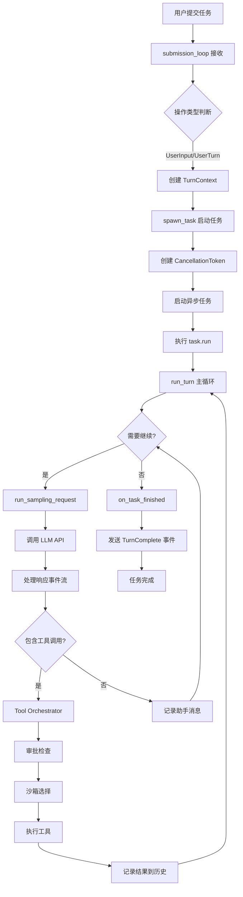
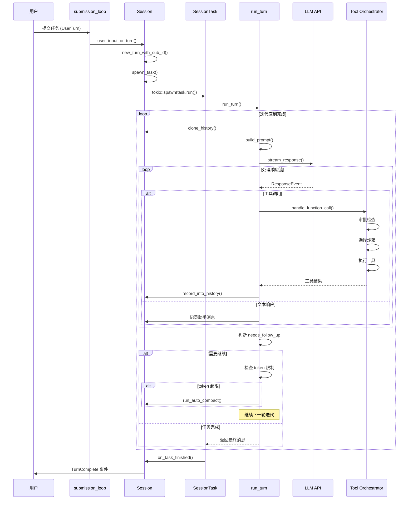
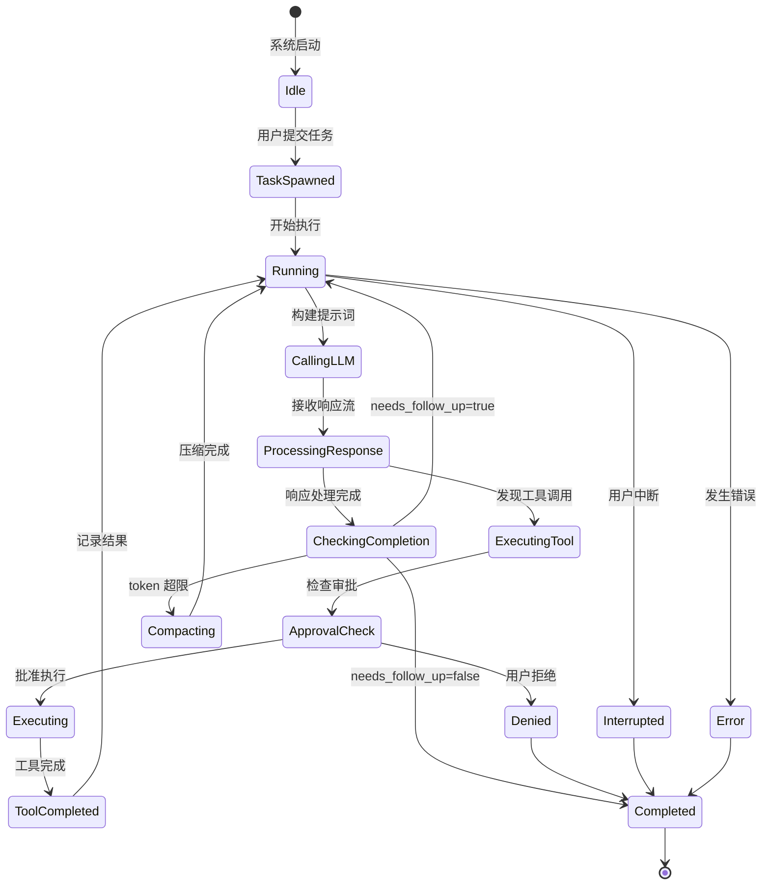

# Codex 事件循环与任务处理机制深度解析

## 概述

Codex 是一个基于 Rust 实现的 AI Agent 系统，采用异步事件驱动架构。当用户发起任务后，Codex 通过精心设计的事件循环机制，将任务分解、处理、迭代，最终完成整个任务。本文档深入解析这一过程的核心机制。

## 核心架构组件

### 1. Session（会话管理器）

`Session` 是 Codex 的核心组件，位于 `core/src/codex.rs`，负责：
- 管理对话历史和上下文
- 协调任务的生命周期
- 处理用户输入和模型响应
- 维护工具调用和执行状态

```rust
pub struct Session {
    conversation_id: ThreadId,
    state: Arc<Mutex<SessionState>>,
    active_turn: Arc<Mutex<Option<ActiveTurn>>>,
    services: Arc<SessionServices>,
    // ... 其他字段
}
```

### 2. Task（任务抽象）

任务系统采用 trait 设计，位于 `core/src/tasks/mod.rs`：

```rust
#[async_trait]
pub(crate) trait SessionTask: Send + Sync + 'static {
    fn kind(&self) -> TaskKind;

    async fn run(
        self: Arc<Self>,
        session: Arc<SessionTaskContext>,
        ctx: Arc<TurnContext>,
        input: Vec<UserInput>,
        cancellation_token: CancellationToken,
    ) -> Option<String>;

    async fn abort(&self, session: Arc<SessionTaskContext>, ctx: Arc<TurnContext>);
}
```

主要任务类型：
- **RegularTask**: 常规对话任务
- **CompactTask**: 上下文压缩任务
- **ReviewTask**: 代码审查任务
- **UndoTask**: 撤销操作任务
- **UserShellCommandTask**: Shell 命令执行任务

### 3. Tool Orchestrator（工具编排器）

位于 `core/src/tools/orchestrator.rs`，负责：
- 工具调用的审批流程
- 沙箱环境选择
- 网络策略管理
- 失败重试机制

## 事件循环机制详解

### 主事件循环

Codex 的主事件循环在 `submission_loop` 函数中实现：

```rust
async fn submission_loop(sess: Arc<Session>, config: Arc<Config>, rx_sub: Receiver<Submission>) {
    while let Ok(sub) = rx_sub.recv().await {
        match sub.op.clone() {
            Op::UserInput { .. } | Op::UserTurn { .. } => {
                handlers::user_input_or_turn(&sess, sub.id.clone(), sub.op).await;
            }
            Op::ExecApproval { .. } => { /* 处理执行审批 */ }
            Op::Interrupt => { /* 处理中断 */ }
            // ... 其他操作
        }
    }
}
```

### 任务处理流程



## 详细处理流程

### 1. 任务提交阶段

当用户发起任务时：

```rust
// 用户输入处理
pub async fn user_input_or_turn(sess: &Arc<Session>, sub_id: String, op: Op) {
    // 1. 创建新的 TurnContext
    let current_context = sess.new_turn_with_sub_id(sub_id, updates).await;

    // 2. 尝试注入到当前任务或启动新任务
    if let Err(SteerInputError::NoActiveTurn(items)) = sess.steer_input(items, None).await {
        // 3. 刷新 MCP 服务器
        sess.refresh_mcp_servers_if_requested(&current_context).await;

        // 4. 启动新任务
        let regular_task = sess.take_startup_regular_task().await.unwrap_or_default();
        sess.spawn_task(Arc::clone(&current_context), items, regular_task).await;
    }
}
```

### 2. 任务启动阶段

`spawn_task` 函数负责任务的启动：

```rust
pub async fn spawn_task<T: SessionTask>(
    self: &Arc<Self>,
    turn_context: Arc<TurnContext>,
    input: Vec<UserInput>,
    task: T,
) {
    // 1. 中止所有现有任务
    self.abort_all_tasks(TurnAbortReason::Replaced).await;

    // 2. 创建取消令牌和完成通知
    let cancellation_token = CancellationToken::new();
    let done = Arc::new(Notify::new());

    // 3. 在新的 tokio 任务中运行
    let handle = tokio::spawn(async move {
        let last_agent_message = task_for_run
            .run(session_ctx, ctx, input, task_cancellation_token)
            .await;

        // 4. 任务完成后的清理
        sess.flush_rollout().await;
        if !task_cancellation_token.is_cancelled() {
            sess.on_task_finished(ctx_for_finish, last_agent_message).await;
        }
        done_clone.notify_waiters();
    });

    // 5. 注册活动任务
    self.register_new_active_task(running_task).await;
}
```

### 3. 核心迭代循环（run_turn）

这是 Codex 自我迭代的核心：

```rust
async fn run_turn(
    sess: Arc<Session>,
    turn_context: Arc<TurnContext>,
    input: Vec<UserInput>,
    prewarmed_client_session: Option<ModelClientSession>,
    cancellation_token: CancellationToken,
) -> Option<String> {
    // 主迭代循环
    loop {
        // 1. 构建提示词
        let sampling_request_input = sess.clone_history().await
            .for_prompt(&turn_context.model_info.input_modalities);

        // 2. 调用 LLM
        match run_sampling_request(
            sess.clone(),
            turn_context.clone(),
            &mut client_session,
            sampling_request_input,
            cancellation_token.child_token(),
        ).await {
            Ok(sampling_request_output) => {
                let SamplingRequestResult { needs_follow_up, last_agent_message } = sampling_request_output;

                // 3. 检查是否需要继续
                if !needs_follow_up {
                    // 任务完成
                    break;
                }

                // 4. 检查 token 限制，必要时压缩上下文
                if token_limit_reached && needs_follow_up {
                    run_auto_compact(&sess, &turn_context, ...).await?;
                }

                // 5. 继续下一轮迭代
                continue;
            }
            Err(e) => {
                // 错误处理
                sess.send_event(&turn_context, EventMsg::Error(e.to_error_event())).await;
                break;
            }
        }
    }

    last_agent_message
}
```

### 4. 采样请求处理（run_sampling_request）

处理单次 LLM 调用和响应：

```rust
async fn run_sampling_request(...) -> CodexResult<SamplingRequestResult> {
    // 1. 构建工具路由器
    let router = built_tools(sess, turn_context, ...).await?;

    // 2. 构建完整提示词
    let prompt = build_prompt(input, router.as_ref(), turn_context, base_instructions);

    // 3. 发起流式请求
    let mut response_stream = client_session.stream_response(...).await?;

    // 4. 处理响应事件流
    while let Some(event) = response_stream.next().await {
        match event? {
            ResponseEvent::ItemStarted { item_id, item } => {
                // 记录新项目开始
            }
            ResponseEvent::ContentDelta { item_id, delta } => {
                // 处理内容增量
            }
            ResponseEvent::FunctionCall { name, arguments, call_id } => {
                // 处理工具调用
                handle_function_call(sess, turn_context, name, arguments, call_id).await;
            }
            ResponseEvent::ItemCompleted { item_id } => {
                // 项目完成
            }
            // ... 其他事件类型
        }
    }

    // 5. 确定是否需要后续轮次
    let needs_follow_up = has_pending_tool_calls || model_requested_continuation;

    Ok(SamplingRequestResult { needs_follow_up, last_agent_message })
}
```

### 5. 工具调用处理

工具调用通过 `ToolOrchestrator` 处理：

```rust
pub async fn run<Rq, Out, T>(
    &mut self,
    tool: &mut T,
    req: &Rq,
    tool_ctx: &ToolCtx,
    turn_ctx: &TurnContext,
    approval_policy: AskForApproval,
) -> Result<OrchestratorRunResult<Out>, ToolError> {
    // 1. 审批检查
    let requirement = tool.exec_approval_requirement(req);
    match requirement {
        ExecApprovalRequirement::NeedsApproval { reason, .. } => {
            let decision = tool.start_approval_async(req, approval_ctx).await;
            if decision == ReviewDecision::Denied {
                return Err(ToolError::Rejected("rejected by user"));
            }
        }
        ExecApprovalRequirement::Forbidden { reason } => {
            return Err(ToolError::Rejected(reason));
        }
        _ => {}
    }

    // 2. 选择沙箱环境
    let initial_sandbox = self.sandbox.select_initial(
        &turn_ctx.sandbox_policy,
        tool.sandbox_preference(),
        ...
    );

    // 3. 第一次尝试执行
    let (first_result, deferred_network_approval) = Self::run_attempt(
        tool, req, tool_ctx, &initial_attempt, ...
    ).await;

    // 4. 如果失败且是沙箱拒绝，尝试升级策略
    match first_result {
        Err(ToolError::Codex(CodexErr::Sandbox(SandboxErr::Denied { .. }))) => {
            // 请求用户批准后在无沙箱环境重试
            let escalated_attempt = SandboxAttempt {
                sandbox: SandboxType::None,
                ...
            };
            Self::run_attempt(tool, req, tool_ctx, &escalated_attempt, ...).await
        }
        Ok(out) => Ok(OrchestratorRunResult { output: out, deferred_network_approval })
    }
}
```

## 任务完成判断机制

Codex 通过多个维度判断任务是否完成：

### 1. 模型层面判断

```rust
// 在 run_sampling_request 中
let needs_follow_up = response_items.iter().any(|item| {
    matches!(item, ResponseItem::FunctionCall { .. })
}) || model_explicitly_requested_continuation;
```

判断依据：
- **工具调用存在**: 如果响应中包含 `FunctionCall`，说明需要执行工具并继续
- **模型明确请求**: 某些情况下模型会明确表示需要继续
- **end_turn 标志**: 模型可以通过 `end_turn` 标志明确表示完成

### 2. Token 限制检查

```rust
let total_usage_tokens = sess.get_total_token_usage().await;
let token_limit_reached = total_usage_tokens >= auto_compact_limit;

if token_limit_reached && needs_follow_up {
    // 触发上下文压缩
    run_auto_compact(&sess, &turn_context, ...).await?;
    continue; // 压缩后继续
}
```

### 3. 取消令牌检查

```rust
if cancellation_token.is_cancelled() {
    // 用户中断或系统取消
    return Err(CodexErr::TurnAborted);
}
```

### 4. 错误处理

```rust
match run_sampling_request(...).await {
    Ok(result) if !result.needs_follow_up => {
        // 正常完成
        break;
    }
    Err(CodexErr::TurnAborted) => {
        // 被中止
        break;
    }
    Err(e) => {
        // 错误，终止任务
        sess.send_event(&turn_context, EventMsg::Error(e.to_error_event())).await;
        break;
    }
}
```

## 完整流程时序图



## 关键设计特点

### 1. 异步并发架构

- 使用 Tokio 异步运行时
- 每个任务在独立的异步任务中运行
- 通过 `CancellationToken` 实现优雅取消

### 2. 事件驱动通信

- 所有状态变化通过事件通知
- 客户端通过事件流实时获取进度
- 支持流式响应，提升用户体验

### 3. 工具编排与安全

- 统一的工具调用接口
- 多层审批机制（配置、策略、用户）
- 沙箱隔离执行
- 网络策略管理

### 4. 上下文管理

- 自动 token 计数和限制检查
- 智能上下文压缩
- 历史记录持久化

### 5. 错误处理与恢复

- 分层错误处理
- 工具执行失败自动重试
- 沙箱升级策略

## 状态机视图



## 性能优化策略

### 1. WebSocket 预热

```rust
pub(crate) async fn with_startup_prewarm(
    model_client: ModelClient,
    prompt: Prompt,
    turn_context: Arc<TurnContext>,
    turn_metadata_header: Option<String>,
) -> CodexResult<Self> {
    let mut client_session = model_client.new_session();
    client_session.prewarm_websocket(...).await?;
    // 预先建立连接，减少首次请求延迟
}
```

### 2. 并行工具执行

- 支持多个独立工具调用并行执行
- 通过 `FuturesOrdered` 管理执行顺序

### 3. 增量响应处理

- 流式处理 LLM 响应
- 实时更新 UI，无需等待完整响应

### 4. 智能上下文压缩

- 仅在必要时触发压缩
- 保留关键上下文信息
- 支持远程压缩服务

## 总结

Codex 的事件循环机制是一个精心设计的异步系统，通过以下核心机制实现任务的自动分解和迭代执行：

1. **提交循环**: 接收并分发用户操作
2. **任务系统**: 抽象不同类型的工作负载
3. **迭代循环**: 持续与 LLM 交互直到任务完成
4. **工具编排**: 安全、可控地执行工具调用
5. **完成判断**: 多维度判断任务是否完成

这种设计使得 Codex 能够：
- 处理复杂的多步骤任务
- 自主决策何时调用工具
- 在遇到问题时自我修正
- 提供实时反馈和进度更新
- 安全地执行潜在危险操作

整个系统的核心在于 **run_turn** 循环，它不断地：
1. 构建包含历史的提示词
2. 调用 LLM 获取下一步行动
3. 执行工具调用（如果有）
4. 判断是否需要继续
5. 重复直到任务完成

这种设计模式使 Codex 成为一个真正的自主 Agent，能够独立完成复杂任务而无需用户的持续干预。
