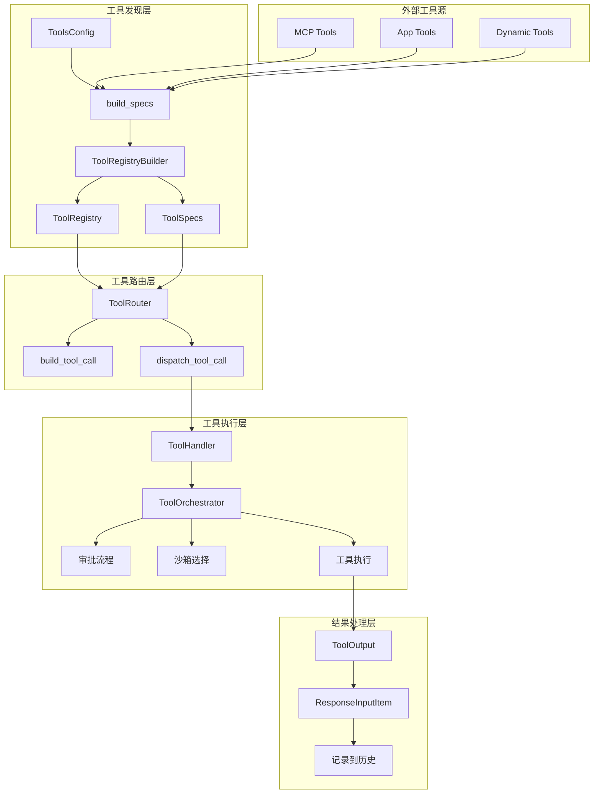
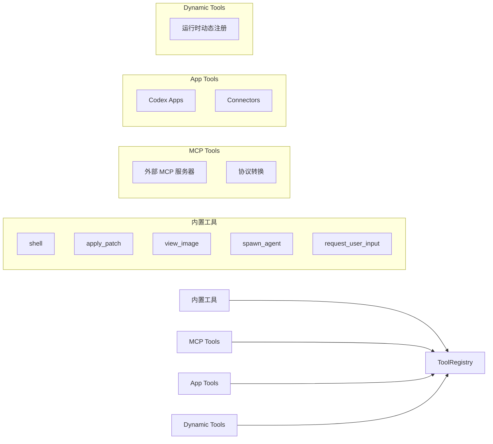
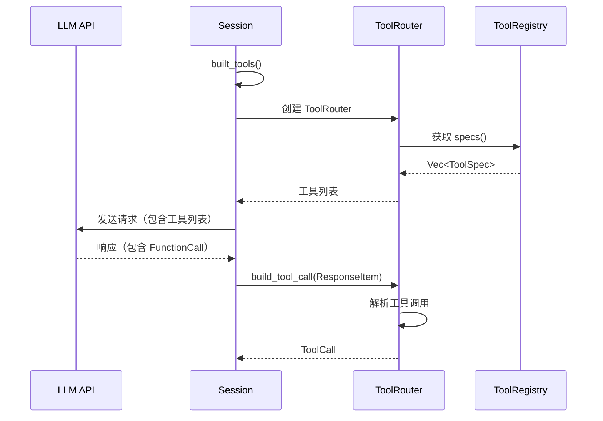
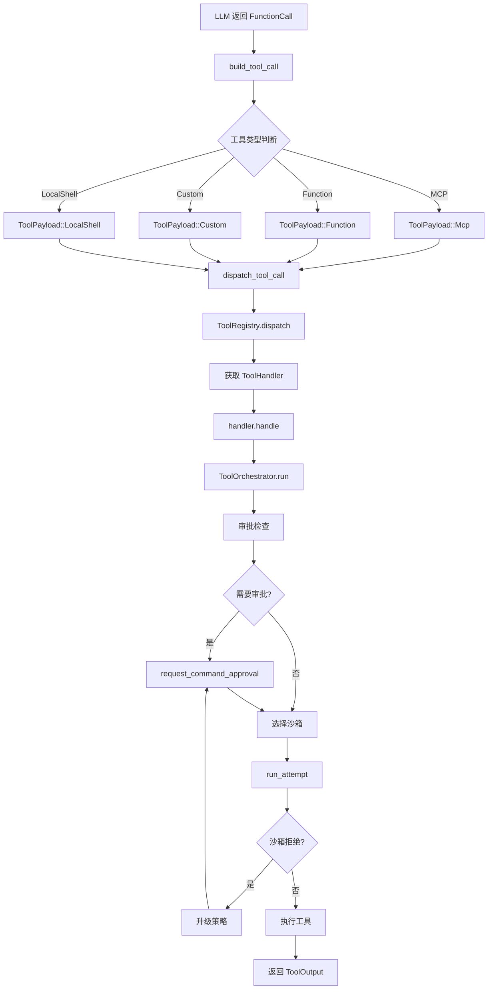
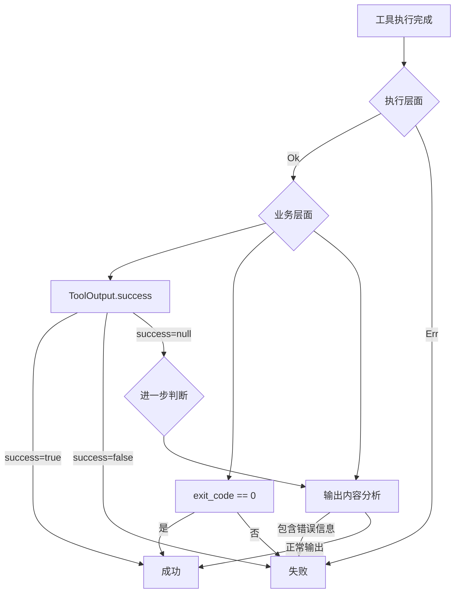
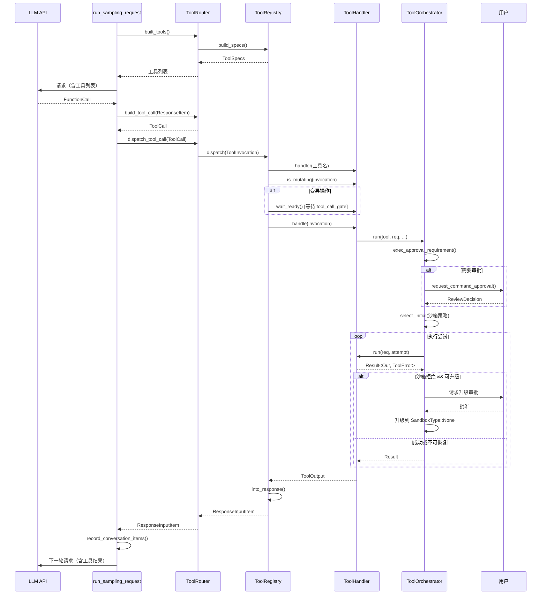

# Codex 工具调用机制深度解析

## 概述

Codex 的工具调用机制是一个精心设计的系统，涵盖了从工具发现、选择、调用到结果处理的完整流程。本文档深入解析 Codex 如何知道有哪些工具可用、如何选择和调用工具、如何处理返回结果，以及如何判断调用是否成功。

## 核心架构

### 整体架构图



## 1. 工具发现机制：Codex 如何知道有哪些工具可以调用

### 1.1 工具配置构建

工具发现的核心是 `ToolsConfig` 和 `build_specs` 函数。

**位置**: `core/src/tools/spec.rs`

```rust
pub(crate) struct ToolsConfig {
    pub shell_type: ConfigShellToolType,
    shell_command_backend: ShellCommandBackendConfig,
    pub allow_login_shell: bool,
    pub apply_patch_tool_type: Option<ApplyPatchToolType>,
    pub web_search_mode: Option<WebSearchMode>,
    pub agent_roles: BTreeMap<String, AgentRoleConfig>,
    pub search_tool: bool,
    pub request_permission_enabled: bool,
    pub js_repl_enabled: bool,
    pub js_repl_tools_only: bool,
    pub collab_tools: bool,
    pub default_mode_request_user_input: bool,
    pub experimental_supported_tools: Vec<String>,
    pub agent_jobs_tools: bool,
    pub agent_jobs_worker_tools: bool,
}
```

### 1.2 工具来源

Codex 的工具来自四个主要来源：



### 1.3 build_specs 函数：工具注册的核心

```rust
pub(crate) fn build_specs(
    config: &ToolsConfig,
    mcp_tools: Option<HashMap<String, rmcp::model::Tool>>,
    app_tools: Option<HashMap<String, ToolInfo>>,
    dynamic_tools: &[DynamicToolSpec],
) -> ToolRegistryBuilder {
    let mut builder = ToolRegistryBuilder::new();

    // 1. 注册 Shell 工具
    match &config.shell_type {
        ConfigShellToolType::Default => {
            builder.push_spec_with_parallel_support(
                create_shell_tool(request_permission_enabled),
                true,  // 支持并行调用
            );
        }
        ConfigShellToolType::UnifiedExec => {
            builder.push_spec_with_parallel_support(
                create_exec_command_tool(config.allow_login_shell, request_permission_enabled),
                true,
            );
            builder.push_spec(create_write_stdin_tool());
            builder.register_handler("exec_command", unified_exec_handler.clone());
            builder.register_handler("write_stdin", unified_exec_handler);
        }
        // ... 其他 shell 类型
    }

    // 2. 注册 MCP 工具
    if let Some(mcp_tools) = mcp_tools {
        for (name, tool) in mcp_tools.into_iter() {
            match mcp_tool_to_openai_tool(name.clone(), tool.clone()) {
                Ok(converted_tool) => {
                    builder.push_spec(ToolSpec::Function(converted_tool));
                    builder.register_handler(name, mcp_handler.clone());
                }
                Err(e) => {
                    tracing::error!("Failed to convert {name:?} MCP tool: {e:?}");
                }
            }
        }
    }

    // 3. 注册 apply_patch 工具
    if let Some(apply_patch_tool_type) = &config.apply_patch_tool_type {
        match apply_patch_tool_type {
            ApplyPatchToolType::Freeform => {
                builder.push_spec(create_apply_patch_freeform_tool());
            }
            ApplyPatchToolType::Function => {
                builder.push_spec(create_apply_patch_json_tool());
            }
        }
        builder.register_handler("apply_patch", apply_patch_handler);
    }

    // 4. 注册其他内置工具...

    builder
}
```

### 1.4 工具规范（ToolSpec）

每个工具都有一个规范定义：

```rust
pub enum ToolSpec {
    // 标准 JSON Schema 函数工具
    Function(ResponsesApiTool),
    // 自由格式工具（如 apply_patch）
    Freeform(FreeformTool),
    // 本地 Shell 工具
    LocalShell {},
    // Web 搜索工具
    WebSearch { external_web_access: Option<bool> },
}
```

**示例：Shell 工具规范**

```rust
fn create_shell_tool(request_permission_enabled: bool) -> ToolSpec {
    let mut properties = BTreeMap::from([
        ("command", JsonSchema::Array {
            items: Box::new(JsonSchema::String { description: None }),
            description: Some("The command to execute".to_string()),
        }),
        ("workdir", JsonSchema::String {
            description: Some("The working directory".to_string()),
        }),
        ("timeout_ms", JsonSchema::Number {
            description: Some("The timeout in milliseconds".to_string()),
        }),
    ]);
    properties.extend(create_approval_parameters(request_permission_enabled));

    ToolSpec::Function(ResponsesApiTool {
        name: "shell".to_string(),
        description: r#"Runs a shell command and returns its output."#.to_string(),
        strict: false,
        parameters: JsonSchema::Object {
            properties,
            required: Some(vec!["command".to_string()]),
            additional_properties: Some(false.into()),
        },
    })
}
```

## 2. 工具选择机制：LLM 如何选择要调用的工具

### 2.1 工具选择流程



### 2.2 工具列表传递给 LLM

在 `run_sampling_request` 中，工具规范被包含在提示词中：

```rust
async fn run_sampling_request(...) -> CodexResult<SamplingRequestResult> {
    // 1. 构建工具路由器
    let router = built_tools(
        sess,
        turn_context,
        input,
        explicitly_enabled_connectors,
        skills_outcome,
        cancellation_token,
    ).await?;

    // 2. 构建完整提示词（包含工具规范）
    let prompt = build_prompt(
        input,
        router.as_ref(),
        turn_context,
        base_instructions
    );

    // 3. 发起流式请求
    let mut response_stream = client_session.stream_response(
        prompt.input,
        prompt.tools,        // <- 工具规范列表
        prompt.parallel_tool_calls,
        // ...
    ).await?;

    // ...
}
```

### 2.3 build_tool_call：解析 LLM 的工具调用

当 LLM 返回工具调用时，`build_tool_call` 将其转换为内部的 `ToolCall` 结构：

```rust
pub async fn build_tool_call(
    session: &Session,
    item: ResponseItem,
) -> Result<Option<ToolCall>, FunctionCallError> {
    match item {
        // 1. 标准函数调用
        ResponseItem::FunctionCall { name, arguments, call_id, .. } => {
            // 检查是否是 MCP 工具（格式：server/tool_name）
            if let Some((server, tool)) = session.parse_mcp_tool_name(&name).await {
                Ok(Some(ToolCall {
                    tool_name: name,
                    call_id,
                    payload: ToolPayload::Mcp {
                        server,
                        tool,
                        raw_arguments: arguments,
                    },
                }))
            } else {
                Ok(Some(ToolCall {
                    tool_name: name,
                    call_id,
                    payload: ToolPayload::Function { arguments },
                }))
            }
        }

        // 2. 自定义工具调用（如 apply_patch）
        ResponseItem::CustomToolCall { name, input, call_id, .. } => {
            Ok(Some(ToolCall {
                tool_name: name,
                call_id,
                payload: ToolPayload::Custom { input },
            }))
        }

        // 3. 本地 Shell 调用
        ResponseItem::LocalShellCall { id, call_id, action, .. } => {
            // ... 处理本地 shell 调用
        }

        _ => Ok(None),
    }
}
```

## 3. 工具调用机制：如何调用工具

### 3.1 工具调用完整流程



### 3.2 dispatch_tool_call：工具分发入口

```rust
pub async fn dispatch_tool_call(
    &self,
    session: Arc<Session>,
    turn: Arc<TurnContext>,
    tracker: SharedTurnDiffTracker,
    call: ToolCall,
    source: ToolCallSource,
) -> Result<ResponseInputItem, FunctionCallError> {
    let ToolCall { tool_name, call_id, payload } = call;

    // 1. 检查 js_repl_tools_only 模式
    if source == ToolCallSource::Direct
        && turn.tools_config.js_repl_tools_only
        && !matches!(tool_name.as_str(), "js_repl" | "js_repl_reset")
    {
        return Ok(Self::failure_response(
            call_id,
            payload_outputs_custom,
            FunctionCallError::RespondToModel(
                "direct tool calls are disabled; use js_repl instead".to_string()
            ),
        ));
    }

    // 2. 构建工具调用上下文
    let invocation = ToolInvocation {
        session,
        turn,
        tracker,
        call_id,
        tool_name,
        payload,
    };

    // 3. 分发到注册表
    match self.registry.dispatch(invocation).await {
        Ok(response) => Ok(response),
        Err(FunctionCallError::Fatal(message)) => Err(FunctionCallError::Fatal(message)),
        Err(err) => Ok(Self::failure_response(call_id, payload_outputs_custom, err)),
    }
}
```

### 3.3 ToolRegistry.dispatch：查找并执行处理器

```rust
pub async fn dispatch(
    &self,
    invocation: ToolInvocation,
) -> Result<ResponseInputItem, FunctionCallError> {
    // 1. 查找处理器
    let handler = match self.handler(&invocation.tool_name) {
        Some(handler) => handler,
        None => {
            let message = unsupported_tool_call_message(&invocation.payload, &invocation.tool_name);
            return Err(FunctionCallError::RespondToModel(message));
        }
    };

    // 2. 验证 payload 类型匹配
    if !handler.matches_kind(&invocation.payload) {
        return Err(FunctionCallError::Fatal(
            format!("tool {} invoked with incompatible payload", invocation.tool_name)
        ));
    }

    // 3. 检查是否是变异操作
    let is_mutating = handler.is_mutating(&invocation).await;

    // 4. 如果是变异操作，等待 tool_call_gate
    let result = async {
        if is_mutating {
            invocation.turn.tool_call_gate.wait_ready().await;
        }
        handler.handle(invocation).await
    }.await;

    // 5. 转换输出为响应
    match result {
        Ok(output) => Ok(output.into_response(&call_id, &payload_for_response)),
        Err(err) => Err(err),
    }
}
```

### 3.4 ToolOrchestrator：工具执行编排器

`ToolOrchestrator` 是工具执行的核心，负责审批、沙箱选择和执行：

```rust
pub async fn run<Rq, Out, T>(
    &mut self,
    tool: &mut T,
    req: &Rq,
    tool_ctx: &ToolCtx,
    turn_ctx: &TurnContext,
    approval_policy: AskForApproval,
) -> Result<OrchestratorRunResult<Out>, ToolError>
where
    T: ToolRuntime<Rq, Out>,
{
    // ========== 阶段 1: 审批检查 ==========
    let requirement = tool.exec_approval_requirement(req).unwrap_or_else(|| {
        default_exec_approval_requirement(approval_policy, &turn_ctx.sandbox_policy)
    });

    match requirement {
        ExecApprovalRequirement::Skip { .. } => {
            // 跳过审批，直接执行
        }
        ExecApprovalRequirement::Forbidden { reason } => {
            return Err(ToolError::Rejected(reason));
        }
        ExecApprovalRequirement::NeedsApproval { reason, .. } => {
            // 请求用户审批
            let decision = tool.start_approval_async(req, approval_ctx).await;
            match decision {
                ReviewDecision::Denied | ReviewDecision::Abort => {
                    return Err(ToolError::Rejected("rejected by user".to_string()));
                }
                _ => {}  // 批准，继续执行
            }
        }
    }

    // ========== 阶段 2: 选择沙箱 ==========
    let initial_sandbox = self.sandbox.select_initial(
        &turn_ctx.sandbox_policy,
        tool.sandbox_preference(),
        turn_ctx.windows_sandbox_level,
        has_managed_network_requirements,
    );

    // ========== 阶段 3: 第一次尝试 ==========
    let (first_result, _) = Self::run_attempt(
        tool, req, tool_ctx, &initial_attempt, ...
    ).await;

    match first_result {
        Ok(out) => Ok(OrchestratorRunResult { output: out, .. }),

        // ========== 阶段 4: 沙箱拒绝，尝试升级 ==========
        Err(ToolError::Codex(CodexErr::Sandbox(SandboxErr::Denied { .. }))) => {
            // 请求用户批准后，在无沙箱环境重试
            let decision = tool.start_approval_async(req, approval_ctx).await;
            if decision == ReviewDecision::Denied {
                return Err(ToolError::Rejected("rejected by user".to_string()));
            }

            // 在无沙箱环境中重试
            let escalated_attempt = SandboxAttempt {
                sandbox: SandboxType::None,
                ...
            };
            Self::run_attempt(tool, req, tool_ctx, &escalated_attempt, ...).await
        }
        Err(err) => Err(err),
    }
}
```

### 3.5 ToolHandler Trait：工具处理器接口

所有工具都必须实现 `ToolHandler` trait：

```rust
#[async_trait]
pub trait ToolHandler: Send + Sync {
    /// 工具类型（Function 或 Mcp）
    fn kind(&self) -> ToolKind;

    /// 检查 payload 类型是否匹配
    fn matches_kind(&self, payload: &ToolPayload) -> bool { ... }

    /// 判断工具调用是否可能修改环境
    async fn is_mutating(&self, _invocation: &ToolInvocation) -> bool {
        false  // 默认不修改
    }

    /// 执行工具调用
    async fn handle(&self, invocation: ToolInvocation) -> Result<ToolOutput, FunctionCallError>;
}
```

**示例：ShellHandler 实现**

```rust
#[async_trait]
impl ToolHandler for ShellHandler {
    fn kind(&self) -> ToolKind {
        ToolKind::Function
    }

    fn matches_kind(&self, payload: &ToolPayload) -> bool {
        matches!(
            payload,
            ToolPayload::Function { .. } | ToolPayload::LocalShell { .. }
        )
    }

    async fn is_mutating(&self, invocation: &ToolInvocation) -> bool {
        match &invocation.payload {
            ToolPayload::Function { arguments } => {
                serde_json::from_str::<ShellToolCallParams>(arguments)
                    .map(|params| !is_known_safe_command(&params.command))
                    .unwrap_or(true)
            }
            ToolPayload::LocalShell { params } => !is_known_safe_command(&params.command),
            _ => true,
        }
    }

    async fn handle(&self, invocation: ToolInvocation) -> Result<ToolOutput, FunctionCallError> {
        // 解析参数，创建执行参数，通过 orchestrator 执行
        let exec_params = Self::to_exec_params(&params, turn.as_ref(), session.conversation_id);
        Self::run_exec_like(RunExecLikeArgs { ... }).await
    }
}
```

## 4. 结果处理机制：如何处理工具的返回结果

### 4.1 ToolOutput 结构

工具执行的结果被封装在 `ToolOutput` 中：

```rust
#[derive(Clone)]
pub enum ToolOutput {
    Function {
        body: FunctionCallOutputBody,
        success: Option<bool>,
    },
    Mcp {
        result: Result<CallToolResult, String>,
    },
}
```

### 4.2 FunctionCallOutputBody

```rust
pub enum FunctionCallOutputBody {
    // 纯文本输出
    Text(String),
    // 结构化内容项（可包含文本、图片等）
    ContentItems(Vec<FunctionCallOutputContentItem>),
}
```

### 4.3 输出转换为响应

```rust
impl ToolOutput {
    pub fn into_response(self, call_id: &str, payload: &ToolPayload) -> ResponseInputItem {
        match self {
            ToolOutput::Function { body, success } => {
                // 自定义工具使用 CustomToolCallOutput
                if matches!(payload, ToolPayload::Custom { .. }) {
                    return ResponseInputItem::CustomToolCallOutput {
                        call_id: call_id.to_string(),
                        output: body.to_text().unwrap_or_default(),
                    };
                }

                // 标准函数工具使用 FunctionCallOutput
                ResponseInputItem::FunctionCallOutput {
                    call_id: call_id.to_string(),
                    output: FunctionCallOutputPayload { body, success },
                }
            }
            ToolOutput::Mcp { result } => {
                ResponseInputItem::McpToolCallOutput {
                    call_id: call_id.to_string(),
                    result,
                }
            }
        }
    }
}
```

### 4.4 结果记录到历史

工具执行完成后，结果被记录到对话历史中：

```rust
// 在 stream_events_utils.rs 中
pub(crate) async fn handle_output_item_done(
    ctx: &mut HandleOutputCtx,
    item: ResponseItem,
    previously_active_item: Option<TurnItem>,
) -> Result<OutputItemResult> {
    match ToolRouter::build_tool_call(ctx.sess.as_ref(), item.clone()).await {
        Ok(Some(call)) => {
            // 1. 记录工具调用到历史
            record_completed_response_item(ctx.sess.as_ref(), ctx.turn_context.as_ref(), &item).await;

            // 2. 创建工具执行 Future
            let tool_future: InFlightFuture<'static> = Box::pin(
                ctx.tool_runtime
                    .clone()
                    .handle_tool_call(call, cancellation_token)
            );

            output.needs_follow_up = true;
            output.tool_future = Some(tool_future);
        }
        Ok(None) => {
            // 非工具调用，记录助手消息
            record_completed_response_item(...).await;
        }
        Err(err) => {
            // 错误处理，将错误作为响应返回给模型
        }
    }
}
```

## 5. 成功判断机制：如何决定工具是否调用成功

### 5.1 成功判断的多层次机制



### 5.2 执行层面判断

在 `ToolRegistry.dispatch` 中：

```rust
match handler.handle(invocation).await {
    Ok(output) => {
        // 执行成功，但业务结果需要进一步判断
        let preview = output.log_preview();
        let success = output.success_for_logging();  // 获取成功标志
        // ...
    }
    Err(err) => {
        // 执行失败
        // ...
    }
}
```

### 5.3 业务层面判断

**ToolOutput 的 success_for_logging 方法：**

```rust
impl ToolOutput {
    pub fn success_for_logging(&self) -> bool {
        match self {
            ToolOutput::Function { success, .. } => success.unwrap_or(true),
            ToolOutput::Mcp { result } => result.is_ok(),
        }
    }
}
```

**Shell 命令的成功判断：**

```rust
pub fn format_exec_output_for_model_structured(
    exec_output: &ExecToolCallOutput,
    truncation_policy: TruncationPolicy,
) -> String {
    // 包含 exit_code 和 duration 元数据
    #[derive(Serialize)]
    struct ExecMetadata {
        exit_code: i32,         // <- 关键成功指标
        duration_seconds: f32,
    }

    // ...
}
```

### 5.4 失败响应的处理

当工具调用失败时，系统会生成失败响应：

```rust
impl ToolRouter {
    fn failure_response(
        call_id: String,
        payload_outputs_custom: bool,
        err: FunctionCallError,
    ) -> ResponseInputItem {
        let message = err.to_string();
        if payload_outputs_custom {
            ResponseInputItem::CustomToolCallOutput {
                call_id,
                output: message,
            }
        } else {
            ResponseInputItem::FunctionCallOutput {
                call_id,
                output: FunctionCallOutputPayload {
                    body: FunctionCallOutputBody::Text(message),
                    success: Some(false),  // <- 明确标记失败
                },
            }
        }
    }
}
```

### 5.5 错误类型与处理策略

```rust
pub enum FunctionCallError {
    // 致命错误，终止任务
    Fatal(String),

    // 需要返回给模型的错误
    RespondToModel(String),

    // 缺少 LocalShellCallId
    MissingLocalShellCallId,
}
```

**错误处理策略：**

| 错误类型 | 处理方式 | 示例 |
|---------|---------|------|
| `Fatal` | 终止任务，返回错误 | 工具处理器类型不匹配 |
| `RespondToModel` | 将错误作为响应返回，模型可以重试 | 参数解析失败 |
| 工具执行错误 | 返回失败响应，包含错误信息 | Shell 命令执行失败 |

## 6. 并行工具调用

### 6.1 并行执行机制

Codex 支持并行执行多个独立的工具调用：

```rust
// 在 parallel.rs 中
impl ToolCallRuntime {
    pub(crate) fn handle_tool_call(self, call: ToolCall, ...) {
        let supports_parallel = self.router.tool_supports_parallel(&call.tool_name);

        // 根据工具是否支持并行，选择不同的锁策略
        let _guard = if supports_parallel {
            Either::Left(lock.read().await)   // 读锁，允许多个并行
        } else {
            Either::Right(lock.write().await) // 写锁，独占执行
        };

        router.dispatch_tool_call(...).await
    }
}
```

### 6.2 工具并行支持配置

```rust
// 在 build_specs 中
builder.push_spec_with_parallel_support(
    create_shell_tool(request_permission_enabled),
    true,  // <- 支持并行调用
);
```

## 7. 完整调用时序图



## 8. 关键设计模式总结

### 8.1 分层架构

```
┌─────────────────────────────────────────┐
│           工具发现层 (Discovery)          │
│  ToolsConfig → build_specs → ToolSpecs  │
├─────────────────────────────────────────┤
│           工具路由层 (Routing)            │
│  ToolRouter → build_tool_call → dispatch│
├─────────────────────────────────────────┤
│           工具执行层 (Execution)          │
│  ToolHandler → ToolOrchestrator → Sandbox│
├─────────────────────────────────────────┤
│           结果处理层 (Result)             │
│  ToolOutput → ResponseInputItem → History│
└─────────────────────────────────────────┘
```

### 8.2 核心设计原则

1. **关注点分离**: 工具定义、路由、执行、结果处理各司其职
2. **可扩展性**: 通过 `ToolHandler` trait 轻松添加新工具
3. **安全性**: 多层审批机制和沙箱隔离
4. **容错性**: 沙箱拒绝自动升级策略
5. **并行支持**: 基于读写锁的并行执行控制

### 8.3 关键组件职责

| 组件 | 职责 |
|-----|------|
| `ToolsConfig` | 工具配置管理 |
| `build_specs` | 工具注册构建 |
| `ToolRouter` | 工具路由和分发 |
| `ToolRegistry` | 处理器注册和查找 |
| `ToolHandler` | 工具执行逻辑 |
| `ToolOrchestrator` | 审批、沙箱、执行编排 |
| `ToolOutput` | 结果封装和转换 |

## 总结

Codex 的工具调用机制是一个设计精良的系统，通过清晰的分层架构实现了：

1. **灵活的工具发现**: 支持内置工具、MCP 工具、App 工具和动态工具
2. **智能的工具选择**: LLM 根据工具规范自主决定调用哪个工具
3. **安全的工具执行**: 多层审批 + 沙箱隔离 + 自动升级策略
4. **可靠的结果处理**: 统一的输出格式和错误处理机制
5. **准确的成功判断**: 执行层面 + 业务层面的双重判断

这种设计使得 Codex 能够安全、高效地执行各种复杂任务，同时保持良好的可扩展性和可维护性。
