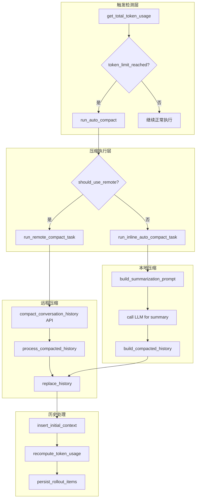
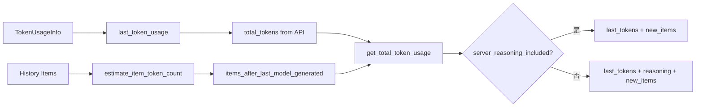
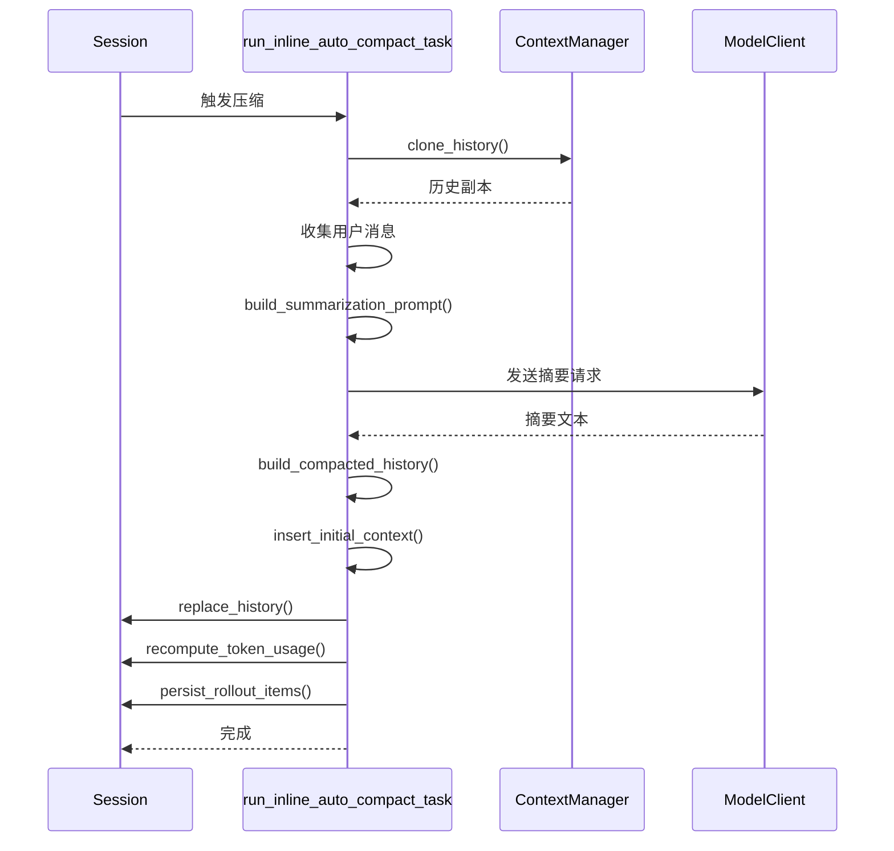
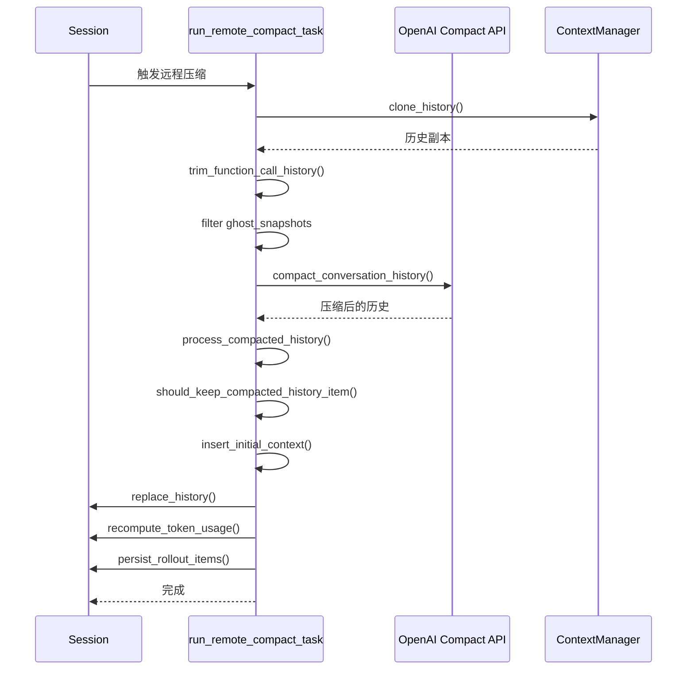
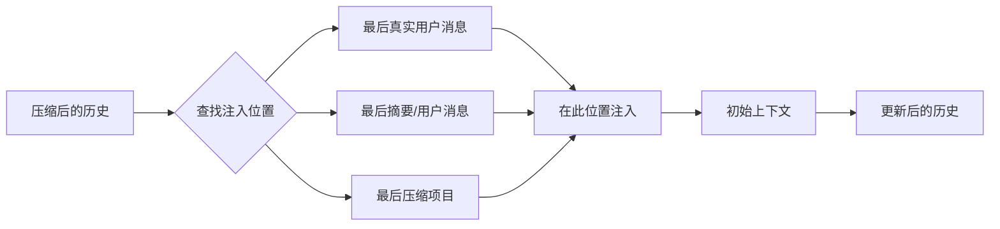
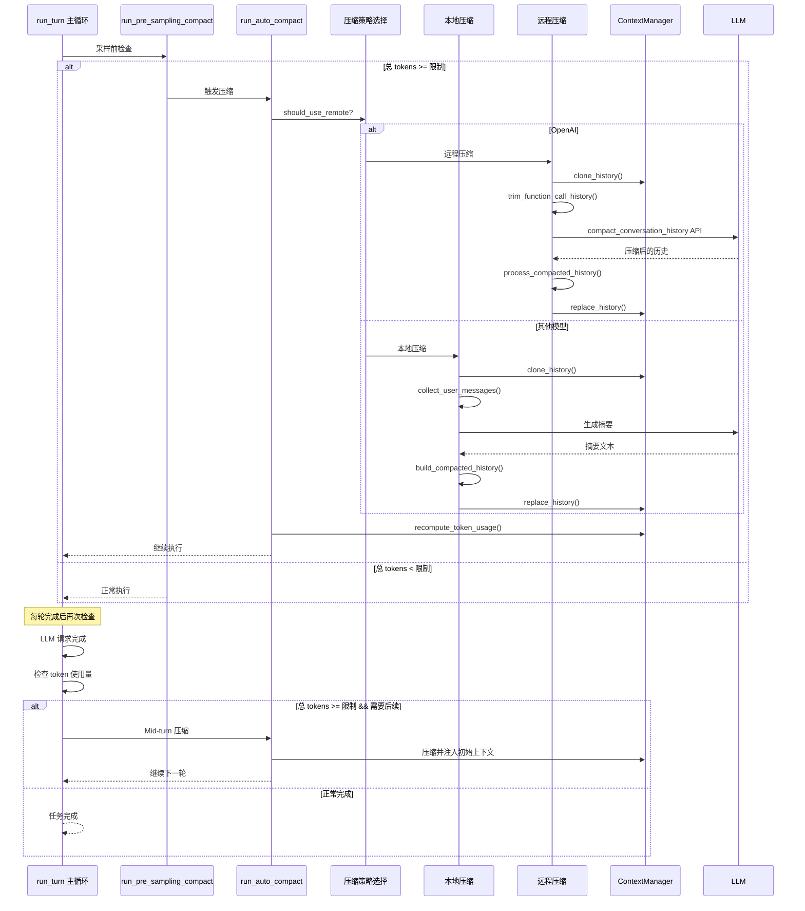

# Codex 上下文压缩机制深度解析

## 概述

Codex 的上下文压缩机制是确保长时间对话不会超出模型上下文窗口的关键系统。当对话历史变得过长时，Codex 会自动触发压缩机制，通过智能摘要历史对话来减少 token 使用量，同时保留关键信息。本文档深入解析压缩的触发条件、执行策略和实现细节。

## 核心架构

### 整体架构图



## 1. 压缩触发机制：何时需要压缩上下文

### 1.1 触发条件

Codex 在两个关键时机检查是否需要压缩：

#### 1.1.1 Pre-Sampling Compaction（采样前压缩）

在每次向 LLM 发送请求之前检查：

```rust
// 位置: core/src/codex.rs
async fn run_pre_sampling_compact(
    sess: &Arc<Session>,
    turn_context: &Arc<TurnContext>,
) -> CodexResult<()> {
    let total_usage_tokens_before_compaction = sess.get_total_token_usage().await;

    // 1. 先处理模型切换时的压缩
    maybe_run_previous_model_inline_compact(
        sess,
        turn_context,
        total_usage_tokens_before_compaction,
    ).await?;

    let total_usage_tokens = sess.get_total_token_usage().await;
    let auto_compact_limit = turn_context
        .model_info
        .auto_compact_token_limit()
        .unwrap_or(i64::MAX);

    // 2. 检查是否超过限制
    if total_usage_tokens >= auto_compact_limit {
        run_auto_compact(
            sess,
            turn_context,
            InitialContextInjection::DoNotInject,
            None,
        ).await?;
    }
    Ok(())
}
```

#### 1.1.2 Mid-Turn Compaction（轮次中压缩）

在每一轮对话完成后检查：

```rust
// 位置: core/src/codex.rs - run_turn 主循环
loop {
    // ... 执行 LLM 请求 ...

    let total_usage_tokens = sess.get_total_token_usage().await;
    let token_limit_reached = total_usage_tokens >= auto_compact_limit;

    // 检查是否需要压缩并且是否需要后续操作
    if token_limit_reached && needs_follow_up {
        run_auto_compact(
            &sess,
            &turn_context,
            InitialContextInjection::BeforeLastUserMessage,
            previous_model.as_deref(),
        ).await?;
        continue;  // 压缩后继续下一轮
    }

    // ... 任务完成逻辑 ...
}
```

### 1.2 Token 限制配置

```rust
// 位置: core/src/codex.rs
let auto_compact_limit = model_info.auto_compact_token_limit().unwrap_or(i64::MAX);
```

**配置来源：**

```rust
// 模型配置中的 auto_compact_token_limit
pub struct ModelConfig {
    pub model_context_window: Option<i64>,
    pub auto_compact_token_limit: Option<i64>,
    // ...
}
```

### 1.3 Token 使用量计算



**Token 使用量计算代码：**

```rust
// 位置: core/src/context_manager/history.rs
pub(crate) fn get_total_token_usage(&self, server_reasoning_included: bool) -> i64 {
    // 1. 最后一次 API 响应报告的总 token 数
    let last_tokens = self
        .token_info
        .as_ref()
        .map(|info| info.last_token_usage.total_tokens)
        .unwrap_or(0);

    // 2. 本地添加的新项目（最后一次模型生成之后）
    let items_after_last_model_generated_tokens = self
        .items_after_last_model_generated_item()
        .iter()
        .map(estimate_item_token_count)
        .fold(0i64, i64::saturating_add);

    // 3. 根据服务器是否已计入 reasoning tokens 决定是否需要重新估算
    if server_reasoning_included {
        last_tokens.saturating_add(items_after_last_model_generated_tokens)
    } else {
        last_tokens
            .saturating_add(self.get_non_last_reasoning_items_tokens())
            .saturating_add(items_after_last_model_generated_tokens)
    }
}
```

## 2. 压缩策略选择：本地 vs 远程

### 2.1 策略判断

```rust
// 位置: core/src/compact.rs
pub(crate) fn should_use_remote_compact_task(provider: &ModelProviderInfo) -> bool {
    provider.is_openai()
}
```

**策略选择逻辑：**

| 模型提供商 | 压缩策略 | 原因 |
|-----------|---------|------|
| OpenAI | 远程压缩 | 使用 OpenAI 的专用压缩 API |
| 其他（如 Ollama, LMStudio） | 本地压缩 | 使用本地 LLM 生成摘要 |

### 2.2 压缩任务调度

```rust
// 位置: core/src/tasks/compact.rs
impl SessionTask for CompactTask {
    async fn run(...) -> Option<String> {
        let _ = if crate::compact::should_use_remote_compact_task(&ctx.provider) {
            // 远程压缩
            crate::compact_remote::run_remote_compact_task(session.clone(), ctx).await
        } else {
            // 本地压缩
            crate::compact::run_compact_task(session.clone(), ctx, input).await
        };
        None
    }
}
```

## 3. 本地压缩机制（Local Compaction）

### 3.1 压缩流程



### 3.2 摘要提示词构建

```rust
// 位置: core/src/compact.rs
pub const SUMMARIZATION_PROMPT: &str = include_str!("../templates/compact/prompt.md");
pub const SUMMARY_PREFIX: &str = include_str!("../templates/compact/summary_prefix.md");

pub(crate) async fn run_inline_auto_compact_task(
    sess: Arc<Session>,
    turn_context: Arc<TurnContext>,
    initial_context_injection: InitialContextInjection,
    previous_user_turn_model: Option<&str>,
) -> CodexResult<()> {
    // 1. 获取压缩提示词
    let prompt = turn_context.compact_prompt().to_string();

    // 2. 构建用户输入
    let input = vec![UserInput::Text {
        text: prompt,
        text_elements: Vec::new(),
    }];

    // 3. 构建完整提示词
    let prompt = Prompt {
        input: history.for_prompt(&turn_context.model_info.input_modalities),
        tools: vec![],  // 压缩时不需要工具
        parallel_tool_calls: false,
        base_instructions,
        personality: turn_context.personality,
        output_schema: None,
    };

    // 4. 调用 LLM 生成摘要
    let mut stream = client_session.stream(&prompt, ...).await?;

    // 5. 收集响应
    loop {
        let event = stream.next().await;
        match event {
            Ok(ResponseEvent::OutputItemDone(item)) => {
                sess.record_into_history(std::slice::from_ref(&item), turn_context).await;
            }
            Ok(ResponseEvent::Completed { token_usage, .. }) => {
                sess.update_token_usage_info(turn_context, token_usage.as_ref()).await;
                return Ok(());
            }
            // ...
        }
    }
}
```

### 3.3 历史构建策略

```rust
// 位置: core/src/compact.rs
pub(crate) fn build_compacted_history(
    initial_context: Vec<ResponseItem>,
    user_messages: &[String],
    summary_text: &str,
) -> Vec<ResponseItem> {
    build_compacted_history_with_limit(
        initial_context,
        user_messages,
        summary_text,
        COMPACT_USER_MESSAGE_MAX_TOKENS,  // 20,000 tokens
    )
}

fn build_compacted_history_with_limit(
    mut history: Vec<ResponseItem>,
    user_messages: &[String],
    summary_text: &str,
    max_tokens: usize,
) -> Vec<ResponseItem> {
    let mut selected_messages: Vec<String> = Vec::new();

    // 1. 从最新的用户消息开始，反向选择直到达到 token 限制
    if max_tokens > 0 {
        let mut remaining = max_tokens;
        for message in user_messages.iter().rev() {
            if remaining == 0 {
                break;
            }
            let tokens = approx_token_count(message);
            if tokens <= remaining {
                selected_messages.push(message.clone());
                remaining = remaining.saturating_sub(tokens);
            } else {
                // 截断过长的消息
                let truncated = truncate_text(message, TruncationPolicy::Tokens(remaining));
                selected_messages.push(truncated);
                break;
            }
        }
        selected_messages.reverse();
    }

    // 2. 添加保留的用户消息
    for message in &selected_messages {
        history.push(ResponseItem::Message {
            id: None,
            role: "user".to_string(),
            content: vec![ContentItem::InputText { text: message.clone() }],
            end_turn: None,
            phase: None,
        });
    }

    // 3. 添加摘要作为最后的用户消息
    history.push(ResponseItem::Message {
        id: None,
        role: "user".to_string(),
        content: vec![ContentItem::InputText {
            text: if summary_text.is_empty() {
                "(no summary available)".to_string()
            } else {
                summary_text.to_string()
            }
        }],
        end_turn: None,
        phase: None,
    });

    history
}
```

**关键策略：**

1. **保留最近的用户消息**: 从最新的消息开始反向选择
2. **Token 预算管理**: 最多保留 20,000 tokens 的用户消息
3. **智能截断**: 过长的消息会被截断而不是完全丢弃
4. **摘要优先**: 摘要总是作为最后一条用户消息

### 3.4 用户消息收集

```rust
// 位置: core/src/compact.rs
pub(crate) fn collect_user_messages(items: &[ResponseItem]) -> Vec<String> {
    items
        .iter()
        .filter_map(|item| match crate::event_mapping::parse_turn_item(item) {
            Some(TurnItem::UserMessage(user)) => {
                // 过滤掉系统生成的上下文消息
                if is_summary_message(&user.message()) {
                    None
                } else {
                    Some(user.message())
                }
            }
            _ => None,
        })
        .collect()
}

pub(crate) fn is_summary_message(message: &str) -> bool {
    // 识别系统生成的摘要消息（以特定前缀开头）
    message.starts_with(format!("{SUMMARY_PREFIX}\n").as_str())
}
```

## 4. 远程压缩机制（Remote Compaction）

### 4.1 远程压缩流程



### 4.2 远程压缩实现

```rust
// 位置: core/src/compact_remote.rs
async fn run_remote_compact_task_inner_impl(
    sess: &Arc<Session>,
    turn_context: &Arc<TurnContext>,
    initial_context_injection: InitialContextInjection,
    previous_user_turn_model: Option<&str>,
) -> CodexResult<()> {
    // 1. 发出压缩开始事件
    let compaction_item = TurnItem::ContextCompaction(ContextCompactionItem::new());
    sess.emit_turn_item_started(turn_context, &compaction_item).await;

    // 2. 克隆历史
    let mut history = sess.clone_history().await;
    let base_instructions = sess.get_base_instructions().await;

    // 3. 预处理：修剪函数调用历史以适应上下文窗口
    let deleted_items = trim_function_call_history_to_fit_context_window(
        &mut history,
        turn_context.as_ref(),
        &base_instructions,
    );

    // 4. 保留 ghost_snapshots（用于 /undo 功能）
    let ghost_snapshots: Vec<ResponseItem> = history
        .raw_items()
        .iter()
        .filter(|item| matches!(item, ResponseItem::GhostSnapshot { .. }))
        .cloned()
        .collect();

    // 5. 构建压缩请求
    let prompt = Prompt {
        input: history.for_prompt(&turn_context.model_info.input_modalities),
        tools: vec![],
        parallel_tool_calls: false,
        base_instructions,
        personality: turn_context.personality,
        output_schema: None,
    };

    // 6. 调用远程压缩 API
    let mut new_history = sess
        .services
        .model_client
        .compact_conversation_history(
            &prompt,
            &turn_context.model_info,
            &turn_context.otel_manager,
        )
        .await?;

    // 7. 后处理压缩结果
    new_history = process_compacted_history(
        sess.as_ref(),
        turn_context.as_ref(),
        new_history,
        initial_context_injection,
        previous_user_turn_model,
    ).await;

    // 8. 恢复 ghost_snapshots
    if !ghost_snapshots.is_empty() {
        new_history.extend(ghost_snapshots);
    }

    // 9. 替换历史
    let reference_context_item = match initial_context_injection {
        InitialContextInjection::DoNotInject => None,
        InitialContextInjection::BeforeLastUserMessage => Some(turn_context.to_turn_context_item()),
    };
    sess.replace_history(new_history.clone(), reference_context_item).await;
    sess.recompute_token_usage(turn_context).await;

    // 10. 持久化
    sess.persist_rollout_items(&[RolloutItem::Compacted(CompactedItem {
        message: String::new(),
        replacement_history: Some(new_history),
    })]).await;

    sess.emit_turn_item_completed(turn_context, compaction_item).await;
    Ok(())
}
```

### 4.3 历史预处理：修剪函数调用

```rust
// 位置: core/src/compact_remote.rs
fn trim_function_call_history_to_fit_context_window(
    history: &mut ContextManager,
    turn_context: &TurnContext,
    base_instructions: &BaseInstructions,
) -> usize {
    let mut deleted_items = 0usize;
    let Some(context_window) = turn_context.model_context_window() else {
        return deleted_items;
    };

    // 从最新的项目开始删除，直到适应上下文窗口
    while history
        .estimate_token_count_with_base_instructions(base_instructions)
        .is_some_and(|estimated_tokens| estimated_tokens > context_window)
    {
        let Some(last_item) = history.raw_items().last() else {
            break;
        };

        // 只删除 Codex 生成的项目（不是用户消息）
        if !is_codex_generated_item(last_item) {
            break;
        }

        history.remove_last_item();
        deleted_items += 1;
    }

    deleted_items
}
```

### 4.4 压缩结果后处理

```rust
// 位置: core/src/compact_remote.rs
pub(crate) async fn process_compacted_history(
    sess: &Session,
    turn_context: &TurnContext,
    mut compacted_history: Vec<ResponseItem>,
    initial_context_injection: InitialContextInjection,
    previous_user_turn_model: Option<&str>,
) -> Vec<ResponseItem> {
    // 1. 如果需要，注入初始上下文
    let initial_context = if matches!(
        initial_context_injection,
        InitialContextInjection::BeforeLastUserMessage
    ) {
        sess.build_initial_context(turn_context, previous_user_turn_model).await
    } else {
        Vec::new()
    };

    // 2. 过滤掉不应该保留的项目
    compacted_history.retain(should_keep_compacted_history_item);

    // 3. 插入初始上下文
    insert_initial_context_before_last_real_user_or_summary(compacted_history, initial_context)
}

/// 判断远程压缩输出中的项目是否应该保留
fn should_keep_compacted_history_item(item: &ResponseItem) -> bool {
    match item {
        // 丢弃: developer 消息（可能包含过时/重复的指令）
        ResponseItem::Message { role, .. } if role == "developer" => false,

        // 保留: 真实用户消息
        ResponseItem::Message { role, .. } if role == "user" => {
            matches!(
                crate::event_mapping::parse_turn_item(item),
                Some(TurnItem::UserMessage(_))
            )
        }

        // 保留: assistant 消息
        ResponseItem::Message { role, .. } if role == "assistant" => true,

        // 丢弃: 其他角色消息
        ResponseItem::Message { .. } => false,

        // 保留: 压缩项目
        ResponseItem::Compaction { .. } => true,

        // 丢弃: 其他所有项目
        _ => false,
    }
}
```

## 5. 初始上下文注入

### 5.1 注入策略

```rust
// 位置: core/src/compact.rs
#[derive(Clone, Copy, Debug, Eq, PartialEq)]
pub(crate) enum InitialContextInjection {
    /// 在最后一个真实用户消息之前注入
    /// （用于 mid-turn 压缩）
    BeforeLastUserMessage,

    /// 不注入初始上下文
    /// （用于 pre-turn 压缩，会在压缩后重新注入）
    DoNotInject,
}
```

### 5.2 注入位置算法

```rust
// 位置: core/src/compact.rs
pub(crate) fn insert_initial_context_before_last_real_user_or_summary(
    mut compacted_history: Vec<ResponseItem>,
    initial_context: Vec<ResponseItem>,
) -> Vec<ResponseItem> {
    let mut last_user_or_summary_index = None;
    let mut last_real_user_index = None;

    // 1. 从后向前查找合适的注入位置
    for (i, item) in compacted_history.iter().enumerate().rev() {
        let Some(TurnItem::UserMessage(user)) =
            crate::event_mapping::parse_turn_item(item) else {
            continue;
        };

        // 跟踪最后一个用户消息（包括摘要）
        last_user_or_summary_index.get_or_insert(i);

        // 跟踪最后一个真实用户消息（不包括摘要）
        if !is_summary_message(&user.message()) {
            last_real_user_index = Some(i);
            break;
        }
    }

    // 2. 查找最后一个压缩项目
    let last_compaction_index = compacted_history
        .iter()
        .enumerate()
        .rev()
        .find_map(|(i, item)| matches!(item, ResponseItem::Compaction { .. }).then_some(i));

    // 3. 优先级: 真实用户消息 > 摘要/用户消息 > 压缩项目
    let insertion_index = last_real_user_index
        .or(last_user_or_summary_index)
        .or(last_compaction_index);

    // 4. 在选定位置注入初始上下文
    if let Some(insertion_index) = insertion_index {
        compacted_history.splice(insertion_index..insertion_index, initial_context);
    } else {
        compacted_history.extend(initial_context);
    }

    compacted_history
}
```

**注入位置优先级：**



## 6. 历史管理

### 6.1 ContextManager 结构

```rust
// 位置: core/src/context_manager/history.rs
#[derive(Debug, Clone, Default)]
pub(crate) struct ContextManager {
    /// 历史项目（从旧到新排序）
    items: Vec<ResponseItem>,

    /// Token 使用信息
    token_info: Option<TokenUsageInfo>,

    /// 参考上下文快照（用于差异比较）
    reference_context_item: Option<TurnContextItem>,
}
```

### 6.2 Token 使用量估算

```rust
// 位置: core/src/context_manager/history.rs
pub(crate) fn estimate_token_count(&self, turn_context: &TurnContext) -> Option<i64> {
    let model_info = &turn_context.model_info;
    let personality = turn_context.personality.or(turn_context.config.personality);
    let base_instructions = BaseInstructions {
        text: model_info.get_model_instructions(personality),
    };

    self.estimate_token_count_with_base_instructions(&base_instructions)
}

pub(crate) fn estimate_token_count_with_base_instructions(
    &self,
    base_instructions: &BaseInstructions,
) -> Option<i64> {
    // 基础指令的 token 数
    let base_tokens =
        i64::try_from(approx_token_count(&base_instructions.text)).unwrap_or(i64::MAX);

    // 历史项目的 token 数
    let items_tokens = self
        .items
        .iter()
        .map(estimate_item_token_count)
        .fold(0i64, i64::saturating_add);

    Some(base_tokens.saturating_add(items_tokens))
}
```

### 6.3 历史操作

```rust
impl ContextManager {
    /// 记录新项目
    pub(crate) fn record_items<I>(&mut self, items: I, policy: TruncationPolicy)
    where
        I: IntoIterator,
        I::Item: std::ops::Deref<Target = ResponseItem>,
    {
        for item in items {
            let processed = self.process_item(item_ref, policy);
            self.items.push(processed);
        }
    }

    /// 删除第一个（最旧的）项目
    pub(crate) fn remove_first_item(&mut self) {
        if !self.items.is_empty() {
            let removed = self.items.remove(0);
            // 同时删除相关的调用/输出对
            normalize::remove_corresponding_for(&mut self.items, &removed);
        }
    }

    /// 删除最后一个（最新的）项目
    pub(crate) fn remove_last_item(&mut self) -> bool {
        if let Some(removed) = self.items.pop() {
            normalize::remove_corresponding_for(&mut self.items, &removed);
            true
        } else {
            false
        }
    }

    /// 替换整个历史
    pub(crate) fn replace(&mut self, items: Vec<ResponseItem>) {
        self.items = items;
    }
}
```

## 7. 完整压缩流程时序图



## 8. 关键设计决策

### 8.1 为什么有两种压缩策略？

| 策略 | 优点 | 缺点 | 适用场景 |
|-----|------|------|---------|
| **远程压缩** | 专业的压缩 API，质量更高；减少本地计算负担 | 依赖网络；可能有延迟 | OpenAI 模型 |
| **本地压缩** | 不依赖外部服务；响应更快 | 质量可能不如远程；占用本地资源 | 本地模型（Ollama, LMStudio） |

### 8.2 为什么保留部分用户消息？

1. **上下文连贯性**: 保留最近的用户消息有助于模型理解当前任务
2. **Token 效率**: 20,000 tokens 的预算在大多数情况下足够
3. **智能截断**: 过长消息截断而非完全丢弃，避免丢失关键信息

### 8.3 为什么摘要总是在最后？

```rust
// 摘要作为用户消息添加
history.push(ResponseItem::Message {
    role: "user".to_string(),
    content: vec![ContentItem::InputText { text: summary_text }],
    ...
});
```

**原因：**

1. **模型训练**: 模型被训练为在最后看到压缩摘要
2. **上下文完整性**: 摘要总结了之前的历史，应该在新一轮对话之前
3. **一致性**: 保持压缩格式的一致性，便于模型理解

### 8.4 初始上下文注入的时机

| 压缩时机 | 注入策略 | 原因 |
|---------|---------|------|
| **Pre-turn** | `DoNotInject` | 压缩后会在新一轮开始时自动注入完整上下文 |
| **Mid-turn** | `BeforeLastUserMessage` | 模型期望看到摘要作为最后一项，初始上下文需要注入在用户消息之前 |

## 9. 错误处理与恢复

### 9.1 压缩失败处理

```rust
// 位置: core/src/compact_remote.rs
async fn run_remote_compact_task_inner(...) -> CodexResult<()> {
    if let Err(err) = run_remote_compact_task_inner_impl(...).await {
        // 1. 记录详细的失败信息
        let event = EventMsg::Error(
            err.to_error_event(Some("Error running remote compact task".to_string()))
        );
        sess.send_event(turn_context, event).await;

        // 2. 返回错误
        return Err(err);
    }
    Ok(())
}
```

### 9.2 压缩失败日志

```rust
// 位置: core/src/compact_remote.rs
fn log_remote_compact_failure(
    turn_context: &TurnContext,
    log_data: &CompactRequestLogData,
    total_usage_breakdown: TotalTokenUsageBreakdown,
    err: &CodexErr,
) {
    error!(
        turn_id = %turn_context.sub_id,
        last_api_response_total_tokens = total_usage_breakdown.last_api_response_total_tokens,
        all_history_items_model_visible_bytes = total_usage_breakdown.all_history_items_model_visible_bytes,
        estimated_tokens_of_items_added_since_last_successful_api_response =
            total_usage_breakdown.estimated_tokens_of_items_added_since_last_successful_api_response,
        model_context_window_tokens = ?turn_context.model_context_window(),
        failing_compaction_request_model_visible_bytes =
            log_data.failing_compaction_request_model_visible_bytes,
        compact_error = %err,
        "remote compaction failed"
    );
}
```

## 10. 性能优化

### 10.1 预估而非精确计算

```rust
// 位置: core/src/truncate.rs
pub fn approx_token_count(text: &str) -> usize {
    // 使用字节估算而非精确的 tokenizer
    // 这是粗略的下界，不是 tokenizer 精确计数
    approx_tokens_from_byte_count(text.len())
}
```

### 10.2 增量更新

```rust
// 位置: core/src/context_manager/history.rs
pub(crate) fn update_token_info(
    &mut self,
    usage: &TokenUsage,
    model_context_window: Option<i64>,
) {
    // 增量更新而非重新计算
    self.token_info = TokenUsageInfo::new_or_append(
        &self.token_info,
        &Some(usage.clone()),
        model_context_window,
    );
}
```

## 总结

Codex 的上下文压缩机制是一个精心设计的系统，具有以下关键特性：

### 核心机制

1. **双重触发检查**: 采样前和轮次中都检查 token 使用量
2. **灵活的策略选择**: 根据模型提供商选择本地或远程压缩
3. **智能历史保留**: 保留最近的用户消息，用摘要替代旧历史
4. **精确的上下文注入**: 根据压缩时机选择正确的注入位置

### 关键参数

- **Token 限制**: `auto_compact_token_limit`（默认为模型上下文窗口）
- **用户消息预算**: 20,000 tokens
- **压缩触发**: `total_usage_tokens >= auto_compact_limit`

### 压缩效果

压缩后的历史结构：
```
[初始上下文] + [保留的用户消息] + [压缩摘要]
```

这种设计确保了：
- 长时间对话不会超出上下文窗口
- 关键信息通过摘要保留
- 最近的交互历史完整保留
- 压缩过程对用户透明且可恢复
