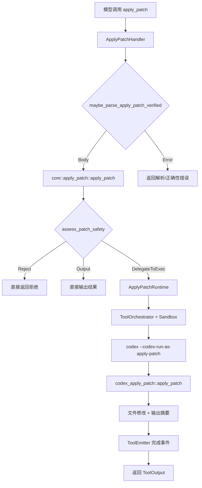
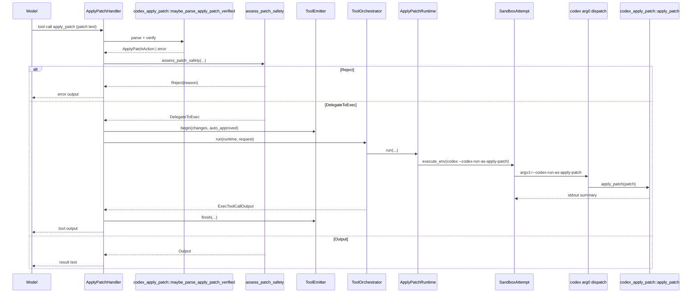

# Codex apply_patch 工具集成解析

## 概览

apply_patch 在 Codex 中是“可解析、可预览、可审批、可沙箱执行”的文件编辑通道。它通过 `codex_apply_patch` crate 提供解析与应用补丁的能力，再由 `codex-core` 把它包装成工具（freeform 或 JSON），并串入审批、沙箱、事件上报与执行编排。

本节围绕三条主线展开：

- 工具如何注册并暴露给模型
- 工具调用如何被解析、审批、执行
- `apply_patch` crate 的职责与对接方式

## 关键组件与职责分工

- `venders/codex/codex-rs/apply-patch/src/lib.rs`
  - `codex_apply_patch` crate 核心入口。
  - 对外暴露 `parse_patch`、`maybe_parse_apply_patch_verified`、`apply_patch`、`ApplyPatchAction` 等 API。
  - 定义内部自调用协议 `CODEX_CORE_APPLY_PATCH_ARG1`。
  - 内置 `APPLY_PATCH_TOOL_INSTRUCTIONS` 常量，来自 `apply_patch_tool_instructions.md`。
- `venders/codex/codex-rs/core/src/tools/handlers/apply_patch.rs`
  - 工具 handler：解析调用、验证补丁、触发审批与运行时执行。
  - 提供 `create_apply_patch_freeform_tool` 与 `create_apply_patch_json_tool`。
- `venders/codex/codex-rs/core/src/apply_patch.rs`
  - 安全评估入口：`assess_patch_safety` 的判定结果决定是否直接输出、请求审批或拒绝。
  - 负责把 `ApplyPatchAction` 转换为协议层 `FileChange`。
- `venders/codex/codex-rs/core/src/tools/runtimes/apply_patch.rs`
  - 运行时：构造 `codex --codex-run-as-apply-patch` 自调用命令，沙箱执行。
- `venders/codex/codex-rs/arg0/src/lib.rs`
  - arg0 调度与 PATH 注入：确保 `apply_patch` CLI 可用，且支持 `--codex-run-as-apply-patch` 内部路径。

## 工具注册：freeform 与 JSON 两条路径

工具是否启用、以及以哪种形式暴露，取决于配置中的 `apply_patch_tool_type`：

- `venders/codex/codex-rs/core/src/tools/spec.rs`
  - `ApplyPatchToolType::Freeform`：注册 `create_apply_patch_freeform_tool()`
  - `ApplyPatchToolType::Function`：注册 `create_apply_patch_json_tool()`
  - 最终统一注册 handler：`builder.register_handler("apply_patch", apply_patch_handler)`

**Freeform 版本**

- `create_apply_patch_freeform_tool()` 生成 `ToolSpec::Freeform`
- 使用 Lark grammar（`tool_apply_patch.lark`）约束输入格式
- 由模型直接输出补丁文本（不包 JSON）

**JSON 版本**

- `create_apply_patch_json_tool()` 生成 `ToolSpec::Function`
- 参数只有 `input: string`，完整补丁文本由 `input` 承载
- 描述字段中内嵌补丁语法与示例，确保模型理解格式

**提示词缓存层补充**

- `venders/codex/codex-rs/core/tests/suite/prompt_caching.rs` 中验证：
  - 当 apply_patch 工具未暴露时，base instructions 会拼接 `APPLY_PATCH_TOOL_INSTRUCTIONS`
  - 目的是保证模型仍能理解补丁格式

## 调用链路与执行流程

核心路径从 handler 开始，解析->安全->执行->回传：

### 1) 解析与验证

- `ApplyPatchHandler::handle` 会把参数重新解析，确保是“合法 apply_patch 调用”
- 核心验证 API：`codex_apply_patch::maybe_parse_apply_patch_verified`
  - 支持直接调用 `apply_patch <patch>`
  - 支持 heredoc 形式的 shell 脚本（见 `invocation.rs`）
  - 检测“隐式 patch 体”并拒绝（防止误解析）

### 2) 安全评估与审批

- `core/src/apply_patch.rs::apply_patch` 调用 `assess_patch_safety`
- 判定依据：
  - patch 是否为空
  - 目标路径是否在可写根目录内
  - approval policy 与 sandbox policy 的组合
- 结果三选一：
  - 直接输出（无需 exec）
  - 委托执行（需要沙箱或审批）
  - 拒绝（路径越界且策略禁止）

### 3) 运行时执行

- `ApplyPatchRuntime::build_command_spec` 生成自调用命令：
  - `program = codex`
  - `args = [--codex-run-as-apply-patch, <patch>]`
  - `env = {}`（最小环境，避免泄露）
- `ToolOrchestrator` 统一编排审批与沙箱执行
- 通过 `ToolEmitter` 发送 begin/finish 事件，并将结果转成 ToolOutput

### 4) arg0 调度与 apply_patch CLI

- `arg0_dispatch` 支持以下分流：
  - `apply_patch` / `applypatch` 直接调用 `codex_apply_patch::main()`
  - `--codex-run-as-apply-patch` 直接调用 `codex_apply_patch::apply_patch()`
- `prepend_path_entry_for_codex_aliases()` 会在 PATH 中注入临时别名：
  - UNIX: 软链接 `apply_patch -> codex`
  - Windows: `apply_patch.bat` 调用 `codex --codex-run-as-apply-patch`

## apply_patch crate 内部逻辑

`codex_apply_patch` 负责“把补丁变成文件修改”的纯逻辑：

- `parser.rs`
  - 解析 `*** Begin Patch`/`*** End Patch` 结构
  - 支持 Add/Delete/Update、Move、`@@` context 与 `*** End of File`
  - 允许 lenient 模式处理 heredoc 场景
- `invocation.rs`
  - 解析 shell 脚本，提取 heredoc 的 patch 正文
  - 支持 `bash`/`pwsh`/`cmd` 的 heredoc 形式
- `lib.rs`
  - `apply_patch`/`apply_hunks` 负责实际落盘
  - `unified_diff_from_chunks` 用于生成统一 diff（供外部审阅）
  - `ApplyPatchAction` 聚合变更内容与绝对路径信息

核心思路：先把 patch 解析成 `Hunk`，再把每个文件变更转换为“替换区间”，最终执行文件写入或移动。

## apply_patch_tool_instructions.md 的作用

- 文件位置：`venders/codex/codex-rs/apply-patch/apply_patch_tool_instructions.md`
- 内容：完整补丁语法说明与示例调用方式
- 在 `codex_apply_patch` 中通过 `include_str!` 暴露为常量
  - `APPLY_PATCH_TOOL_INSTRUCTIONS`
- 主要用途：
  - 当 apply_patch 工具不在 tools 列表里时，把说明文本拼入 base instructions
  - 保证模型仍然理解补丁格式与调用规范
  - Bazel 构建时作为 compile_data 引入（`apply-patch/BUILD.bazel` 与 `core/BUILD.bazel`）

## 如何与 apply_patch crate 打交道

常用集成方式分为“解析/验证”和“执行/落盘”两类：

**解析/验证**

- `codex_apply_patch::maybe_parse_apply_patch_verified(argv, cwd)`
  - 解析命令参数（支持 heredoc）
  - 产出 `MaybeApplyPatchVerified::Body(ApplyPatchAction)`
  - 用于生成预览、审批、sandbox 判断

**执行/落盘**

- `codex_apply_patch::apply_patch(patch, stdout, stderr)`
  - 直接把补丁应用到文件系统
  - 输出“Success. Updated the following files:”风格摘要

**生成变更与 diff**

- `ApplyPatchAction::changes()` 返回 `ApplyPatchFileChange` 集合
- `unified_diff_from_chunks` 生成 unified diff，便于 UI/审批展示

## 补充 1：调用时序图（含审批与沙箱）

补充说明：如果模型试图通过 `exec_command`/`shell` 直接调用 `apply_patch`，`intercept_apply_patch(...)` 会解析并记录警告（提示改用工具），同时仍走相同审批/执行路径。

## 补充 2：事件与日志流

- `ToolEmitter::apply_patch(...)` 在 `handle` 中发出 begin/finish 事件；payload 使用 `convert_apply_patch_to_protocol` 转成 `FileChange`，用于 UI 预览与审批展示。
- `ApplyPatchRuntime::start_approval_async` 通过 `request_patch_approval` 发起审批；`with_cached_approval` 会复用先前对相同文件路径的审批结果。
- `session.record_model_warning(...)` 记录模型“走错通道”的行为（例如用 exec 调 apply_patch），用于提示/诊断。
- `Prompt::get_formatted_input` 会在 freeform apply_patch 工具存在时，把 shell 输出重序列化为结构化文本，避免 JSON 嵌套影响模型理解。

## 补充 3：语法与行为边界案例

- **隐式 patch 被拒绝**：当 argv 只有 patch 文本或 shell 脚本正文就是 patch 时，`maybe_parse_apply_patch_verified` 返回 `ImplicitInvocation`。
- **补丁包络严格**：缺失 `*** Begin Patch` 或 `*** End Patch` 会触发 `InvalidPatchError`。
- **空 Update hunk**：`*** Update File` 下没有有效 chunk 会触发 `InvalidHunkError`。
- **首个 chunk 可省略 @@**：首段允许无 `@@`（`allow_missing_context`），但后续 chunk 必须带上下文。
- **EOF 追加**：使用 `*** End of File` 标记末尾追加；匹配失败时会返回 “Failed to find expected lines”。
- **heredoc 解析极严格**：只接受 `apply_patch <<'EOF'` 或 `cd <path> && apply_patch <<'EOF'` 两种顶层形式；任何额外命令/管道/多参数 `cd` 都会拒绝。
- **路径与权限**：语法说明要求相对路径；实现中会用 `cwd.join(path)` 解析，若为绝对路径则直接落在绝对位置，随后由 `assess_patch_safety` 判断是否越界、是否需要审批或拒绝。
- **匹配容错**：`seek_sequence` 依次尝试精确/trim/Unicode 标点归一化匹配（如 EN DASH 转 `-`），以提高实际命中率。
- **落盘失败**：删除不存在文件或只读文件写入会返回错误；移动操作先写新文件后删除旧文件。

## 小结

apply_patch 在 Codex 中不是简单的文件替换工具，而是一条“可解析、可审计、可 sandbox”的编辑通道。`codex_apply_patch` 负责补丁语法与文件变更语义，`codex-core` 负责工具暴露、审批策略和运行时编排，`arg0` 负责把 apply_patch 变成可调度的 CLI 与内部自调用入口。整体设计兼顾了模型可用性与操作安全性。
