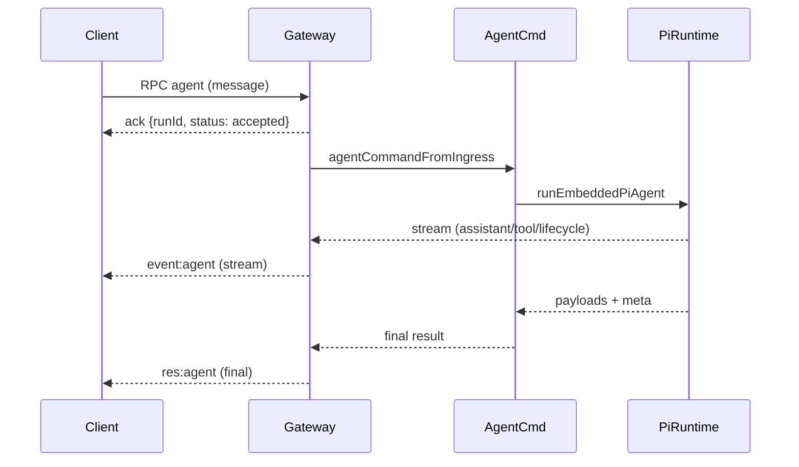
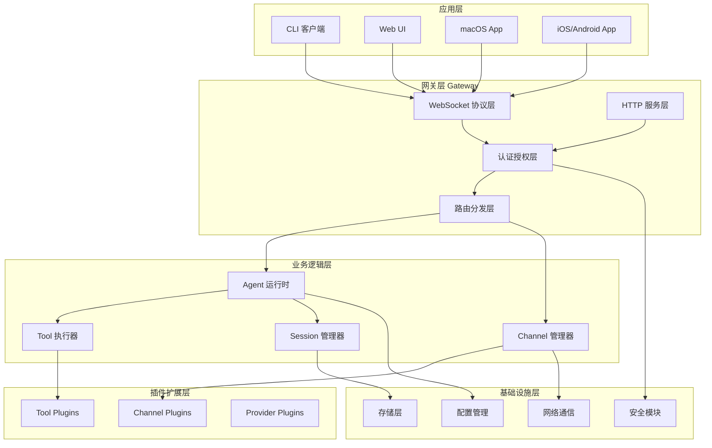
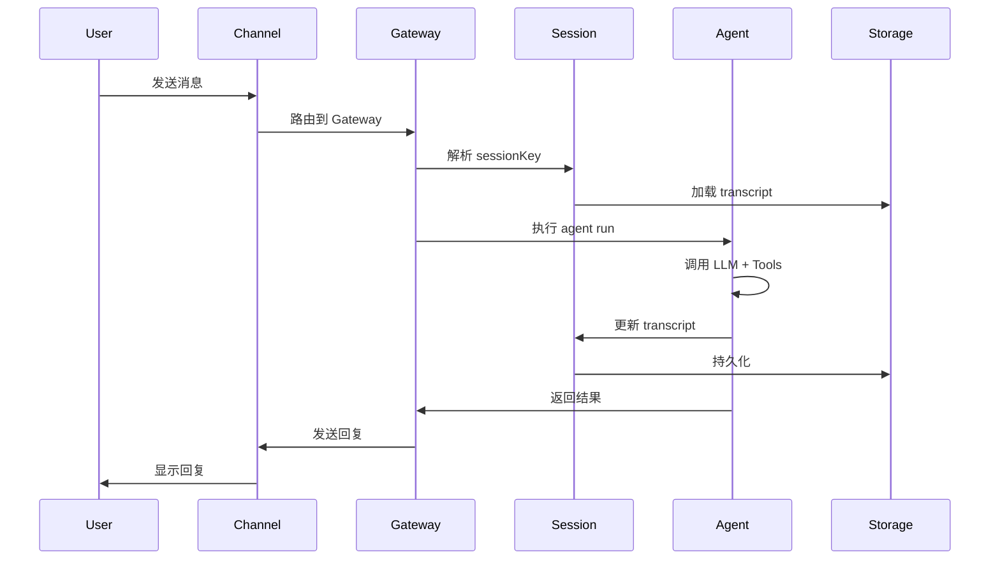
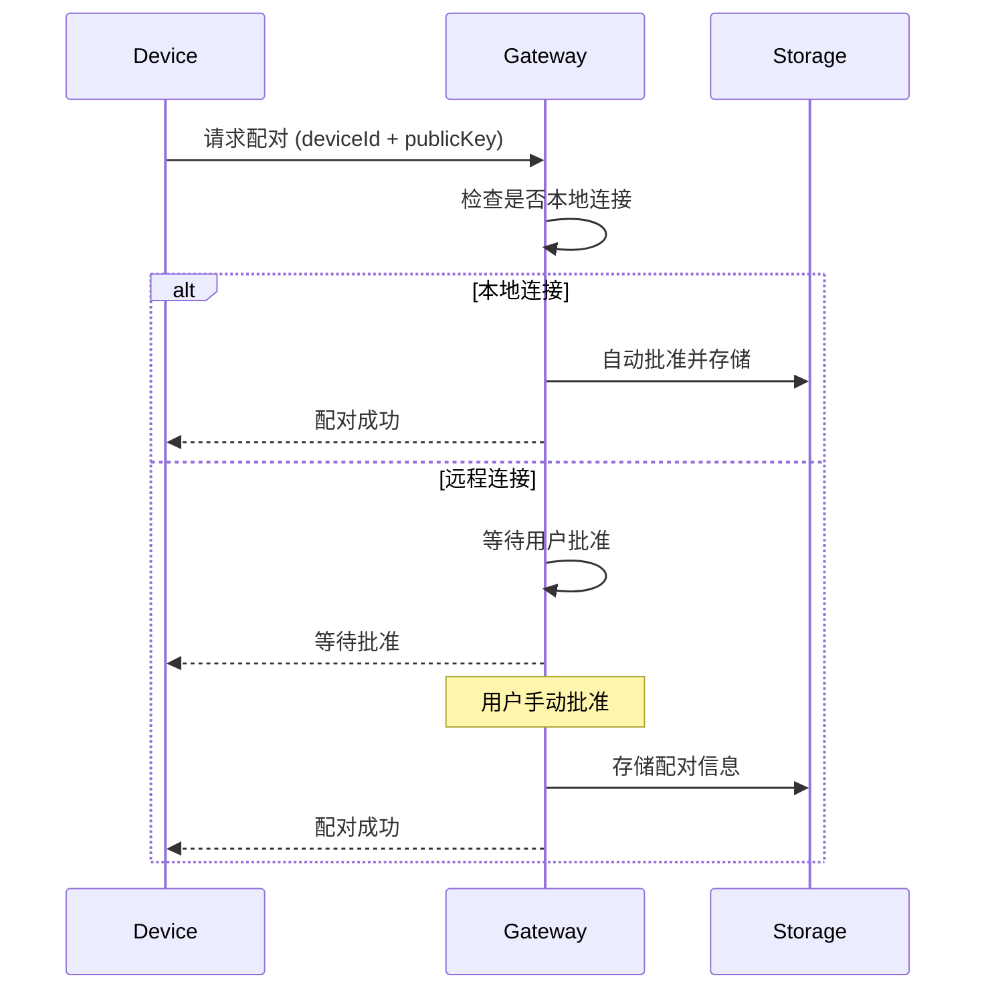
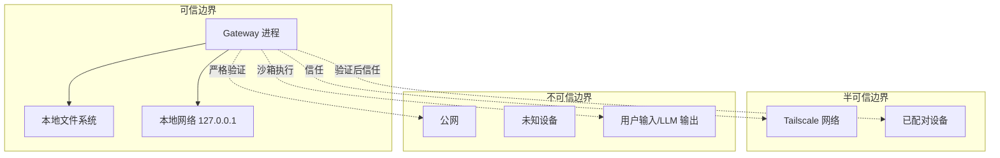
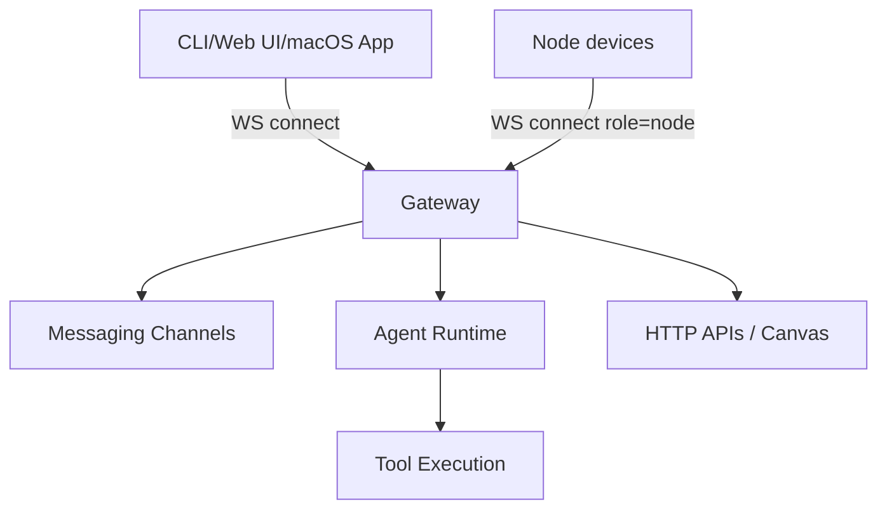

# OpenClaw 架构分析（基于 vendors/openclaw）

> 目标读者：研发 + 新同事（理解全貌）
> 说明：本文结合 `vendors/openclaw` 代码与文档，对系统架构、核心运行链路、组件边界与关键模块进行梳理。必要处以 mermaid 图示描述。

## 1. 系统全景与核心定位

OpenClaw 是一个运行在用户自有设备上的 **个人 AI 助手**。系统核心是 **Gateway（网关/控制平面）**，它同时承担：

- 所有消息渠道的接入与连接维护（WhatsApp/Telegram/Slack/Discord/Signal/iMessage/WebChat 等）。
- 对外提供统一的 WebSocket 控制 API 与事件流。
- 运行 AI 代理（agent runtime），协调模型调用、工具执行与会话持久化。
- 同端口提供 HTTP 服务（OpenAI 兼容接口、工具调用接口、Canvas/A2UI 等）。

因此，OpenClaw 的总体形态是：
**“单进程 Gateway + 多客户端/节点 + 统一 agent 运行时 + 插件/技能扩展体系”。**

## 2. 技术栈

### 2.1 核心技术

**运行时环境：**
- Node.js 22+ (主要运行时)
- Bun (开发与测试，保持兼容)
- TypeScript 5.9+ (ESM 模块)

**核心框架与库：**
- Express 5.x (HTTP 服务器)
- ws 8.x (WebSocket 服务)
- @mariozechner/pi-* (内嵌 AI Agent 运行时)
- Vitest (测试框架，V8 覆盖率)

**消息渠道 SDK：**
- @whiskeysockets/baileys (WhatsApp)
- grammy (Telegram)
- @slack/bolt (Slack)
- discord.js (Discord)
- @line/bot-sdk (LINE)
- 其他 40+ 渠道集成

**构建工具链：**
- tsdown (TypeScript 编译)
- oxlint/oxfmt (代码检查与格式化)
- pnpm (包管理器)

**移动端：**
- Swift/SwiftUI (macOS/iOS)
- Kotlin (Android)
- Xcode/Gradle (构建工具)

### 2.2 数据存储

- **配置文件**: JSON5 格式 (`~/.openclaw/config.json5`)
- **会话存储**: JSONL 格式 (每个 agent 独立目录)
- **凭证管理**: 加密存储于 `~/.openclaw/credentials/`
- **向量数据库**: sqlite-vec (可选，用于 memory 扩展)

## 3. 核心组件与职责分层

### 3.1 Gateway（控制平面/运行时入口）

**职责：**
- 持久运行的单进程服务。
- 统一管理所有 messaging 渠道、Web UI、CLI、桌面应用、自动化等控制面客户端。
- 作为 agent runtime 的调度入口与会话/工具的统一协调器。

**关键代码：**
- Gateway 入口：`src/gateway/server.ts` / `src/gateway/server.impl.ts`
- WebSocket 协议处理：`src/gateway/*` + `src/gateway/server-methods/*`

**重要特性：**
- 统一 WS 协议（必须 `connect` 握手）。
- 设备配对（device pairing）与 token/password 认证。
- 事件流（agent/chat/presence/health/cron 等）与请求/响应共存。

### 2.2 Agent Runtime（pi-mono 内嵌运行时）

OpenClaw 使用内嵌的 **pi-mono** 运行时（非外部服务），核心逻辑由 OpenClaw 自己管理：

- 运行入口：`runEmbeddedPiAgent`（`src/agents/pi-embedded-runner/run.ts`）
- 运行时桥接：`subscribeEmbeddedPiSession` 负责把 pi 事件流映射到 OpenClaw 的 agent 事件流
- 组织结构：`src/agents/` 下的 `pi-embedded-*` 与 `pi-tools/*`

**关键特性：**
- 每次 agent run 通过 “session lane + global lane” 串行化（保证会话一致性）。
- 自动上下文处理（compaction/overflow recovery/tool result truncation）。
- 系统提示词由 OpenClaw 组装（workspace + skills + bootstrap + overrides）。

### 2.3 Channels（消息渠道）

OpenClaw 将每个消息渠道抽象成 **channel plugin**：

- 核心入口：`src/channels/plugins/*`
- 管理器：`src/gateway/server-channels.ts`（统一启动、重启、状态跟踪）

渠道插件向 Gateway 暴露：
- 启动/停止账号
- 配置验证
- 运行时状态/错误

### 2.4 Tools / Skills（工具与能力体系）

OpenClaw 使用 **工具化的 LLM 调用接口**：

- 工具层（runtime）：`src/agents/pi-tools/*` + `src/agents/tool-policy*`
- 文档：`docs/tools/*`

Skills 不是工具，而是 **对工具使用的指导说明**（AgentSkills 规范）：

- Skills 来源：内置 + `~/.openclaw/skills` + workspace `skills/`
- 优先级：workspace > managed > bundled
- 技能加载与过滤：`src/agents/skills/*`

### 2.5 Plugins（扩展机制）

插件用于扩展：
- 新渠道（channel plugin）
- 新工具（agent tools）
- 新 providers（模型接入）

插件必须包含 `openclaw.plugin.json`（严格 schema 校验）。

关键路径：
- 插件注册与运行时：`src/plugins/*`
- 插件 manifest 规则：`docs/plugins/manifest.md`

### 2.6 Nodes（外部设备节点）

Nodes 是“外设型”设备（macOS/iOS/Android/headless）：

- 通过 WebSocket 连接 Gateway（role: node）
- 提供 Canvas/Camera/Device/Screen 等能力
- Gateway 仍是唯一控制面与消息接入点

文档：`docs/nodes/index.md`

## 3. 核心运行链路（Agent Loop）

### 3.1 入口链路（控制面调用）

入口主要来自：
- Gateway RPC: `agent` / `agent.wait`
- CLI: `openclaw agent`

**执行链路（简化）：**

1. Gateway `agent` RPC 接收请求（`src/gateway/server-methods/agent.ts`）
2. 解析 sessionKey/sessionId，写入 session store 元数据
3. 立即返回 `{ runId, accepted }`
4. 异步调用 `agentCommandFromIngress` → `agentCommand`
5. `agentCommand` 解析模型/技能/上下文，调用 `runEmbeddedPiAgent`

### 3.2 Agent Loop 生命周期（从文档 + 代码）

流程来自 `docs/concepts/agent-loop.md`：

1. 入口（RPC/CLI）
2. 解析模型 + 会话 + skills
3. `runEmbeddedPiAgent` 进入 session/global lane
4. 运行 pi runtime + tool execution + streaming
5. 输出 stream 事件（assistant/tool/lifecycle）
6. 结束后返回 payload + usage meta

### 3.3 Mermaid：Agent Loop 概览



## 4. 分层架构设计

OpenClaw 采用清晰的分层架构，从下到上分为：



### 4.1 层次职责

**应用层**：各类客户端，通过 WebSocket 连接 Gateway

**网关层**：统一入口，处理协议、认证、路由

**业务逻辑层**：核心业务逻辑，Agent 执行、Channel 管理、Session 管理

**插件扩展层**：可插拔的扩展机制

**基础设施层**：底层支撑服务

## 5. 数据模型设计

### 5.1 核心数据结构

**OpenClawConfig (配置模型)**
```typescript
interface OpenClawConfig {
  agents: {
    [agentId: string]: {
      model?: string;
      provider?: string;
      skills?: string[];
      session?: SessionConfig;
      tools?: ToolsConfig;
    }
  };
  gateway: {
    mode: 'local' | 'remote';
    bind?: string;
    port?: number;
    auth?: AuthConfig;
  };
  channels: {
    [channelId: string]: ChannelConfig;
  };
  plugins?: PluginConfig[];
}
```

**Session (会话模型)**
```typescript
interface Session {
  sessionKey: string;        // 格式: agent:<id>:<scope>
  agentId: string;
  transcript: Message[];     // 对话历史
  metadata: {
    createdAt: number;
    updatedAt: number;
    messageCount: number;
  };
  context?: {
    workspace?: string;
    files?: string[];
  };
}
```

**AgentRun (执行模型)**
```typescript
interface AgentRun {
  runId: string;
  sessionKey: string;
  status: 'pending' | 'running' | 'completed' | 'failed';
  model: string;
  provider: string;
  input: {
    message: string;
    attachments?: Attachment[];
  };
  output?: {
    content: string;
    toolCalls?: ToolCall[];
  };
  usage?: {
    inputTokens: number;
    outputTokens: number;
    cost?: number;
  };
  timing: {
    startedAt: number;
    completedAt?: number;
    duration?: number;
  };
}
```

**Channel (渠道模型)**
```typescript
interface Channel {
  channelId: string;
  type: 'telegram' | 'slack' | 'discord' | 'whatsapp' | ...;
  accounts: {
    [accountId: string]: {
      enabled: boolean;
      credentials: Record<string, unknown>;
      status: 'connected' | 'disconnected' | 'error';
    }
  };
}
```

### 5.2 数据流转



## 6. 会话系统与并发控制

### 4.1 Session Key 规则

- 每个 agent 默认有一个“主会话”（`agent:<id>:main`）。
- DM 会话可通过 `session.dmScope` 控制粒度（`main` / `per-peer` / `per-channel-peer` / `per-account-channel-peer`）。
- 会话元数据存储于 `~/.openclaw/agents/<agentId>/sessions/sessions.json`。
- 会话 transcript 存储为 JSONL。详见 `docs/concepts/session.md`。

### 4.2 Command Queue（并发串行化）

- 每次 agent run 会进入 session lane + global lane。
- 保障：同一 session 不会并发执行。
- 限流入口：`agents.defaults.maxConcurrent`。
- 设计说明：`docs/concepts/queue.md`。

## 7. 系统安全设计

### 7.1 认证与授权体系

OpenClaw 实现了多层次的安全防护机制：

**1. Gateway 认证**
- Token 认证：通过 `gateway.auth.token` 配置
- Password 认证：通过 `gateway.auth.password` 配置
- 设备配对（Device Pairing）：基于公钥签名的设备信任机制

**2. 设备配对流程**



**3. 角色与权限**
- `client` 角色：CLI、Web UI、桌面应用
- `node` 角色：提供设备能力的节点（iOS/Android/macOS）
- 不同角色有不同的 RPC 方法访问权限

**4. 速率限制**
- 认证失败速率限制（防暴力破解）
- 控制平面 RPC 速率限制
- 可配置的窗口大小和阈值

### 7.2 命令执行安全

**Exec Approval 机制**：

OpenClaw 对所有系统命令执行实施严格的审批机制：

```typescript
// 命令执行需要经过多层检查
interface ExecApproval {
  // 1. 命令白名单检查
  allowlist?: string[];

  // 2. 安全二进制策略
  safeBinPolicy?: 'strict' | 'moderate' | 'permissive';

  // 3. 混淆检测
  obfuscationDetection: boolean;

  // 4. 路径安全检查
  pathSafety: boolean;
}
```

**安全策略层级**：
1. **Allowlist 优先**：明确允许的命令模式
2. **Safe Bin Policy**：可信二进制白名单（git、npm、curl 等）
3. **Obfuscation Detection**：检测命令混淆（base64、hex 编码等）
4. **Path Safety**：防止路径遍历和符号链接攻击

**关键代码路径**：
- `src/infra/exec-approvals.ts`
- `src/infra/exec-safe-bin-policy.ts`
- `src/gateway/node-invoke-system-run-approval.ts`

### 7.3 数据安全

**1. 凭证存储**
- 位置：`~/.openclaw/credentials/`
- 加密存储敏感凭证（API keys、tokens）
- 按 provider 分离存储

**2. Secrets 管理**
- 支持环境变量注入
- 支持命令级别的 secret 绑定
- 运行时快照机制，避免配置泄露

**3. 文件系统边界**
- 严格的路径验证（`src/infra/boundary-path.ts`）
- 防止访问系统敏感目录
- Workspace 隔离机制

### 7.4 网络安全

**1. 绑定地址控制**
- 默认 `127.0.0.1`（仅本地访问）
- 支持 `0.0.0.0`（需明确配置）
- Tailscale 集成（安全远程访问）

**2. Origin 检查**
- Control UI 的 CORS 和 Origin 验证
- WebSocket 连接的 Origin 白名单
- 防止 CSRF 攻击

**3. TLS 支持**
- 可选的 TLS 加密传输
- 自签名证书支持
- Let's Encrypt 集成（通过 Tailscale）

### 7.5 安全边界与信任模型

OpenClaw 的安全设计基于以下信任边界：



**信任原则**：
1. **本地优先**：本地连接自动信任
2. **显式批准**：远程连接需要用户批准
3. **最小权限**：工具和命令执行遵循最小权限原则
4. **纵深防御**：多层安全检查，不依赖单一防护

## 8. Gateway 与网络边界

### 5.1 WebSocket 网关协议

- 单端口：默认 `127.0.0.1:18789`（WS + HTTP 复用）。
- 必须握手 `connect`。
- 支持 client / node 角色。
- 协议文档：`docs/gateway/protocol.md`。

### 5.2 安全模型

- gateway auth token/password
- device pairing（device identity + challenge 签名）
- local 连接可自动配对
- 非本地必须显式批准

文档：`docs/gateway/security/index.md`

### 5.3 Mermaid：Gateway 连接结构



## 6. 插件/扩展体系

### 6.1 插件模型

- 所有插件必须有 `openclaw.plugin.json`（manifest）。
- 插件可声明：channels/providers/tools/skills。
- 插件加载由 Gateway 负责。

### 6.2 工具扩展

- 插件可以注册 agent tools（可选 or 必选）。
- 工具访问由 allowlist/denylist 控制。
- Tool policy 支持 `tools.profile` / `tools.allow` / `tools.deny` / `tools.byProvider`。

文档参考：
- `docs/plugins/manifest.md`
- `docs/plugins/agent-tools.md`
- `docs/tools/index.md`

## 7. Skills 与 Prompt 组装

- Skills 只是“指令和用法说明”，不直接运行代码。
- Skills 参与 system prompt 构造。
- Skills 加载优先级：workspace > managed > bundled。

核心逻辑：`src/agents/skills/*`

## 8. Sub-agents（并行/子任务）

- Sub-agent 是隔离 session 的后台 agent run。
- 使用 `sessions_spawn` 生成，结果回写到主会话。
- 有最大深度控制（默认 1，可配置到 2）。

文档：`docs/tools/subagents.md`

## 9. 关键代码路径速览

- Gateway 启动：`src/gateway/server.ts` / `src/gateway/server.impl.ts`
- Gateway RPC 路由：`src/gateway/server-methods/*`
- Agent 入口：`src/commands/agent.ts`
- Embedded runtime：`src/agents/pi-embedded-runner/run.ts`
- 会话解析：`src/config/sessions.ts` / `src/routing/session-key.ts`
- Channel 管理：`src/gateway/server-channels.ts`
- Plugins：`src/plugins/*`
- Tools 与 policy：`src/agents/pi-tools/*` / `src/agents/tool-policy*`

## 10. 结论与理解路径建议

对于新同事：
1) 先理解 Gateway 的控制面模型（WS 协议 + 角色 + RPC 结构）。
2) 再理解 Agent Loop：`agent` RPC → `agentCommand` → `runEmbeddedPiAgent`。
3) 理解 session key 规则与并发 lane（避免会话错乱）。
4) 最后深入 tools/skills/plugins 体系及 channel plugin 结构。

---

（本文完成）
