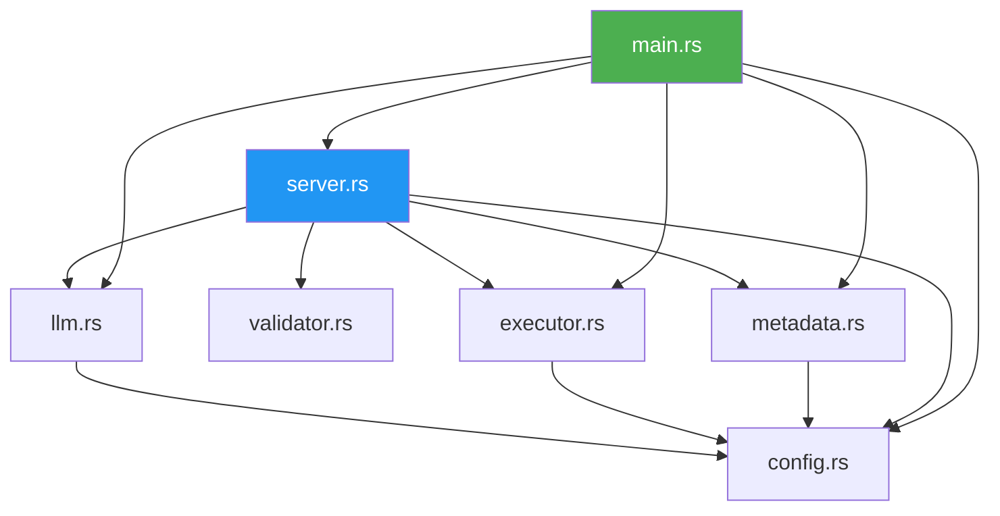
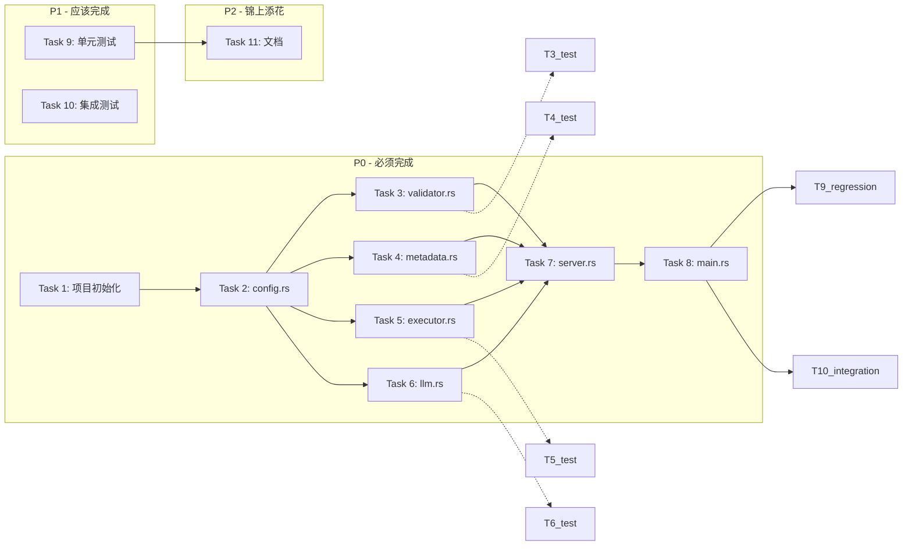

# PostgreSQL MCP Server 实现计划

## 文档信息

| 项目 | 内容 |
|------|------|
| 文档版本 | 1.1 |
| 创建日期 | 2026-03-31 |
| 关联设计文档 | [002-postgres-mcp-design.md](./002-postgres-mcp-design.md) |
| 项目名称 | pg-mcp |
| 项目路径 | `w5-pg-mcp/` |

---

## 1. 实现阶段总览

```mermaid
gantt
    title pg-mcp 实现阶段
    dateFormat X
    axisFormat %s

    section Phase 1 - 项目骨架
    项目初始化 & Cargo.toml        :p1a, 0, 1
    config.rs 配置管理             :p1b, 1, 2

    section Phase 2 - 核心模块
    validator.rs SQL 安全校验      :p2a, 2, 3
    metadata.rs 元数据缓存         :p2b, 2, 4
    executor.rs 查询执行器         :p2c, 3, 4
    llm.rs 大模型客户端            :p2d, 3, 4

    section Phase 3 - 集成
    server.rs MCP Server           :p3a, 4, 5
    main.rs 启动入口               :p3b, 5, 6

    section Phase 4 - 测试
    单元测试                       :p4a, 5, 7
    集成测试                       :p4b, 7, 8

    section Phase 5 - 收尾
    文档 & 示例配置                :p5a, 8, 9
```



---

## 2. 模块依赖图



**实现顺序原则**：无内部依赖的模块先行，被依赖的模块先实现。

---

## 3. Phase 1 - 项目骨架

### 3.1 Task 1: 项目初始化

**目标**：创建 Rust 项目、配置 Cargo.toml、建立目录结构。

**步骤**：

1. 在 `w5-pg-mcp/` 下执行 `cargo init --name pg-mcp`
2. 编写 `Cargo.toml`，声明所有依赖
3. 创建目录结构：
   ```
   src/
   ├── main.rs
   ├── config.rs
   ├── metadata.rs
   ├── validator.rs
   ├── llm.rs
   ├── executor.rs
   └── server.rs
   ```
4. 每个 `.rs` 文件写入模块骨架（空的 struct/impl）
5. `cargo check` 确认编译通过
6. **依赖探针验证**：编写最小可编译示例，逐个验证关键依赖的正确 crate 名称和 API 可用性：
   - `sqlparser-rs`：验证 `Parser::parse_sql(&PostgreSqlDialect, "SELECT 1")` 可编译
   - `rmcp`：验证 `#[tool]` 宏和 `ServerHandler` trait 可编译
   - `sqlx`：验证 `PgPool` 和 `Row` trait 可编译
7. 若发现 crate 名称/版本有误，立即修正 `Cargo.toml` 并记录实际可用版本

**验收标准**：
- [x] `cargo check` 无错误
- [x] 所有模块文件已创建
- [x] 依赖版本正确，编译通过
- [x] 依赖探针验证通过（每个关键依赖的最小示例可编译运行）

**关键注意**：
- `rmcp` 需要启用 `server`, `transport-io`, `macros`, `schemars` features
- `sqlx` 需要启用 `runtime-tokio`, `postgres`, `chrono`, `uuid` features
- `sqlparser-rs` 是正确的 crate 名称（注意是 `sqlparser-rs` 不是 `sqlparser`）
- **步骤 6 是硬性要求**：不通过探针验证不得进入后续 Task，避免 Task 3+ 因依赖问题返工

---

### 3.2 Task 2: config.rs - 配置管理

**目标**：实现完整的三层配置加载系统（CLI > 文件 > 环境变量 > 默认值）。

**步骤**：

1. 定义 `AppConfig`, `DatabaseConfig`, `LlmConfig`, `ServerConfig` 结构体
2. 实现 `clap::Parser` 的 `Cli` 结构体
3. 实现 `AppConfig::load()` 配置加载与合并逻辑
4. 处理 `ServerConfig` 中的 `#[serde(default)]` 默认值
5. 创建 `config.example.toml` 模板文件
6. 编写单元测试

**需实现的公共 API**：

```rust
pub struct AppConfig {
    pub database: DatabaseConfig,
    pub llm: LlmConfig,
    pub server: ServerConfig,
}

impl AppConfig {
    pub fn load() -> anyhow::Result<Self>;
}

pub fn mask_password(url: &str) -> String;
```

**环境变量映射表**：

| 环境变量 | 对应配置项 | 说明 |
|----------|-----------|------|
| `PG_MCP_CONFIG` | `cli.config` | 配置文件路径 |
| `PG_MCP_DATABASE_URL` | `database.url` | 数据库连接字符串 |
| `PG_MCP_DATABASE_SCHEMA` | `database.schema` | 数据库 schema |
| `PG_MCP_LLM_API_URL` | `llm.api_url` | LLM API 地址 |
| `PG_MCP_LLM_API_KEY` | `llm.api_key` | LLM API 密钥 |
| `PG_MCP_LLM_MODEL` | `llm.model` | LLM 模型名称 |
| `PG_MCP_MAX_ROWS` | `server.max_rows` | 最大返回行数 |
| `PG_MCP_QUERY_TIMEOUT` | `server.query_timeout_secs` | SQL 超时（秒） |

> 环境变量通过 clap 的 `#[arg(long, env = "PG_MCP_XXX")]` 自动绑定，
> 优先级由 clap 处理：CLI 参数 > 环境变量（因为 CLI 显式提供时覆盖 env 默认值）。
> 完整优先级：**CLI 参数 > 环境变量 > TOML 配置文件 > 默认值**。

**配置合并策略**（关键逻辑）：

```rust
impl AppConfig {
    pub fn load() -> anyhow::Result<Self> {
        let cli = Cli::parse();

        // 1. 从 TOML 文件加载基础配置（最低优先级来源）
        let mut config: AppConfig = if let Some(path) = &cli.config {
            let content = std::fs::read_to_string(path)?;
            toml::from_str(&content)?
        } else {
            // 使用硬编码默认值
            Self::default_config()
        };

        // 2. CLI 参数覆盖（含 env 变量，由 clap 自动处理 env 回退）
        //    clap 的行为：CLI 显式提供 → 使用 CLI 值；CLI 未提供但有 env → 使用 env 值
        //    因此这里统一用 CLI 字段即可，env 已在 clap 层合并
        if let Some(url) = cli.database_url {
            config.database.url = url;
        }
        config.database.schema = cli.database_schema;
        if let Some(api_url) = cli.llm_api_url {
            config.llm.api_url = api_url;
        }
        if let Some(api_key) = cli.llm_api_key {
            config.llm.api_key = api_key;
        }
        if let Some(model) = cli.llm_model {
            config.llm.model = model;
        }
        config.server.max_rows = cli.max_rows;
        config.server.query_timeout_secs = cli.query_timeout_secs;

        Ok(config)
    }
}
```

**验收标准**：
- [x] 仅 CLI 参数能正确加载
- [x] 仅 TOML 文件能正确加载
- [x] 仅环境变量能正确加载（`PG_MCP_DATABASE_URL` 等）
- [x] CLI 参数覆盖 TOML 文件值
- [x] 环境变量覆盖 TOML 文件值
- [x] CLI 参数覆盖环境变量值
- [x] 缺少必要配置时返回清晰错误
- [x] `excluded_tables` 和 `allowed_tables` 默认为空 Vec
- [x] `prompt_budget` 默认为 8000
- [x] `metadata_refresh_secs` 默认为 0

---

## 4. Phase 2 - 核心模块

### 4.1 Task 3: validator.rs - SQL 安全校验

**目标**：实现多层 SQL 安全校验，拒绝所有非 SELECT 语句，并强制执行表级访问控制。

**步骤**：

1. 定义 `SqlValidator` 结构体（含 `allowed_tables` 和 `excluded_tables`）
2. 实现 `validate(&self, sql: &str) -> Result<String, String>`
3. 实现 `validate_query` - CTE 检查 + 锁子句检查
4. 实现 `validate_cte` - 递归检查 CTE 中的数据修改
5. 实现 `validate_set_expr` - 递归检查子查询
6. **实现 `extract_table_names`** - 从 AST 中提取所有引用的表名
7. **实现 `validate_table_access`** - 检查表名是否在 allowed_tables/excluded_tables 范围内
8. 编写全面的单元测试

**需实现的公共 API**：

```rust
pub struct SqlValidator {
    allowed_tables: HashSet<String>,  // 空 = 允许所有
    excluded_tables: HashSet<String>, // 优先级高于 allowed_tables
}

impl SqlValidator {
    pub fn new(allowed_tables: HashSet<String>, excluded_tables: HashSet<String>) -> Self;
    pub fn validate(&self, sql: &str) -> Result<String, String>;
}
```

**关键实现细节**：

- 使用 `PostgreSqlDialect` 进行解析
- 检查 `Statement::Query` 的 `query.with` 字段检测 CTE
- 检查 `query.lock` 字段检测 FOR UPDATE/FOR SHARE
- 递归检查 `SetExpr::Query` 和 `SetExpr::SetOperation`
- 必须是单条语句

**必须通过的测试用例**：

```rust
#[cfg(test)]
mod tests {
    use super::*;

    // 通过的用例
    assert!(v.validate("SELECT 1").is_ok());
    assert!(v.validate("SELECT * FROM users WHERE id = 1").is_ok());
    assert!(v.validate("SELECT u.name, o.total FROM users u JOIN orders o ON u.id = o.user_id").is_ok());
    assert!(v.validate("WITH active AS (SELECT * FROM users WHERE active = true) SELECT * FROM active").is_ok());
    assert!(v.validate("SELECT COUNT(*) FROM users GROUP BY role").is_ok());

    // 拒绝的用例
    assert!(v.validate("INSERT INTO users VALUES (1, 'a')").is_err());
    assert!(v.validate("UPDATE users SET name = 'b'").is_err());
    assert!(v.validate("DELETE FROM users").is_err());
    assert!(v.validate("DROP TABLE users").is_err());
    assert!(v.validate("ALTER TABLE users ADD COLUMN x int").is_err());
    assert!(v.validate("TRUNCATE users").is_err());
    assert!(v.validate("GRANT SELECT ON users TO public").is_err());
    assert!(v.validate("SELECT * FROM users; DROP TABLE users").is_err());  // 多语句
    assert!(v.validate("SELECT * FROM users FOR UPDATE").is_err());          // 锁子句
    assert!(v.validate("WITH d AS (DELETE FROM users RETURNING *) SELECT * FROM d").is_err()); // 数据修改 CTE

    // 表访问控制用例（allowed_tables = {"users", "orders"}）
    let v_restricted = SqlValidator::new(
        HashSet::from(["users".into(), "orders".into()]),
        HashSet::new(),
    );
    assert!(v_restricted.validate("SELECT * FROM users").is_ok());
    assert!(v_restricted.validate("SELECT * FROM secrets").is_err()); // 不在白名单
    assert!(v_restricted.validate("SELECT * FROM users JOIN secrets ON users.id = secrets.id").is_err()); // JOIN 中含未授权表

    // excluded_tables 优先级高于 allowed_tables
    let v_excluded = SqlValidator::new(
        HashSet::from(["users".into(), "orders".into(), "passwords".into()]),
        HashSet::from(["passwords".into()]),
    );
    assert!(v_excluded.validate("SELECT * FROM passwords").is_err()); // 虽然 allowed 但被 excluded
}
```

**验收标准**：
- [x] 所有通过的测试用例通过
- [x] 所有拒绝的测试用例被正确拒绝
- [x] 错误信息以固定前缀标识类型：`"安全校验失败: "`（语句类型）、`"表访问被拒绝: "`（表控制）
- [x] 错误信息包含被拒绝的具体原因和原始 SQL 片段
- [x] 空 SQL 和多语句被拒绝
- [x] `allowed_tables` 非空时，查询未授权表返回错误
- [x] `excluded_tables` 中的表在 allowed_tables 和查询中均被拒绝
- [x] 表名提取覆盖 FROM、JOIN、CTE、子查询中的表引用

---

### 4.2 Task 4: metadata.rs - 元数据缓存

**目标**：实现数据库元数据加载、缓存、相关表检索和定时刷新。

**步骤**：

1. 定义 `DatabaseMetadata`, `TableInfo`, `ColumnInfo`, `IndexInfo`, `ViewInfo` 数据结构
2. 实现 `MetadataCache::new()` 和 `load()`
3. 实现 5 个 `information_schema` 查询
4. 实现 `get_relevant_context()` 基于关键词的相关表检索
5. 实现 `format_table()` 元数据格式化（排除注释）
6. 实现 `start_refresh_loop()` 后台刷新
7. 实现 `table_count()` 和 `view_count()` 辅助方法
8. 编写单元测试

**需实现的公共 API**：

```rust
pub struct MetadataCache { /* ... */ }

impl MetadataCache {
    pub fn new(pool: PgPool, schema: &str, excluded_tables: HashSet<String>) -> Self;
    pub async fn load(&self) -> anyhow::Result<()>;
    pub async fn get_relevant_context(&self, question: &str, prompt_budget: usize) -> String;
    pub async fn table_count(&self) -> usize;
    pub async fn view_count(&self) -> usize;
    /// 启动后台定时刷新，返回 JoinHandle 供 main 统一管理生命周期
    pub fn start_refresh_loop(&self, interval_secs: u64) -> tokio::task::JoinHandle<()>;
}
```

> **Code Review 修复**：`start_refresh_loop` 改为返回 `JoinHandle<()>` 而非 `async fn`，
> 由调用方在 main 中持有句柄，进程退出时通过 `abort()` 统一关闭。

**关键实现细节**：

- 使用 `RwLock<DatabaseMetadata>` 支持并发读取和定时刷新时的写入
- 列注释从数据库查询但 **不包含在 LLM prompt 中**（防注入）
- 视图定义同样不发送给 LLM，仅发送视图名称
- `get_relevant_context` 的匹配逻辑：
  1. 将 question 转小写
  2. 检查是否包含表名（小写）
  3. 检查是否包含任何列名（小写）
  4. 无匹配时返回所有表（受 budget 限制）
  5. 遍历时跳过 `excluded_tables` 中的表

**验收标准**：
- [x] 能正确加载表、列、主键、索引、视图信息
- [x] 相关表检索：包含表名的问题能匹配到对应表
- [x] 相关表检索：包含列名的问题能匹配到对应表
- [x] 无匹配时返回所有表
- [x] excluded_tables 中的表不出现在 LLM context 中
- [x] prompt_budget 超出时截断并显示提示
- [x] 注释不包含在格式化输出中

---

### 4.3 Task 5: executor.rs - 查询执行器

**目标**：实现安全的 SQL 查询执行，使用 READ ONLY 事务。

**步骤**：

1. 定义 `QueryResult` 结构体（含 `truncated` 字段）
2. 实现 `QueryExecutor::new()`
3. 实现 `execute()` 方法：READ ONLY 事务 + LIMIT 保护 + JSON 序列化
4. 实现 `apply_limit()` 追加 LIMIT
5. 实现 `sanitize_error()` 错误清洗
6. 编写单元测试

**需实现的公共 API**：

```rust
pub struct QueryExecutor { /* ... */ }

impl QueryExecutor {
    pub fn new(pool: PgPool, max_rows: u32, query_timeout_secs: u64, debug: bool) -> Self;
    pub async fn execute(&self, sql: &str) -> anyhow::Result<QueryResult>;
}

#[derive(Debug, Serialize)]
pub struct QueryResult {
    pub sql: String,
    pub columns: Vec<String>,
    pub rows: Vec<serde_json::Value>,
    pub row_count: usize,
    pub truncated: bool,
    pub execution_time_ms: u64,
    pub error: Option<String>,
}
```

**关键实现细节**：

- 事务开始后立即执行 `SET TRANSACTION READ ONLY`
- 使用 `SET LOCAL statement_timeout` 防止长时间查询
- **LIMIT 注入策略（Code Review 修复）**：改为 AST 级外层包裹而非字符串拼接：
  ```rust
  // 不再使用字符串 contains("LIMIT") 判断
  // 改为：SELECT * FROM (原始 SQL) AS _subq LIMIT max_rows
  fn wrap_with_limit(sql: &str, max_rows: u32) -> String {
      format!("SELECT * FROM ({}) AS _subq LIMIT {}", sql.trim_end_matches(';'), max_rows)
  }
  ```
  - 先用 sqlparser 解析确认 SQL 无语法错误
  - 如果 AST 中最外层已有 `LIMIT`，直接使用原 SQL
  - 否则使用子查询包裹方式添加 LIMIT
  - 这种子查询方式天然避免了子查询 LIMIT 误判、注释/字符串干扰、UNION/CTE 等问题
- `truncated` = 实际返回行数 == max_rows
- **行数据序列化（Code Review 修复）**：`row.get::<String>(i)` 对 integer/timestamp/uuid/jsonb 等类型会运行时崩溃。改为类型分派：
  ```rust
  fn row_value_to_json(row: &PgRow, i: usize) -> serde_json::Value {
      let raw = row.try_get_raw(i).unwrap();
      if raw.is_null() { return Value::Null; }
      // 按类型尝试解码，失败则回退字符串化
      let type_info = raw.postgres_type();
      match type_info.name() {
          "int2" | "int4" | "int8" => row.try_get::<i64, _>(i)
              .map(Value::from).unwrap_or_else(|_| fallback_string(row, i)),
          "float4" | "float8" => row.try_get::<f64, _>(i)
              .map(|v| serde_json::to_value(v).unwrap()).unwrap_or_else(|_| fallback_string(row, i)),
          "bool" => row.try_get::<bool, _>(i)
              .map(Value::Bool).unwrap_or_else(|_| fallback_string(row, i)),
          "json" | "jsonb" => row.try_get::<serde_json::Value, _>(i)
              .unwrap_or_else(|_| fallback_string(row, i)),
          _ => fallback_string(row, i), // text, varchar, timestamp, uuid, etc.
      }
  }
  fn fallback_string(row: &PgRow, i: usize) -> Value {
      row.try_get::<String, _>(i).map(Value::String).unwrap_or(Value::Null)
  }
  ```
- 错误清洗在 `debug=false` 时将数据库错误替换为通用提示

**验收标准**：
- [x] READ ONLY 事务中执行查询
- [x] 无 LIMIT 的 SQL 被子查询包裹方式追加 LIMIT
- [x] 已有 LIMIT 的 SQL 不被修改（AST 检测）
- [x] UNION / CTE / 子查询 SQL 的 LIMIT 保护正确（不误判子查询中的 LIMIT）
- [x] 行数达到 max_rows 时 truncated = true
- [x] integer/float/bool/jsonb 类型正确序列化为对应 JSON 类型（非字符串包裹）
- [x] timestamp/uuid/未知类型回退为字符串序列化
- [x] debug=false 时错误被清洗
- [x] debug=true 时返回原始错误

---

### 4.4 Task 6: llm.rs - 大模型客户端

**目标**：实现 OpenAI 兼容的 Chat Completion API 调用。

**步骤**：

1. 定义 `ChatRequest`, `ChatMessage`, `ChatResponse` 等请求/响应结构
2. 实现 `LlmClient::new()`
3. 实现 `generate_sql()` 方法
4. 实现 `build_system_prompt()` 和 `build_user_prompt()`
5. 实现 `extract_sql()` SQL 提取
6. 编写单元测试（主要是 extract_sql 和 prompt 构建）

**需实现的公共 API**：

```rust
pub struct LlmClient { /* ... */ }

impl LlmClient {
    pub fn new(config: &LlmConfig) -> Self;
    pub async fn generate_sql(
        &self,
        question: &str,
        db_context: &str,
        last_error: Option<&str>,
    ) -> anyhow::Result<String>;
}
```

**关键实现细节**：

- API URL 拼接：`{api_url}/chat/completions`（注意末尾斜杠处理）
- 重试时 `user_prompt` 包含上次错误信息
- `extract_sql` 处理三种格式：` ```sql...``` `、` ```...``` `、裸 SQL
- System prompt 包含 7 条规则（含 "无法回答时返回 ERROR" 和日期处理规则）
- reqwest 超时设置：建议 60 秒（覆盖 LLM 响应时间）

**验收标准**：
- [x] extract_sql 正确处理 markdown 代码块
- [x] extract_sql 正确处理裸 SQL
- [x] last_error=None 时生成普通 prompt
- [x] last_error=Some 时生成带错误反馈的 prompt
- [x] API 错误返回格式为 `"LLM API 错误 ({status}): {body}"`
- [x] extract_sql 处理空白包裹的 SQL 后不含前后换行
- [x] API 超时返回 `"LLM 请求超时 ({duration:?})"` 格式的错误

---

## 5. Phase 3 - 集成

### 5.1 Task 7: server.rs - MCP Server

**目标**：使用 rmcp 框架定义 MCP Server，暴露 `query` 工具。

**步骤**：

1. 定义 `QueryParams`（含 schemars 描述）
2. 定义 `QueryToolResult` 结构体
3. 定义 `PgMcpServer` 结构体
4. 使用 `#[tool_router]` 实现 tool 注册
5. 使用 `#[tool]` 实现 `query` 方法（含重试逻辑）
6. 使用 `#[tool_handler]` 实现 `ServerHandler`
7. 验证 MCP handshake 能成功完成

**需实现的公共 API**：

```rust
pub struct PgMcpServer { /* ... */ }

impl PgMcpServer {
    pub fn new(
        config: Arc<AppConfig>,
        metadata: Arc<MetadataCache>,
        llm: Arc<LlmClient>,
        executor: Arc<QueryExecutor>,
    ) -> Self;
}
```

**关键实现细节**：

- `MAX_RETRIES = 1`：最多 2 次尝试（初始 + 1 次重试）
- 重试仅针对 SQL 执行失败，不针对校验失败（校验失败直接拒绝）
- 返回 `Result<String, rmcp::ErrorData>`，其中 String 是 JSON 序列化的 QueryResult
- `tool_router` 宏自动生成 `Self::tool_router()` 方法
- `tool_handler` 宏自动生成 `call_tool` 和 `list_tools` 实现

**验收标准**：
- [x] `cargo build` 编译通过
- [x] tool 参数 schema 正确生成（通过 MCP list_tools 验证）
- [x] query 工具可被 MCP 客户端调用

---

### 5.2 Task 8: main.rs - 启动入口

**目标**：将所有模块组装，实现完整的启动流程，含统一的生命周期管理。

**步骤**：

1. 初始化 `tracing_subscriber` 日志
2. 调用 `AppConfig::load()` 加载配置
3. 创建 `PgPool` 数据库连接池
4. 创建 `MetadataCache` 并加载元数据
5. 可选启动后台刷新任务（持有 `JoinHandle`）
6. 初始化 `LlmClient` 和 `QueryExecutor`
7. 创建 `PgMcpServer`
8. 启动 stdio transport
9. 等待关闭（stdin 断开时自动退出）
10. **关闭时清理后台任务**：对 `JoinHandle` 调用 `abort()` 终止刷新循环

**关键实现细节（Code Review 修复）**：

```rust
// main.rs 中的生命周期管理
let mut refresh_handle: Option<tokio::task::JoinHandle<()>> = None;

if config.server.metadata_refresh_secs > 0 {
    let mc = metadata_cache.clone();
    let interval = config.server.metadata_refresh_secs;
    let handle = mc.start_refresh_loop(interval);
    refresh_handle = Some(handle);
    tracing::info!(refresh_interval_secs = interval, "元数据自动刷新已启用");
}

// ... 启动 MCP Server ...

service.waiting().await?;

// 进程退出时清理后台任务
if let Some(handle) = refresh_handle {
    handle.abort();
    tracing::info!("元数据刷新任务已停止");
}
```

**验收标准**：
- [x] 配置加载成功并打印日志（密码已 mask）
- [x] 数据库连接失败时终止并打印错误
- [x] 元数据加载成功并打印表/视图数量
- [x] metadata_refresh_secs > 0 时启动后台刷新
- [x] MCP Server 成功启动并等待连接
- [x] 进程退出时后台刷新任务被正确终止（通过 JoinHandle::abort）

---

## 6. Phase 4 - 测试

### 6.1 Task 9: 单元测试

**目标**：为每个模块编写全面的单元测试。

**测试清单**：

| 模块 | 测试用例 |
|------|----------|
| `config` | 默认值验证、CLI 覆盖、文件加载、**环境变量覆盖**、缺少必要配置报错、excluded_tables/allowed_tables 解析、**优先级验证（CLI > env > file > default）** |
| `validator` | SELECT 通过（5 种）、INSERT/UPDATE/DELETE 拒绝、CREATE/DROP/ALTER 拒绝、多语句拒绝、空 SQL 拒绝、FOR UPDATE 拒绝、CTE 数据修改拒绝、UNION 查询通过、子查询通过、**allowed_tables 白名单拒绝**、**excluded_tables 黑名单拒绝**、**JOIN 中引用未授权表拒绝** |
| `llm` | extract_sql: ` ```sql...``` `、` ```...``` `、裸 SQL、含前后空白、prompt 构建、重试 prompt 含错误信息 |
| `metadata` | 相关表检索：表名匹配、列名匹配、无匹配返回全部、excluded_tables 过滤、budget 截断 |
| `executor` | apply_limit: 无 LIMIT 追加、有 LIMIT 不追加、truncated 计算、**子查询包裹方式对 UNION/CTE 的处理**、**类型分派（int/float/bool/jsonb/null）正确序列化** |

**验收标准**：
- [x] `cargo test` 全部通过
- [x] 测试覆盖率 > 80%（核心逻辑）

---

### 6.2 Task 10: 集成测试

**目标**：端到端测试完整请求流程。

**前置条件**：需要运行中的 PostgreSQL 实例。

**测试方案**：使用 `testcontainers` 运行 PostgreSQL Docker 容器。

**测试清单**：

| 场景 | 描述 |
|------|------|
| 元数据加载 | 创建测试表和视图，验证缓存正确 |
| 端到端查询 | 手动构造 SQL 绕过 LLM，验证执行链路 |
| READ ONLY 验证 | 尝试在 executor 中执行 INSERT，验证被 READ ONLY 事务拒绝 |
| 错误处理 | 执行引用不存在表的 SQL，验证错误返回 |
| **MCP handshake** | 发送 JSON-RPC `initialize` 请求，验证 server 正确响应 capabilities |
| **MCP list_tools** | 发送 `tools/list` 请求，验证返回的 schema 含 `query` 工具且参数描述正确 |
| **MCP 重试分支** | mock LLM 返回有错误的 SQL → 验证第二次调用含 last_error → 验证最终结果正确 |
| **MCP 错误码映射** | 验证 validator 拒绝返回 `invalid_params`，执行失败返回 `internal_error` |

**注意**：由于 LLM API 需要 API Key 且有成本，集成测试中用 mock 替代 LLM 调用。

**验收标准**：
- [x] 元数据加载测试通过
- [x] 端到端查询测试通过
- [x] READ ONLY 保护测试通过
- [x] MCP handshake 成功
- [x] MCP list_tools 返回正确的 schema
- [ ] 重试分支测试通过（一次失败后二次成功）
- [x] 错误码映射正确（validator → invalid_params, executor → internal_error）

---

## 7. Phase 5 - 收尾

### 7.1 Task 11: 文档与示例

**目标**：编写使用文档和示例配置。

**步骤**：

1. 确保 `config.example.toml` 完整且注释清晰
2. 验证 `cargo build --release` 成功
3. 手动测试完整的 MCP 集成流程（Claude Code 或 Cursor）

**验收标准**：
- [x] `cargo build --release` 成功
- [x] config.example.toml 所有配置项有注释说明
- [x] 能与 MCP 客户端正常通信

---

## 8. 风险与缓解

| 风险 | 概率 | 影响 | 缓解措施 |
|------|------|------|----------|
| rmcp API 与设计文档不一致 | 中 | 高 | Task 1 中先验证 rmcp 编译通过，尽早发现问题 |
| sqlparser-rs 的 CTE AST 结构与预期不同 | 中 | 中 | Task 3 中先打印 AST 结构确认，再实现校验 |
| sqlx 的行数据类型转换不完整 | 低 | 中 | 使用类型分派到 `serde_json::Value`，未知类型回退字符串化 |
| LLM API 响应格式不稳定 | 中 | 低 | extract_sql 多种格式兼容，重试机制兜底 |
| 大型 schema 元数据加载超 5 秒 | 低 | 低 | 可通过并发查询优化，或接受较长加载时间 |
| **测试容器不可用（CI 无 Docker）** | 中 | 中 | 集成测试标记 `#[ignore]`，提供 `DATABASE_URL` env 手动运行；CI 可用 `services: postgres` 替代 testcontainers |
| **连接池/超时参数不当** | 低 | 高 | `PgPoolOptions::max_connections` 和 `acquire_timeout` 使用合理默认值（10 连接、5 秒），并在 config.example.toml 注释说明调优建议 |
| **prompt_budget 按字符/token 不一致** | 中 | 低 | 文档中明确标注 "prompt_budget 单位为字符（非 token）"，实际截断用 `.len()` 而非 token 计数；后续可引入 tiktoken 精确控制 |
| **敏感日志泄露（API Key / SQL 数据）** | 低 | 高 | `mask_password()` 处理连接字符串；日志级别控制：TRACE 才输出结果数据；INFO 级别仅输出 SQL 和行数统计；API Key 永不记录到日志 |

---

## 9. 实现优先级总结



**Task 依赖关系**：
- Task 1 → Task 2（项目骨架先行）
- Task 2 → Task 3, 4, 5, 6（config 是所有模块的依赖）
- Task 3, 4, 5, 6 → Task 7（server 集成所有模块）
- Task 7 → Task 8（main 组装 server）
- Task 8 → Task 9, 10（**最终回归/集成测试**依赖完整实现）
- Task 9 → Task 11（文档最后）
- **随模块并行**：Task 3/4/5/6 各自的单测随模块实现同步完成（在各自 Task 步骤中标注），不依赖 Task 9
- Task 9 = 最终回归测试（全量 `cargo test`），Task 10 = 集成/协议契约测试

- **随模块的单测随各 Task 同步完成**， 最终回归测试在 Task 9/10 中进行
- Task 9/10 中的单测实际在模块实现阶段已完成， 不应作为独立阶段后置

---

## 10. Code Review 反馈追踪（v1.0 → v1.1）

> 基于 [004-postgres-mcp-impl-plan-review-by-codex.md](./004-postgres-mcp-impl-plan-review-by-codex.md) 的 10 项发现。

| # | 严重性 | 反馈摘要 | 处理方式 | 更新位置 |
|---|--------|---------|---------|---------|
| 1 | Critical | 环境变量层缺失：目标写 4 层优先级但示例代码只有 CLI + TOML | 已采纳：添加 env 映射表、clap `env` 属性说明、优先级明确化、新增 3 条 env 验收标准 | Task 2 |
| 2 | Critical | `sqlparser-rs` crate 名称可能不正确 | 已采纳：Task 1 新增步骤 6"依赖探针验证"，硬性要求 `cargo check` + 最小编译示例逐个验证 | Task 1 |
| 3 | High | `allowed_tables` 配置存在但未在执行时强制 | 已采纳：`SqlValidator` 新增 `allowed_tables`/`excluded_tables` 参数，新增 `extract_table_names` + `validate_table_access` 步骤，新增表访问控制测试用例 | Task 3 |
| 4 | High | `row.get::<String>(i)` 对 integer/timestamp/uuid/jsonb 等类型运行时崩溃 | 已采纳：改为类型分派到 `serde_json::Value`，含 int/float/bool/jsonb 分支和 `fallback_string` 回退 | Task 5 |
| 5 | High | `apply_limit` 字符串 `contains("LIMIT")` 判断过于脆弱 | 已采纳：改为子查询包裹 `SELECT * FROM (...) AS _subq LIMIT n`，仅 AST 解析确认已有限时跳过 | Task 5 |
| 6 | High | `start_refresh_loop` 无停止机制，生命周期风险 | 已采纳：返回 `JoinHandle<()>`，main 中统一 `abort()` 管理 | Task 4 + Task 8 |
| 7 | Medium | 依赖图测试依赖表达不一致 | 已采纳：单测随模块并行（虚线标注），Task 9 改为"最终回归测试"，更新 mermaid 和文字描述 | Section 9 |
| 8 | Medium | 集成测试缺少 MCP 协议层场景 | 已采纳：新增 4 个协议契约测试场景（handshake/list_tools/重试分支/错误码映射） | Task 10 |
| 9 | Medium | 风险表漏项：测试环境/连接池/prompt budget/日志泄露 | 已采纳：新增 4 条风险项，含检测信号和预案 | Section 8 |
| 10 | Low | "错误信息清晰"验收标准不可量化 | 已采纳：改为固定前缀 `"安全校验失败: "` / `"表访问被拒绝: "`，含具体原因和 SQL 片段 | Task 3 + Task 6 |
